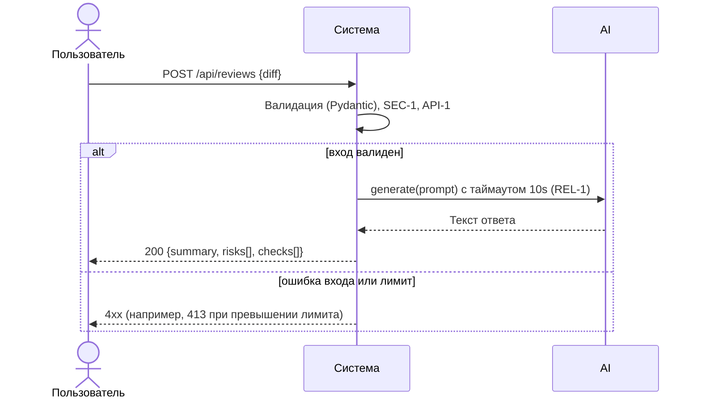

# Use cases и user stories

## Первый рабочий сценарий

Когда разработчик отправляет JSON с diff на эндпоинт POST `/api/reviews`, система валидирует вход, применяет правила SEC-1/API-1/REL-1 и возвращает структурированный ответ, а пользователь получает проверяемый комментарий по PR в строгом формате.

Не входит в этот сценарий:

- Аутентификация, интеграции с GitHub, сохранение в БД, автопочинка кода.

## Use case

| Поле | Значение |
|---|---|
| Актор | Разработчик (внутренний пользователь сервиса) |
| Триггер | Отправка HTTP POST `/api/reviews` с телом `{"diff": "..."}` |
| Предусловия | Доступен сервис; diff не превышает 20000 символов; тело соответствует контракту |
| Основной результат | 200 OK с телом `{ summary, risks: [<=3], checks: [] }` |
| Ошибка или отказ | 4xx при нарушении контракта/лимита; контролируемая 5xx при таймауте LLM |



## User stories и acceptance criteria

```gherkin
Feature: Отправить diff на ревью

  Scenario: Позитивный ответ на валидный diff
    Given сервис доступен и принимает JSON по POST /api/reviews
    And тело запроса содержит поле diff длиной <= 20000 символов
    When разработчик отправляет корректный diff
    Then ответ 200 OK и тело содержит поля summary, risks (не более 3 элементов), checks
    And элементы risks имеют поля file, line, evidence, risk

  Scenario: Негативный — отсутствует поле diff
    Given сервис доступен
    When разработчик отправляет пустое тело {}
    Then ответ — контролируемая ошибка в классе 4xx (422/400)
    And в теле объяснение, что поле diff обязательно

  Scenario: Граничный — превышение лимита размера
    Given сервис доступен и настроен лимит 20000 символов
    When разработчик отправляет diff длиной 20001 символ
    Then ответ 413 Payload Too Large
    And тело ошибки не содержит исходный diff
```

## Как использовали AI

- Для чего: оформить use case и сценарии вокруг уже реализованного эндпоинта и сервиса, добавив тестируемые критерии.
- Тип промпта: master prompt (P1-03).
- Строка в [`prompts.md`](prompts.md): P1-03.
- Что проверили и исправили сами: уточнили границы сценария, согласовали статусы ответов и поля с правилами CASE и кодом diff.
