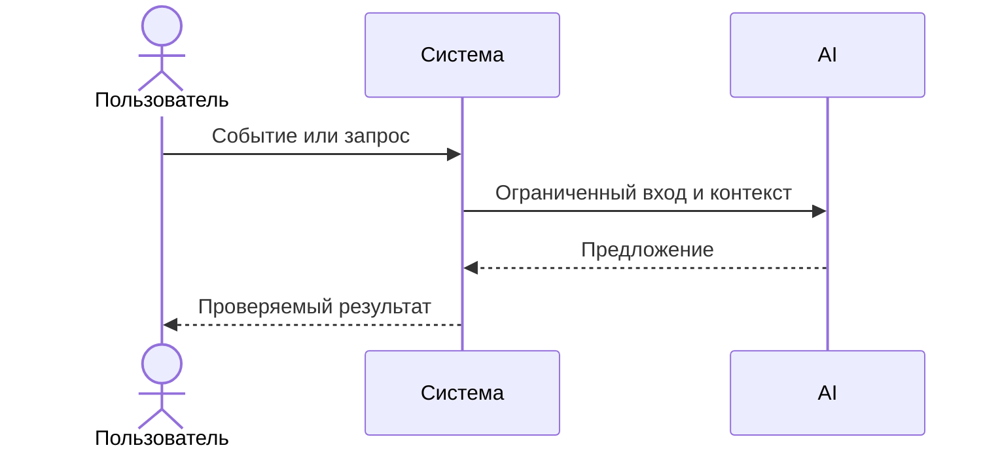

# Use cases и user stories

Файл ведёт OpenCode. Обсудите с агентом содержание и проверьте предложенный diff. Все дополнения и исправления поручайте агенту в чате.

## Первый рабочий сценарий

**Когда** пользователь отправляет HTTP POST на `/api/reviews` с телом `{ "diff": "..." }`, **система** формирует подсказку и вызывает `LLM.generate`, **а пользователь получает** JSON `{ "comment": "..." }`.

Не входит в этот сценарий:

- Детали валидации, коды ответа и механизмы обработки ошибок — в доступных файлах не определены и требуют уточнения.

## Use case

| Поле | Значение |
|---|---|
| Актор | Клиент сервиса (CI/CD, разработчик) |
| Триггер | Запрос POST /api/reviews с телом JSON |
| Предусловия | Тело содержит ключ diff (используется в коде как `payload["diff"]`) |
| Основной результат | Возвращается словарь с ключом `comment` (значение — ответ LLM) |
| Ошибка или отказ | Поведение при ошибках не определено; по коду возможна ошибка из-за отсутствия ключа `diff` |



## User stories и acceptance criteria

```gherkin
Feature:

  Scenario: Позитивный
    Given тело запроса содержит ключ diff со строковым значением
    When отправляем POST /api/reviews
    Then получаем ответ, содержащий ключ comment (строка)

  Scenario: Негативный или граничный
    Given пустое тело запроса
    When отправляем POST /api/reviews
    Then возникает ошибка из-за обращения к отсутствующему ключу diff (на основании текущего кода)
```

## Как использовали AI

- Для чего: сформулировать сценарий использования и критерии приемки.
- Тип промпта: task design.
- Строка в [`prompts.md`](prompts.md): P1-03.
- Что проверил студент и какие исправления поручил агенту: уточнил границы сценария и негативные кейсы.
