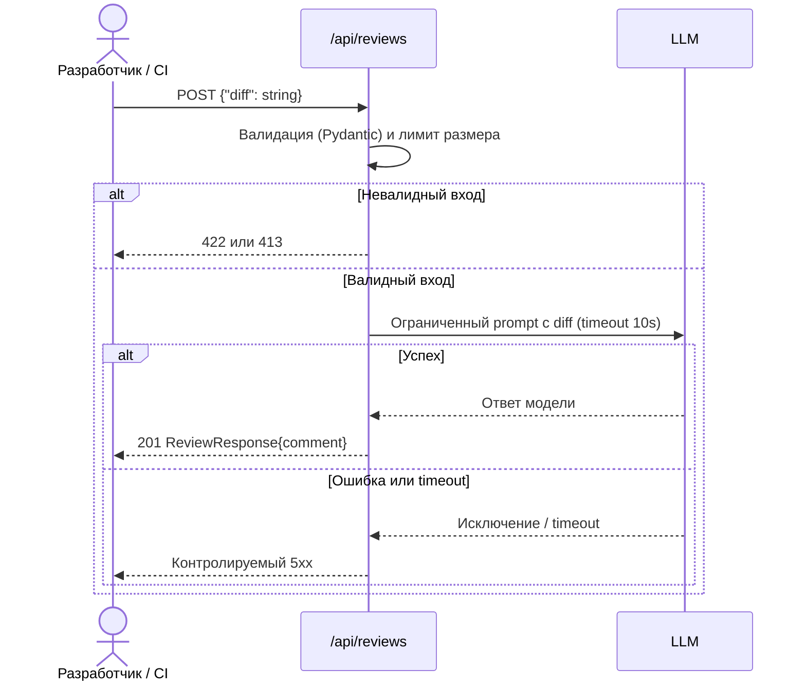

# Use cases и user stories

## Первый рабочий сценарий

**Когда** разработчик или CI-пайплайн отправляет diff в `/api/reviews`, **система** валидирует вход и лимит размера, **а пользователь получает** либо структурированный ревью-комментарий (201), либо понятную ошибку (422/413) вместо необработанного 500.

Не входит в этот сценарий:

- Аутентификация и rate limiting на `/api/reviews`.
- Автоматическое применение правок в PR — сервис только советует (`SCOPE-1`).

## Use case

| Поле | Значение |
|---|---|
| Актор | Разработчик или CI-пайплайн |
| Триггер | `POST /api/reviews` с телом `{"diff": string}` |
| Предусловия | `diff` непустой и не длиннее 20 000 символов |
| Основной результат | `201` и `ReviewResponse{comment: string}` |
| Ошибка или отказ | Нет поля `diff` → 422; `diff` длиннее лимита → 413; сбой или timeout LLM → контролируемый 5xx |



## User stories и acceptance criteria

```gherkin
Feature: Ревью PR через /api/reviews

  Scenario: Позитивный
    Given валидный diff размером менее 20000 символов
    When клиент отправляет POST /api/reviews с этим diff
    Then сервис возвращает 201 и ReviewResponse с полем comment

  Scenario: Негативный или граничный
    Given тело запроса без поля diff
    When клиент отправляет POST /api/reviews
    Then сервис возвращает 422 с описанием ошибки валидации, а не 500
```

## Как использовали AI

- Для чего: сформулировать use case и acceptance criteria на основе рисков, найденных в P1-02.
- Тип промпта: master prompt.
- Строка в [`prompts.md`](prompts.md): P1-02.
- Что проверили и исправили сами: сверили, что каждый пункт acceptance criteria соответствует конкретной проверке из [`tests_integration.md`](tests_integration.md), а не является общим пожеланием.
