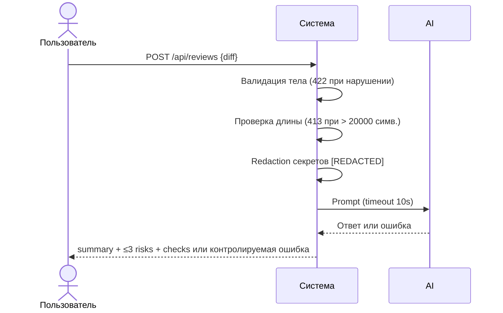

# Use cases и user stories

## Первый рабочий сценарий

**Когда** разработчик или CI отправляет корректный и небольшой `diff` в POST `/api/reviews`, **система** валидирует тело, проверяет длину `diff` (≤ 20 000 символов), редактирует секреты и вызывает внешний LLM с таймаутом 10 секунд, **а пользователь получает** структурированный результат с `summary`, максимум тремя `risks` и `checks`; решение всегда остаётся за человеком.

Не входит в этот сценарий:

- аутентификация и квоты;
- изменение репозитория GitHub или автоматический merge;
- поддержка диффов > 20 000 символов;
- выбор/реализация конкретного SDK LLM.

## Use case

| Поле | Значение |
|---|---|
| Актор | Разработчик/CI |
| Триггер | Необходимость получить ревью по `diff` PR |
| Предусловия | Есть валидный JSON с полем `diff` (строка) длиной ≤ 20 000 символов |
| Основной результат | JSON: `summary`, `risks` (≤3, каждый с file/line/evidence/risk), `checks` |
| Ошибка или отказ | 422 при невалидном теле; 413 при превышении лимита; 502 с `LLM_UPSTREAM_ERROR` при ошибке или timeout LLM |



## User stories и acceptance criteria

### User stories

1. Как разработчик, я хочу отправить корректный diff на ревью, чтобы до слияния PR получить не более трёх рисков с доказательствами и проверками.
2. Как владелец CI, я хочу получать предсказуемые ответы 422 и 413 для некорректного или слишком большого входа, чтобы ошибки клиента не превращались в 5xx.
3. Как инженер по безопасности, я хочу удалять токены, пароли и приватные ключи до вызова LLM, чтобы секреты не покидали доверенный контур.
4. Как владелец сервиса, я хочу преобразовывать исключения и timeout внешнего LLM в контролируемый ответ 502, чтобы сбой провайдера не приводил к необработанному исключению.
5. Как ревьюер, я хочу получать `summary`, `risks` и `checks`, чтобы проверить выводы AI и самостоятельно принять решение по PR.

```gherkin
Feature: AI-ревью PR по diff

  Scenario: Позитивный — корректный небольшой diff
    Given тело запроса содержит поле diff как строку длиной 100 символов
    When пользователь отправляет POST /api/reviews с этим телом
    Then ответ содержит поля summary, risks и checks, и в risks не больше 3 элементов

  Scenario: Негативный — отсутствует поле diff
    Given тело запроса не содержит поле diff
    When пользователь отправляет POST /api/reviews
    Then сервис возвращает 422 Unprocessable Content и не пишет diff в логи

  Scenario: Граничный — diff длиной 20001 символ
    Given тело запроса содержит поле diff длиной 20001 символ
    When пользователь отправляет POST /api/reviews
    Then сервис возвращает 413 Content Too Large (RFC 9110) и не вызывает LLM

  Scenario: Ошибка LLM — таймаут 10 секунд
    Given внешний LLM недоступен или отвечает дольше 10 секунд
    When сервис вызывает LLM
    Then сервис возвращает 502 с error.code LLM_UPSTREAM_ERROR и не логирует содержимое diff или ответа модели
```

## Как использовали AI

- Для чего: сформулировать первый рабочий сценарий, use case, user stories и AC в Gherkin на основе CASE.md.
- Тип промпта: master prompt + уточняющие запросы.
- Строка в [`prompts.md`](prompts.md): P1-02.
- Что проверили и исправили сами: синхронизировали терминологию (413 Content Too Large, лимит 20 000 символов), исключили недоказанные предположения.
