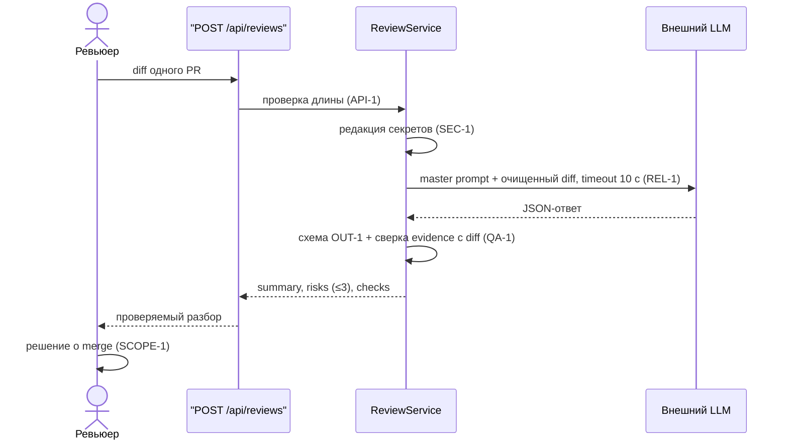

# Use cases и user stories

## Первый рабочий сценарий

**Когда** ревьюер отправляет дифф одного pull request в `review-assistant`, **система** очищает дифф от секретов, вызывает LLM с master prompt и возвращает JSON с описанием изменения, не более чем тремя рисками и списком проверок, **а пользователь получает** набор утверждений, каждое из которых подтверждается дословной строкой диффа и ID нарушенного правила.

Не входит в этот сценарий:

- approve, merge и любые действия в GitHub (`SCOPE-1`);
- генерация кода или патчей;
- правила, не применимые к рассматриваемому диффу (`snake_case` для таблиц БД, i18n для frontend-строк), обоснование в разделе «Факты и правила» [`context.md`](context.md);
- аутентификация и rate limiting эндпоинта: в правилах репозитория их нет, требования без данных о нагрузке не сформулировать;
- работа с несколькими PR за один вызов.

## Use case

| Поле | Значение |
|---|---|
| Актор | ревьюер pull request; вызов инициирует сервис-интегратор, ответ читает человек |
| Триггер | PR открыт или обновлён, дифф передан в `POST /api/reviews` |
| Предусловия | дифф не длиннее 20 000 символов (`API-1`); внешний LLM-провайдер доступен |
| Основной результат | JSON: `summary`, `risks` (не более трёх, поля `file`, `line`, `evidence`, `risk` с ID правила), `checks` с описанием входа и ожидаемого результата |
| Ошибка или отказ | дифф длиннее лимита: HTTP 413 без вызова LLM; провайдер молчит дольше 10 секунд или отвечает ошибкой: контролируемый ответ (`REL-1`); ответ модели не проходит схему `OUT-1` — контролируемая ошибка, сырой ответ наружу не отдаётся |



## User stories и acceptance criteria

Все три сценария выведены из правил `CASE.md`, а не придуманы: позитивный проверяет `SEC-1` и `OUT-1`, негативный бьёт в `API-1`, граничный в `REL-1`.

```gherkin
Feature: Проверяемое ревью одного pull request

  Как ревьюер
  Я хочу получать риски с точной ссылкой на строку и дословной цитатой
  Чтобы проверять утверждения помощника, не перечитывая дифф целиком

  Scenario: Позитивный - дифф с нарушением правила
    Given дифф длиной менее 20 000 символов
    And в диффе есть строка "prompt = f\"Review this pull request and find problems:\\n{diff}\""
    When ревьюер отправляет дифф в POST /api/reviews
    Then ответ содержит поля summary, risks и checks
    And risks содержит не более трёх элементов
    And среди risks есть элемент с file "app/review_service.py", line "14" и ID правила SEC-1
    And поле evidence этого элемента дословно встречается в отправленном диффе

  Scenario: Негативный - дифф превышает лимит входа
    Given дифф длиной 20 001 символ
    When ревьюер отправляет дифф в POST /api/reviews
    Then сервис отвечает HTTP 413
    And внешний LLM не вызывается

  Scenario: Граничный - провайдер не отвечает в срок
    Given дифф длиной менее 20 000 символов
    And внешний LLM отвечает дольше 10 секунд
    When ревьюер отправляет дифф в POST /api/reviews
    Then сервис возвращает контролируемый ответ об ошибке не позднее 10 секунд
    And ответ не содержит трассировки исключения
```

## Как использовали AI

- Для чего: развернуть контракт ответа из Context Pack в проверяемые сценарии; формулировки про формат результата взяты из `P1-02`.
- Тип промпта: master prompt (`P1-02`), из него взяты формулировки про формат ответа.
- Строка в [`prompts.md`](prompts.md): `P1-02`.
- Что проверили и исправили сами: каждый `Then` привязан к правилу или к строке диффа, сценариев без источника в файле нет. Строку и цитату в позитивном сценарии брали счётом по телу ханка в `TRAINING_PR.diff`, а не из примера в `CASE.md` и не из заголовка ханка: заголовок завышен, а пример указывает `app/review_service.py:16`, тогда как присвоение `prompt` приходится на строку 14. Из ранней версии сценариев убрали проверку кода ответа 401 — аутентификация в задачу не входит.
