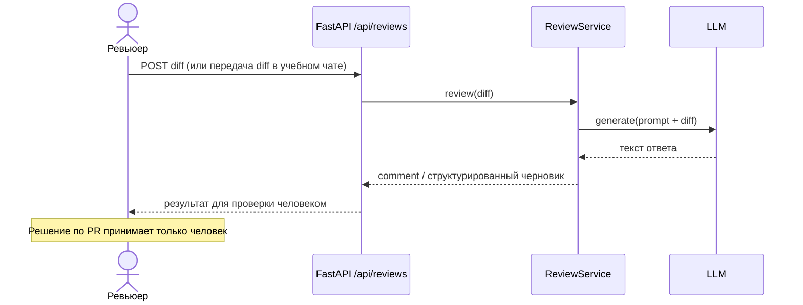

# Use cases и user stories

## Первый рабочий сценарий

**Когда** ревьюер получает PR с diff, **система** (AI-помощник ревьюера) анализирует diff по master prompt и Context Pack, **а пользователь получает** краткое описание изменения, не больше трёх рисков с доказательствами и список проверок с ожидаемым результатом.

Не входит в этот сценарий:

- автоматический approve или merge;
- изменение кода в репозитории помощником;
- доступ к прод-данным и секретам;
- ревью нескольких PR одним запросом без явного контракта (**Открытый вопрос** о пакетном режиме).

## Use case

| Поле | Значение |
|---|---|
| Актор | Ревьюер PR |
| Триггер | Доступен diff PR (учебный вход: `TRAINING_PR.diff`) |
| Предусловия | Задан master prompt с Context Pack; помощник не имеет права менять код |
| Основной результат | Markdown: описание + ≤3 доказанных риска + проверки с ожидаемым результатом |
| Ошибка или отказ | Нет доказательства у риска → риск не включается; нет данных → «Открытый вопрос»; сбой LLM сервиса продукта → **Открытый вопрос** по UX ошибки API |



## User stories и acceptance criteria

```gherkin
Feature: AI-помощник ревьюера PR
  Как ревьюер
  Я хочу получить доказательный черновик ревью по diff
  Чтобы быстрее решить, какие риски проверить, не передавая решение AI

  Scenario: Позитивный — валидный diff
    Given передан непустой diff учебного PR
    And активен master prompt с Context Pack
    When помощник выполняет ревью
    Then в ответе есть краткое описание изменения
    And число рисков не больше 3
    And у каждого риска есть файл, строка или функция и цитата из diff
    And есть список проверок с ожидаемым результатом
    And в ответе нет approve, merge и предложений править код за автора

  Scenario: Негативный — отсутствие поля diff в API продукта
    Given сервис принимает POST /api/reviews
    And тело запроса — пустой JSON-объект {}
    When вызывается create_review
    Then обращение payload["diff"] не должно считаться успешным контрактом
    And ревьюер или тест фиксирует фактический статус/ошибку
    And помощник ревьюера при анализе diff указывает этот риск с цитатой

  Scenario: Граничный — недостаточно данных в diff
    Given в diff нет сведений о SLA, тестах или прод-конфиге
    When помощник формирует ответ
    Then он не выдумывает требования
    And помечает пробелы как "Открытый вопрос"
```

## Как использовали AI

- Для чего: use case, sequence diagram, Gherkin-сценарии.
- Тип промпта: master prompt / product structuring.
- Строка в [`prompts.md`](prompts.md): P1-01 и P1-02.
- Что проверил студент и какие исправления поручил агенту: сценарии согласованы с `TRAINING_PR.diff` и границами помощника из README.
