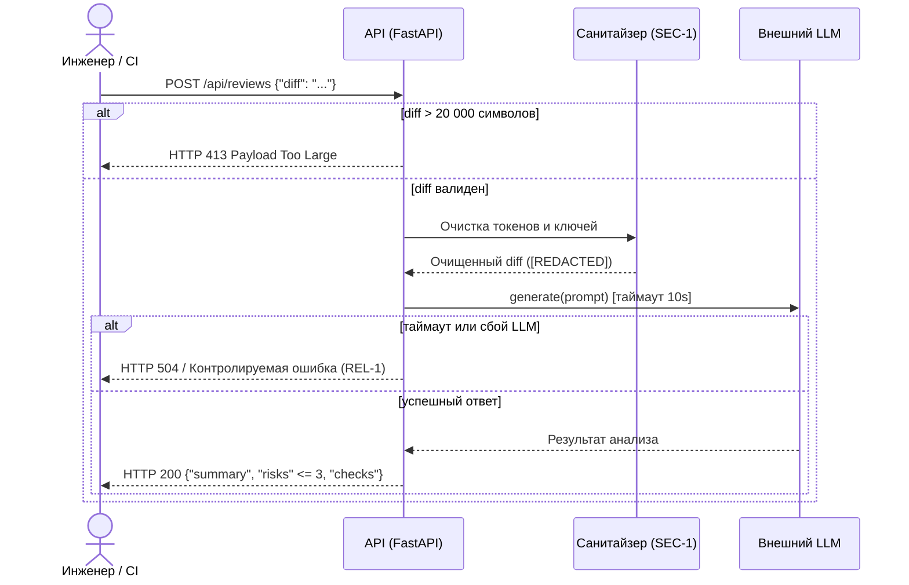

# Use cases и user stories

## Первый рабочий сценарий

**Когда** разработчик отправляет diff pull request в API сервиса ревью, **система** валидирует размер, маскирует секреты, опрашивает LLM с жестким таймаутом и формирует структурированный отчет, **а пользователь (инженер-ревьюер) получает** краткое саммари, список максимум из 3 критичных рисков с цитатами строк и готовые команды для воспроизведения дефектов.

Не входит в этот сценарий:
- Автоматический merge или закрытие pull request в репозитории (SCOPE-1).
- Генерация исправленного кода и отправка коммитов в ветку.
- Аутентификация через внешние провайдеры (OAuth/SSO) на этапе первого инкремента.

## Use case

| Поле | Значение |
|---|---|
| Актор | Инженер-ревьюер / CI-раннер репозитория |
| Триггер | HTTP POST запрос к `/api/reviews` с телом `{"diff": "..."}` |
| Предусловия | Сервис запущен, доступен эндпоинт `/health`, размер diff <= 20 000 символов |
| Основной результат | HTTP 200 с JSON `{ "summary": "...", "risks": [...], "checks": [...] }` |
| Ошибка или отказ | HTTP 400 при отсутствии поля `diff`; HTTP 413 при превышении длины 20 000 символов; HTTP 504 при таймауте LLM > 10 с |



## User stories и acceptance criteria

```gherkin
Feature: Автоматизированный анализ diff pull request

  Scenario: Позитивный анализ валидного diff
    Given запущен сервис ревью и доступна модель LLM
    When клиент отправляет POST /api/reviews с корректным "diff" длиной до 20000 символов
    Then сервис возвращает HTTP 200
    And тело ответа содержит "summary", массив "risks" (не более 3 элементов) и массив "checks"
    And каждый риск содержит поля "file", "line", "evidence", "risk"

  Scenario: Превышение допустимого размера diff (API-1)
    Given запущен сервис ревью
    When клиент отправляет POST /api/reviews с полем "diff" длиной более 20000 символов
    Then сервис возвращает HTTP 413 Payload Too Large
    And запрос во внешнюю модель LLM не отправляется

  Scenario: Маскирование приватных токенов и секретов (SEC-1)
    Given в присланном diff содержатся приватный ключ или токен авторизации
    When сервис формирует промпт для вызова LLM
    Then все найденные токены заменяются на "[REDACTED]"
    And оригинальные секреты не попадают в prompt и логи сервиса (OBS-1)
```

## Как использовали AI

- Для чего: формулирование use case, sequence diagram и gherkin-сценариев первого рабочего процесса.
- Тип промпта: master prompt (P1-03).
- Строка в [`prompts.md`](prompts.md): строка P1-03.
- Что проверили и исправили сами: синхронизировали сценарии с правилами SEC-1, API-1, REL-1, OUT-1, исключили автомерж (SCOPE-1).
