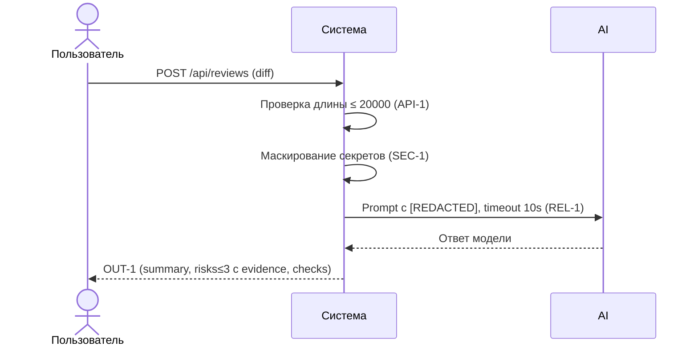

# Use cases и user stories

## Первый рабочий сценарий

**Когда** разработчик отправляет diff PR для анализа, **система** проверяет длину, маскирует секреты, вызывает LLM с таймаутом 10 секунд и возвращает структурированный ответ OUT-1, **а пользователь получает** краткое summary, до 3 рисков с evidence и список проверок для воспроизведения.

Не входит в этот сценарий:

- Любые действия в GitHub (approve/merge/комментарии), генерация кода, изменение исходников (SCOPE-1).

## Use case

| Поле | Значение |
|---|---|
| Актор | Разработчик или ревьюер |
| Триггер | Поступил POST /api/reviews с diff |
| Предусловия | Diff ≤ 20000 символов; сервис доступен |
| Основной результат | Возвращён объект OUT-1: summary, risks (≤3, с file/line/evidence/risk), checks |
| Ошибка или отказ | 413 при >20000; контролируемый ответ при таймауте/ошибке LLM |



## User stories и acceptance criteria

```gherkin
Feature:

  Scenario: Позитивный
    Given корректный diff длиной ≤ 20000 символов
    When пользователь отправляет POST /api/reviews с полем diff
    Then система возвращает 200 и объект OUT-1 с summary, не более 3 risks с file/line/evidence/risk и списком checks

  Scenario: Негативный или граничный
    Given diff длиной > 20000 символов
    When пользователь отправляет POST /api/reviews
    Then система возвращает 413 и не вызывает внешний LLM

  Scenario: Обработка таймаута
    Given корректный diff и зависание LLM более 10 секунд
    When пользователь отправляет POST /api/reviews
    Then система возвращает контролируемый ответ с сообщением об ошибке и без 500
```

## Как использовали AI

- Для чего: формализовать первый рабочий сценарий, use case и acceptance criteria по правилам SEC-1…OBS-1.
- Тип промпта: master prompt.
- Строка в [`prompts.md`](prompts.md): P1-03.
- Что проверили и исправили сами: уточнили границы (SCOPE-1), формализовали негативный сценарий и формат OUT-1, расширили sequenceDiagram.
