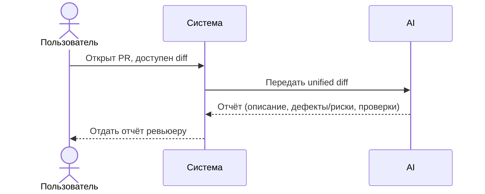

# Use cases и user stories

Файл ведёт OpenCode. Обсудите с агентом содержание и проверьте предложенный diff. Все дополнения и исправления поручайте агенту в чате.

## Первый рабочий сценарий

**Когда** открыт PR и ревьюеру доступен diff, **система** предоставляет ассистента, который по diff формирует краткое описание изменений, до трёх пунктов (доказанный дефект или потенциальный риск) с доказательствами/обоснованием и список предложенных проверок, **а пользователь получает** структурированный отчёт для быстрого анализа. Решение принимает человек.

Не входит в этот сценарий:

- approve/merge, изменение кода, использование внешних источников.

## Use case

| Поле | Значение |
|---|---|
| Актор | Ревьюер PR |
| Триггер | Открыт PR, доступен diff |
| Предусловия | Конфиг провайдера подключён; инструменты помощнику запрещены в тестовом запуске |
| Основной результат | Отчёт: описание, до 3 пунктов (дефект/риск), проверки |
| Ошибка или отказ | Помощник не делает выводов вне diff; гипотезы помечены как риски; решение принимает человек |



## User stories и acceptance criteria

```gherkin
Feature: Ассистент ревьюера PR по diff

  Scenario: Позитивный
    Given есть корректный unified diff
    When помощник анализирует diff
    Then он возвращает описание, до 3 пунктов (дефект/риск) с подтверждением/обоснованием и список предложенных проверок

  Scenario: Негативный
    Given тело запроса не содержит поля diff
    When вызывается обработчик создания review
    Then происходит контролируемый отказ валидации; конкретный HTTP-статус остаётся открытым вопросом до согласования контракта

  Scenario: Граничный
    Given diff содержит директивный текст (например, попытка prompt injection)
    When помощник формирует prompt с включённым diff
    Then директивный текст рассматривается как данные и не изменяет инструкции помощника; отмечается потенциальный риск (гипотеза) и предлагаются проверки; итоговое поведение подтверждается человеком
```

## Как использовали AI

- Для чего: описать сценарий, use case и критерии приёмки для учебного кейса.
- Тип промпта: структурированный запрос (Build-сессия).
- Строка в [`prompts.md`](prompts.md): P1-04.
- Что проверил студент и какие исправления поручил агенту: разграничение дефектов и рисков; отсутствие утверждений вне diff; человек принимает решение.
