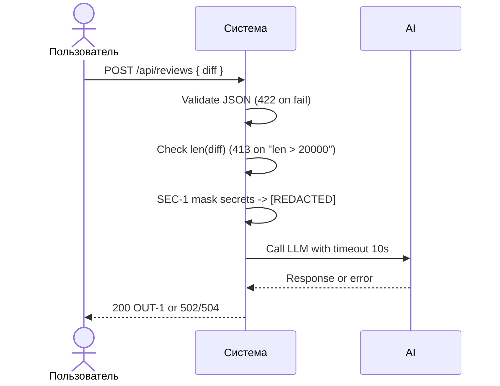

# Use cases и user stories

## Первый рабочий сценарий

**Когда** ревьюер отправляет diff одного PR в POST `/api/reviews`, **система** валидирует вход, проверяет длину, маскирует секреты и делает предсказуемый вызов LLM с таймаутом 10 секунд, формируя структурированный ответ OUT-1, **а пользователь получает** стабильный JSON с `summary`, максимум 3 `risks` и списком `checks` или корректный код ошибки 413/422/502/504.

Не входит в этот сценарий:

- approve/merge PR, коммиты или любые действия в GitHub (SCOPE-1)
- аутентификация и квоты
- отчёты ROI/IRR/WACC и бизнес-метрики

## Use case

| Поле | Значение |
|---|---|
| Актор | Ревьюер/сервис CI |
| Триггер | HTTP POST на `/api/reviews` с JSON телом, содержащее `diff` |
| Предусловия | Размер `diff ≤ 20000` символов; корректная схема запроса |
| Основной результат | 200 OK и JSON по OUT-1: `summary`, `risks`≤3, `checks` |
| Ошибка или отказ | 422 при неверной схеме; 413 при `len(diff) > 20000`; 502 при ошибке провайдера; 504 при превышении 10с таймаута |



## User stories и acceptance criteria

```gherkin
Feature: Получение подсказки ревью по diff

  Scenario: Позитивный
    Given валидный JSON с полем diff длиной не более 20000 символов
    When я отправляю POST /api/reviews с этим телом
    Then получаю 200 OK и тело ответа в формате OUT-1 с полями summary, risks (не более 3), checks

  Scenario: Негативный (413)
    Given JSON с полем diff длиной более 20000 символов
    When я отправляю POST /api/reviews
    Then получаю 413 Payload Too Large

  Scenario: Граничный (SEC-1)
    Given JSON с diff, содержащим тестовый токен вида ghp_ABCDEFG и блок приватного ключа
    When я отправляю POST /api/reviews
    Then перед вызовом LLM все секреты маскированы и в промпте присутствует маркер [REDACTED]
```

## Как использовали AI

- Для чего: описать первый рабочий сценарий, формализовать use case и критерии приёмки Gherkin с учётом SEC-1, API-1, REL-1, OUT-1.
- Тип промпта: Master Prompt v2
- Строка в [`prompts.md`](prompts.md): P1-04
- Что проверили и исправили сами: уточнили негативные и граничные сценарии (413, SEC-1), привели sequenceDiagram к валидному синтаксису и не меняли структуру разделов.
