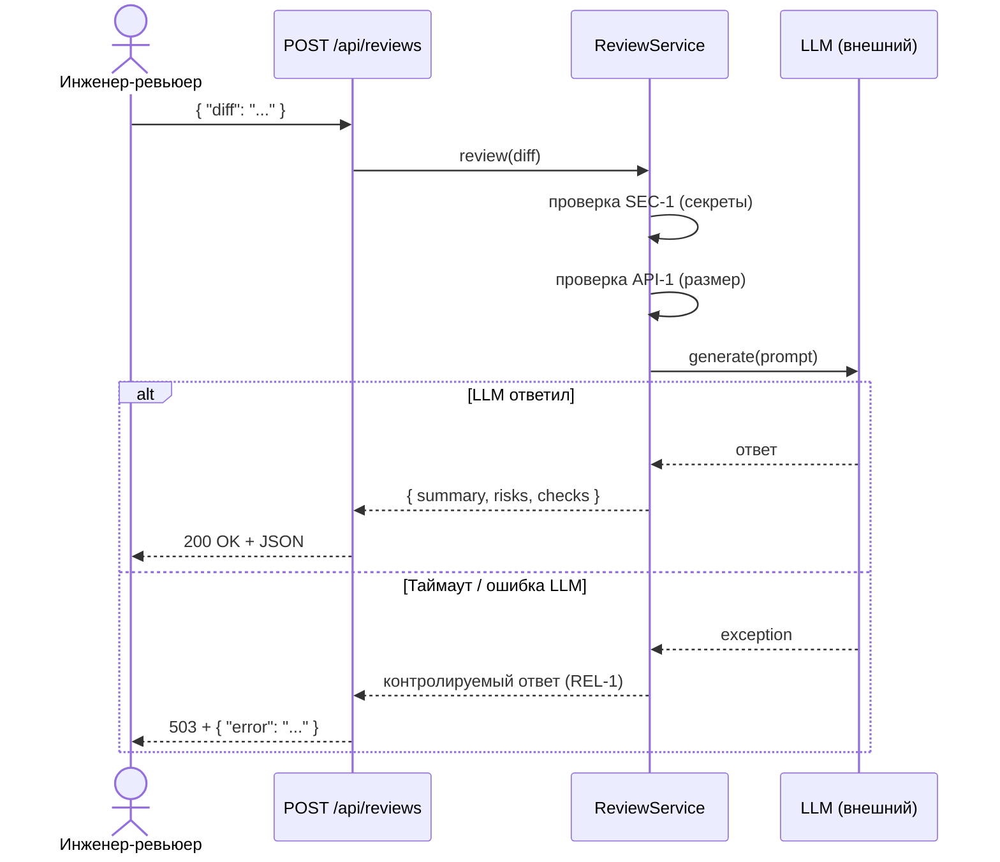

# Use cases и user stories

## Первый рабочий сценарий

**Когда** инженер-ревьюер отправляет diff PR в `POST /api/reviews`, **система** проверяет его на секреты, ограничивает размер, вызывает LLM с timeout и **возвращает** структурированный отчёт с summary, до трёх рисков со ссылками на строки и списком проверок.

Не входит в этот сценарий:
- автоматический approve или merge PR;
- исправление кода сервисом или ревьюером по результатам ответа AI;
- чтение файлов репозитория, кроме переданного diff.

## Use case

| Поле | Значение |
|---|---|
| Актор | Инженер-ревьюер (или CI-система) |
| Триггер | Отправка `POST /api/reviews` с полем `diff` |
| Предусловия | diff не содержит секретов (`SEC-1`); длина diff ≤ 20 000 символов (`API-1`) |
| Основной результат | JSON `{ summary, risks: [{file, line, evidence, risk}], checks }` |
| Ошибка или отказ | 400 — секреты в diff; 413 — diff слишком длинный; 503 — LLM недоступен (`REL-1`) |



## User stories и acceptance criteria

```gherkin
Feature: AI-assisted PR review

  Scenario: Позитивный — корректный diff
    Given ревьюер отправляет diff без секретов длиной < 20 000 символов
    When сервис вызывает LLM и получает ответ менее чем за 10 секунд
    Then ответ содержит поля summary, risks (не более 3) и checks
    And каждый элемент risks содержит поля file, line, evidence, risk
    And каждый risk подтверждён строкой diff (QA-1)

  Scenario: Негативный — diff содержит секрет
    Given ревьюер отправляет diff со строкой вида "API_KEY=abc123"
    When сервис проверяет diff по SEC-1
    Then сервис возвращает HTTP 400
    And секрет не передаётся в LLM

  Scenario: Граничный — diff превышает лимит
    Given ревьюер отправляет diff длиной 20 001 символ
    When сервис проверяет размер по API-1
    Then сервис возвращает HTTP 413
    And LLM не вызывается
```

## Как использовали AI

- Для чего: определение рисков и граничных сценариев на основе zero-shot ревью (P1-01).
- Тип промпта: zero-shot (P1-01) — Open Questions из ответа AI послужили основой для негативного и граничного сценариев.
- Строка в [`prompts.md`](prompts.md): P1-01.
- Что проверили и исправили сами: каждый Scenario сверен с правилами `CASE.md` (`SEC-1`, `API-1`, `REL-1`, `QA-1`); use case дополнен обработкой ошибок LLM, которой не было в zero-shot ответе в явном сценарии.
