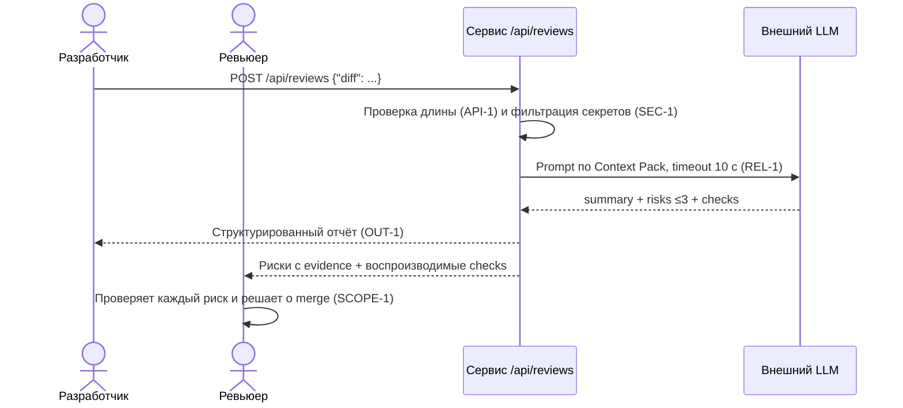

# Use cases и user stories

## Первый рабочий сценарий

**Когда** разработчик отправляет diff PR в сервис ревью, **система** фильтрует секреты, вызывает внешний LLM по правилам Context Pack с таймаутом 10 с и возвращает `summary` + не более трёх рисков с `file`/`line`/`evidence`/`risk` и список проверок, **а пользователь (ревьюер) получает** структурированный отчёт, который может по очереди подтвердить или отклонить, прежде чем решить о merge.

Не входит в этот сценарий:

- approve, merge и редактирование кода (SCOPE-1);
- поиск отдельного GitHub PR и интеграция с GitHub API;
- автоматическое применение изменений по результатам ревью.

## Use case

| Поле | Значение |
|---|---|
| Актор | Разработчик, открывающий PR (инициатор); ревьюер, принимающий решение |
| Триггер | Новый PR / запрос на ревью diff |
| Предусловия | Diff готов; сервис подключён к LLM; правила Context Pack (SEC-1…OBS-1) доступны; diff ≤ 20 000 символов |
| Основной результат | Отчёт: `summary`, массив `risks` (≤3, каждый с `file`, `line`, `evidence`, `risk`), массив `checks` (OUT-1); решение принимает человек (SCOPE-1) |
| Ошибка или отказ | diff >20 000 символов → HTTP 413 (API-1); ошибка/таймаут LLM → контролируемый ответ (REL-1); риск без evidence не включается (QA-1) |



## User stories и acceptance criteria

```gherkin
Feature: Ревью PR помощником ревьюера

  Scenario: Позитивный сценарий — корректный diff
    Given валидный diff длиной не более 20000 символов
    And во внешнем LLM настроены правила Context Pack (SEC-1, API-1, REL-1, OUT-1, QA-1, OBS-1)
    When разработчик отправляет POST /api/reviews с этим diff
    Then сервис возвращает 200
    And ответ содержит summary
    And ответ содержит массив risks из не более трёх элементов
    And каждый риск имеет поля file, line, evidence, risk
    And ответ содержит массив checks
    And каждый риск подтверждён строкой diff или правилом репозитория

  Scenario: Негативный сценарий — секреты в diff
    Given diff содержит тестовый токен и приватный ключ
    When разработчик отправляет POST /api/reviews с этим diff
    Then сервис удаляет секреты перед вызовом LLM
    And в prompt, переданном во внешний LLM, вместо токена и ключа стоит [REDACTED]
    And ответ содержит риск про нарушение SEC-1

  Scenario: Граничный сценарий — слишком длинный diff
    Given diff длиной более 20000 символов
    When разработчик отправляет POST /api/reviews с этим diff
    Then сервис отклоняет запрос с HTTP 413
    And LLM не вызывается

  Scenario: Отказ внешнего LLM
    Given внешний LLM не отвечает дольше 10 секунд
    When разработчик отправляет POST /api/reviews с этим diff
    Then сервис возвращает контролируемый ответ об ошибке, а не HTTP 500
    And запрос логируется с request_id, длительностью и статусом, без содержимого diff и ответа
```

## Как использовали AI

- Для чего: сформулировать первый рабочий сценарий, use case, user stories и Gherkin-сценарии на основе Context Pack
- Тип промпта: zero-shot (P1-01), master prompt (P1-02)
- Строка в [`prompts.md`](prompts.md): P1-01, P1-02
- Что проверили и исправили сами: acceptance criteria в Gherkin покрывают правила SEC-1/API-1/REL-1/OUT-1/QA-1/OBS-1 и границы SCOPE-1; убрали сценарии, не обеспеченные правилами Context Pack