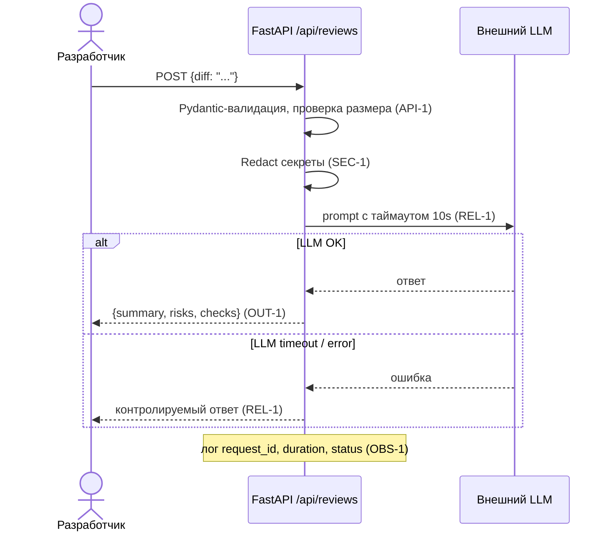

# Use cases и user stories

## Первый рабочий сценарий

**Когда** разработчик отправляет diff на `POST /api/reviews`, **система** валидирует вход (API-1, Pydantic), удаляет секреты (SEC-1), вызывает LLM с таймаутом 10 секунд (REL-1) и возвращает структурированный ответ с `summary`, `risks` и `checks` (OUT-1), **а пользователь получает** контролируемый результат с понятными рисками и проверками.

Не входит в этот сценарий:
- аутентификация и авторизация (выявляется, но не реализуется)
- отправка diff более 20 000 символов (отклоняется на этапе валидации)
- интеграция с GitHub (SCOPE-1: сервис только советует)

## Use case

| Поле | Значение |
|---|---|
| Актор | Backend-разработчик |
| Триггер | POST /api/reviews с телом `{"diff": "..."}` |
| Предусловия | Сервис запущен; diff ≤ 20 000 символов; секреты удалены |
| Основной результат | Структурированный ответ `summary`, `risks`, `checks` (OUT-1) |
| Ошибка или отказ | diff > 20 000 → 413; невалидный payload → 422; LLM timeout → контролируемый ответ (REL-1) |



## User stories и acceptance criteria

```gherkin
Feature: AI-ассистент ревьюера PR

  Scenario: Позитивный — валидный diff возвращает структурированный ответ
    Given разработчик отправляет POST /api/reviews с корректным diff длиной ≤ 20000 символов
    When сервис удаляет секреты, вызывает LLM с таймаутом 10 секунд и получает ответ
    Then ответ содержит summary, risks (не более 3 с полями file, line, evidence, risk) и checks

  Scenario: Негативный — diff превышает лимит 20 000 символов
    Given разработчик отправляет POST /api/reviews с diff длиной 20001 символ
    When сервис проверяет размер diff
    Then ответ возвращает HTTP 413 (API-1)

  Scenario: Граничный — payload без поля diff
    Given разработчик отправляет POST /api/reviews с телом {"other": "value"}
    When сервис валидирует payload через Pydantic-модель
    Then ответ возвращает HTTP 422 с описанием ошибки валидации

  Scenario: Негативный — LLM превышает timeout 10 секунд
    Given LLM задерживает ответ более 10 секунд
    When сервис дожидается ответ с таймаутом
    Then возвращается контролируемый ответ с объяснением ошибки (REL-1)
```

## Как использовали AI

- Для чего: формулировка use cases, user stories и Gherkin-сценариев на основе правил репозитория
- Тип промпта: zero-shot (P1-01), затем уточнение с master prompt (P1-02)
- Строка в `prompts.md`: P1-01, P1-02
- Что проверили и исправили сами: сверили сценарии с каждым правилом (API-1, SEC-1, REL-1, OUT-1, OBS-1)
