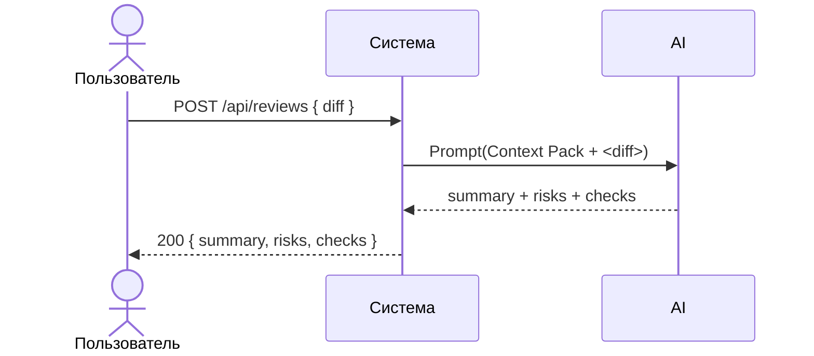

# Use cases и user stories

## Первый рабочий сценарий

Когда ревьюер открывает PR и запускает помощника на diff, система отправляет diff в LLM по master prompt, а пользователь получает структурированный список до трёх рисков с доказательствами и перечень проверок.

Не входит в этот сценарий:

- Автоматическое исправление кода; approve/merge; аутентификация и биллинг; хранение содержимого diff в логах.

## Use case

| Поле | Значение |
|---|---|
| Актор | Ревьюер PR |
| Триггер | Появился новый PR или обновился diff |
| Предусловия | Доступен diff; сервис помощника запущен |
| Основной результат | Получен ответ: summary, ≤3 risks (file, line, evidence, risk), checks |
| Ошибка или отказ | Diff слишком большой (HTTP 413); таймаут LLM (контролируемая ошибка) |



## User stories и acceptance criteria

```gherkin
Feature: Первичное ревью PR помощником

  Scenario: Позитивный ответ с рисками
    Given новый PR и корректный diff
    When ревьюер отправляет diff в сервис
    Then в ответе есть summary, не более трёх risks с file, line, evidence, risk и список checks

  Scenario: Негативный — отсутствует поле diff
    Given тело запроса без поля diff
    When вызываем POST /api/reviews
    Then получаем 422 с сообщением об ошибке валидации

  Scenario: Граничный — diff слишком большой
    Given diff длиной более 20000 символов
    When вызываем POST /api/reviews
    Then получаем 413 Request Entity Too Large
```

## Как использовали AI

- Для чего:
- Тип промпта: master prompt для формулировки сценариев и критериев
- Строка в [`prompts.md`](prompts.md): Master Prompt v1
- Что проверили и исправили сами: ограничили объём ответа, добавили негативные/граничные сценарии по API-1 и REL-1.
