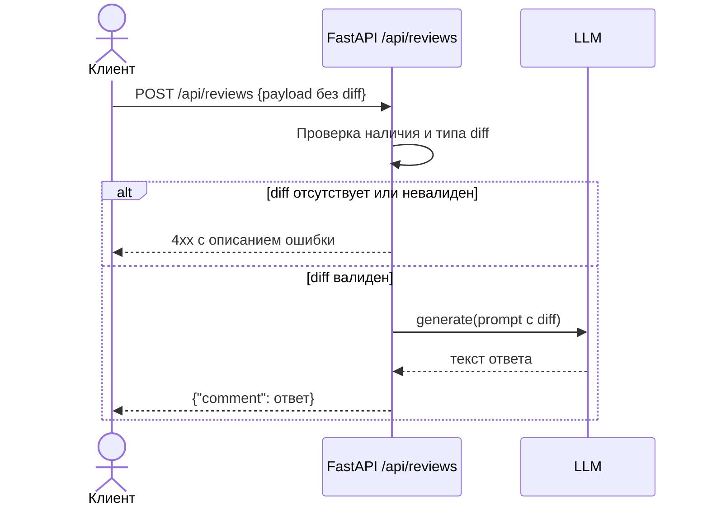

# Use cases и user stories

## Первый рабочий сценарий

**Когда** клиент отправляет `POST /api/reviews` с телом, где отсутствует или некорректен ключ `diff`, **система** возвращает понятную ошибку 4xx с описанием проблемы вместо необработанного `KeyError`/500 (TRAINING_PR.diff:36-37), **а пользователь получает** предсказуемый ответ, по которому можно исправить запрос.

Не входит в этот сценарий:

- изменение формата успешного ответа `{"comment": str}` (TRAINING_PR.diff:22) — рассматривается как отдельный сценарий;
- обработка ошибок самого вызова `llm.generate` (таймаут, лимиты) — отдельный сценарий, описанный в `analysis.md` (TO BE) и `problem.md`.

## Use case

| Поле | Значение |
|---|---|
| Актор | Клиент эндпоинта `/api/reviews` (человек через UI или внешний сервис/CI — конкретный тип не указан в diff, допущение) |
| Триггер | `POST /api/reviews` с телом без ключа `diff` или с `diff`, не являющимся строкой |
| Предусловия | Эндпоинт `/api/reviews` доступен (TRAINING_PR.diff:35) |
| Основной результат | Клиент получает HTTP 4xx с текстом ошибки, объясняющим, что поле `diff` обязательно и должно быть строкой |
| Ошибка или отказ | Без исправления: `payload["diff"]` вызывает `KeyError` → необработанное исключение → HTTP 500 без объяснения (TRAINING_PR.diff:36-37) |



## User stories и acceptance criteria

```gherkin
Feature: Валидация входа эндпоинта /api/reviews

  Scenario: Позитивный
    Given клиент отправляет POST /api/reviews с телом {"diff": "diff --git a/foo.py ..."}
    When запрос обрабатывается сервисом
    Then клиент получает 200 и тело {"comment": "<текст ответа LLM>"}

  Scenario: Негативный или граничный
    Given клиент отправляет POST /api/reviews с телом {} (без ключа diff)
    When запрос обрабатывается сервисом
    Then клиент получает 4xx с сообщением о том, что поле diff обязательно, а не 500 с необработанным KeyError (TRAINING_PR.diff:36-37)
```

## Как использовали AI

- Для чего: сформулировать use case и user stories для первого рабочего сценария (валидация входа) на основе найденных в diff проблем.
- Тип промпта: master prompt.
- Строка в [`prompts.md`](prompts.md): P1-03.
- Что проверили и исправили сами: сценарий ограничен только валидацией входа (самая явная и однозначно подтверждённая diff проблема); формат ответа LLM и остальные риски (SEC, timeout, rate limiting) сознательно не включены в этот use case, чтобы не смешивать несколько сценариев в одном.
