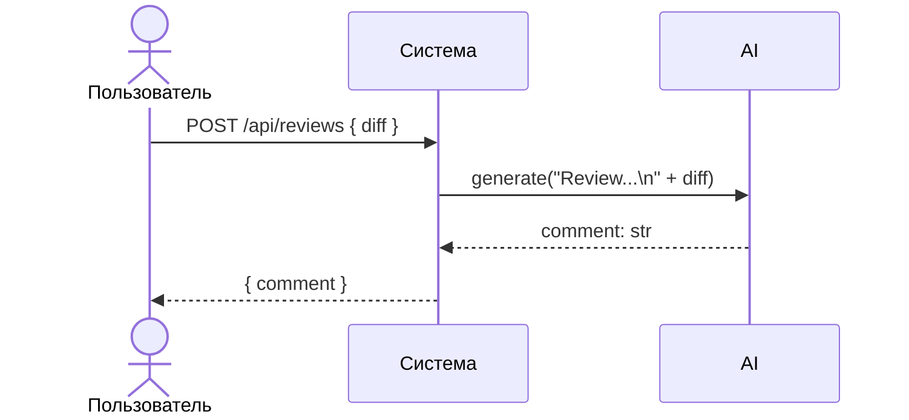

# Use cases и user stories

## Первый рабочий сценарий

**Когда** клиент API отправляет POST `/api/reviews` с JSON, содержащим ключ "diff", **система** передаёт `diff` в сервис рецензии, формирует промпт и получает ответ от LLM, **а пользователь получает** JSON `{"comment": string}`.

Не входит в этот сценарий:

- Аутентификация/авторизация, биллинг, хранение истории и структурирование ответа сверх `{comment: str}` — это за рамками предоставленного diff.

## Use case

| Поле | Значение |
|---|---|
| Актор | Клиент API |
| Триггер | Запрос POST `/api/reviews` с JSON, содержащим ключ `diff` |
| Предусловия | Доступен сервис; клиент формирует корректный JSON с полем `diff` (строка) |
| Основной результат | Возвращён ответ `{"comment": string}` — текст рецензии от LLM |
| Ошибка или отказ | При отсутствии ключа/неверном типе сейчас вероятен 500 (KeyError); в TO BE — 422/413 |



## User stories и acceptance criteria

```gherkin
Feature: Рецензия PR по diff через API

  Scenario: Позитивный — корректный diff
    Given доступен эндпоинт POST /api/reviews
    And сформирован JSON с ключом "diff" и строковым значением
    When клиент отправляет запрос
    Then система возвращает 2xx и JSON с ключом "comment"
    And значение "comment" является строкой

  Scenario: Негативный — отсутствует ключ diff (AS IS поведение)
    Given доступен эндпоинт POST /api/reviews
    And сформирован JSON без ключа "diff"
    When клиент отправляет запрос
    Then в текущей реализации возможно 500 (KeyError)
    And в целевом состоянии ожидается 422 Unprocessable Entity

  Scenario: Граничный — слишком большой diff
    Given доступен эндпоинт POST /api/reviews
    And подготовлен diff размером больше лимита (например, 100 KB)
    When клиент отправляет запрос
    Then в целевом состоянии ожидается 413 Payload Too Large
```

## Как использовали AI

- Для чего: Описать первый use case, user stories и acceptance criteria, строго опираясь на строки TRAINING_PR.diff.
- Тип промпта: master prompt
- Строка в [`prompts.md`](prompts.md): P1-02
- Что проверили и исправили сами: Все утверждения выровнены по TRAINING_PR.diff: endpoint и формат ответа подтверждены строками diff; сценарии TO BE отмечены как целевые, не как текущее поведение.
