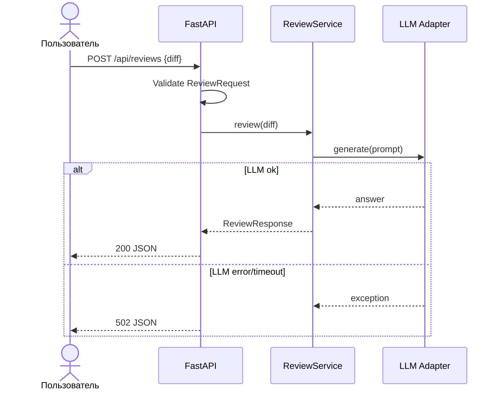

# Use cases и user stories

Файл ведёт OpenCode. Сценарии сформулированы для AI‑помощника ревьюера PR.

## Первый рабочий сценарий

Когда разработчик отправляет POST /api/reviews с корректным diff, система валидирует вход, формирует prompt к LLM, нормализует ответ и возвращает структурированный результат с ≤3 рисками, а пользователь получает предсказуемый JSON для автоматической проверки в CI.

Не входит в этот сценарий:

- Авторизация, интеграции с GitHub/GitLab, хранение истории и UI.

## Use case

| Поле | Значение |
|---|---|
| Актор | Разработчик/CI |
| Триггер | Запрос POST /api/reviews с ReviewRequest |
| Предусловия | Сервис доступен; LLM адаптер настроен; соблюдена схема входа |
| Основной результат | 200 OK и ReviewResponse: summary и ≤3 риска с rule/evidence/check |
| Ошибка или отказ | 422 при нарушении схемы, 502 при сбое LLM |



## User stories и acceptance criteria

```gherkin
Feature: Review PR diff with structured output

  Scenario: Valid diff returns structured review
    Given the service is running
    And a valid ReviewRequest with a non-empty diff
    When I POST it to /api/reviews
    Then I receive 200 OK
    And the response matches ReviewResponse with at most 3 risks

  Scenario: Missing required field returns 422
    Given a payload without the diff field
    When I POST it to /api/reviews
    Then I receive 422 Unprocessable Entity
    And the error details describe the missing field

  Scenario: LLM provider fails returns 502
    Given LLM adapter is configured to raise a timeout
    When I POST a valid ReviewRequest
    Then I receive 502 Bad Gateway
    And the body contains a machine-readable error code
```

## Как использовали AI

- Для чего: оформить первый сценарий, последовательности и критерии приёмки.
- Тип промпта: master prompt с ограничениями на риски и формат.
- Строка в [`prompts.md`](prompts.md): P1-02, P1-03.
- Что проверил студент и какие исправления поручил агенту: согласованы статусы и лимит рисков, уточнены шаги alt/else в sequence.
