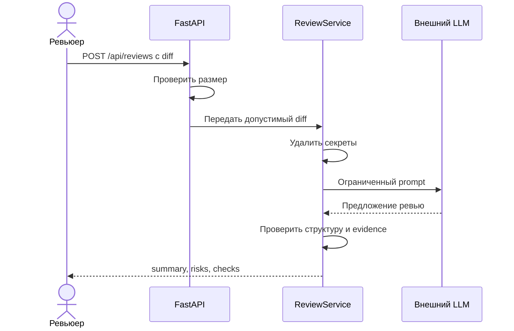

# Use cases и user stories

Файл ведёт OpenCode. Обсудите с агентом содержание и проверьте предложенный diff. Все дополнения и исправления поручайте агенту в чате.

## Первый рабочий сценарий

**Когда** человек отправляет diff одного PR, **система** проверяет вход, удаляет секреты, получает ограниченную рекомендацию LLM и проверяет её формат, **а пользователь получает** summary, до трёх доказуемых рисков и список проверок.

Не входит в этот сценарий:

- автоматическое изменение кода;
- approve или merge PR;
- выбор конкретного LLM-провайдера;
- анализ файлов за пределами переданного diff.

## Use case

| Поле | Значение |
|---|---|
| Актор | Человек-ревьюер PR |
| Триггер | Отправка `POST /api/reviews` с diff |
| Предусловия | Endpoint доступен; передан diff одного PR; внешний LLM настроен |
| Основной результат | Пользователь получает `summary`, не более трёх `risks` с evidence и массив `checks` |
| Ошибка или отказ | Слишком большой diff отклонён до LLM; ошибка или timeout LLM дают контролируемый ответ |



## User stories и acceptance criteria

```gherkin
Feature: Проверяемая рекомендация по diff

  Scenario: Валидный diff
    Given передан diff не длиннее 20000 символов без реальных секретов
    And LLM возвращает ответ требуемой структуры
    When ревьюер вызывает POST /api/reviews
    Then ответ содержит summary, risks и checks
    And risks содержит не больше трех элементов
    And у каждого риска есть file, line, evidence и risk

  Scenario: Слишком большой diff
    Given передан diff длиной 20001 символ
    When ревьюер вызывает POST /api/reviews
    Then API возвращает HTTP 413
    And внешний LLM не вызывается

  Scenario: Ошибка внешнего LLM
    Given внешний LLM завершает вызов ошибкой или дольше 10 секунд
    When ревьюер вызывает POST /api/reviews
    Then сервис возвращает контролируемый ответ
    And решение по PR не принимается автоматически
```

## Как использовали AI

- Для чего: превратить проблему в один пользовательский сценарий и проверяемые acceptance criteria.
- Тип промпта: контекстный master prompt.
- Строка в [`prompts.md`](prompts.md): P1-03.
- Что проверил студент и какие исправления поручил агенту: сценарии согласованы с `API-1`, `REL-1`, `OUT-1` и `SCOPE-1`; неподтверждённые действия GitHub исключены.
