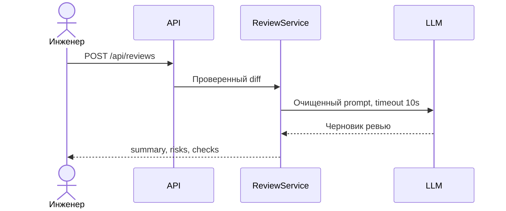

# Use cases и user stories

## Первый рабочий сценарий

**Когда** инженер отправляет допустимый diff, **система** очищает его, получает ограниченное по времени ревью и проверяет структуру, **а пользователь получает** summary, не более трёх доказанных рисков и список checks.

Не входит: изменение кода, approve, merge и действия в GitHub.

## Use case

| Поле | Значение |
|---|---|
| Актор | Инженер-ревьюер |
| Триггер | `POST /api/reviews` с `diff` |
| Предусловия | Непустой diff длиной не более 20 000 символов |
| Основной результат | Структурированное ревью по `OUT-1` |
| Ошибка или отказ | 4xx для неверного тела, 413 для длинного diff, контролируемая ошибка при timeout LLM; точный контракт timeout нужно согласовать |



## User stories и acceptance criteria

```gherkin
Feature: Безопасное автоматическое ревью diff

  Scenario: Допустимый diff
    Given diff длиной не более 20000 символов
    When клиент отправляет POST /api/reviews
    Then ответ содержит summary, risks и checks
    And risks содержит не более 3 элементов с evidence

  Scenario: Слишком длинный diff
    Given diff длиной 20001 символ
    When клиент отправляет POST /api/reviews
    Then сервис возвращает HTTP 413
    And LLM не вызывается

  Scenario: Timeout внешнего LLM
    Given LLM не отвечает 10 секунд
    When обрабатывается допустимый diff
    Then сервис возвращает контролируемую ошибку
    And содержимое diff не попадает в лог
```

## Как использовали AI

- Для чего: вывести сценарии и критерии приёмки из правил кейса.
- Тип промпта: R.C.T.F.
- Строка в [`prompts.md`](prompts.md): `P1-03`.
- Проверка человеком: сценарии не расширяют полномочия сервиса за `SCOPE-1`.
