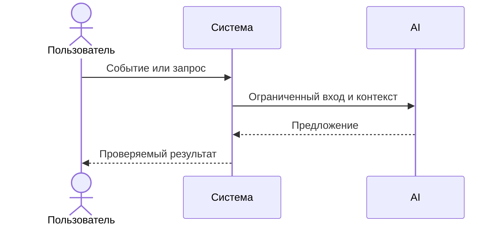

# Use cases и user stories

## Первый рабочий сценарий

Когда пользователь или CI отправляет валидный diff на API `/api/reviews`, система валидирует размер и наличие поля, маскирует секреты, вызывает LLM с таймаутом и возвращает структурированный результат формата OUT-1, а пользователь получает краткое резюме, до трёх подтверждённых рисков и список проверок.

Не входит в этот сценарий:

- Автоматическое принятие решений (approve/merge), изменение кода, правки в репозитории, любые действия в GitHub

## Use case

| Поле | Значение |
|---|---|
| Актор | Ревьюер или CI |
| Триггер | Появился diff PR, требуется первичная проверка |
| Предусловия | Доступен API сервиса; diff ≤ 20 000 символов |
| Основной результат | Структурированный ответ OUT-1: `summary`, `risks` (≤3, с evidence), `checks` |
| Ошибка или отказ | HTTP 413 при превышении размера; контролируемый ответ при таймауте LLM |



## User stories и acceptance criteria

```gherkin
Feature: Первичное ревью PR диффа

  Scenario: Позитивный ответ в формате OUT-1
    Given валидный diff длиной менее 20000 символов
    When я отправляю POST /api/reviews с полем diff
    Then я получаю JSON с полями summary, risks (не более трёх) и checks
    And каждый risk содержит file, line, evidence, risk

  Scenario: Граничный размер диффа
    Given diff длиной 20001 символ
    When я отправляю POST /api/reviews
    Then я получаю статус 413 и сообщение об ограничении размера

  Scenario: Таймаут LLM
    Given сервис LLM не отвечает более 10 секунд
    When выполняется review
    Then я получаю контролируемый ответ без падения API
```

## Как использовали AI

- Для чего:
- Тип промпта: master prompt
- Строка в [`prompts.md`](prompts.md): P1-03
- Что проверили и исправили сами: сценарии выведены из CASE.md правил и текущего кода TRAINING_PR.diff; не добавляли нефактические шаги
