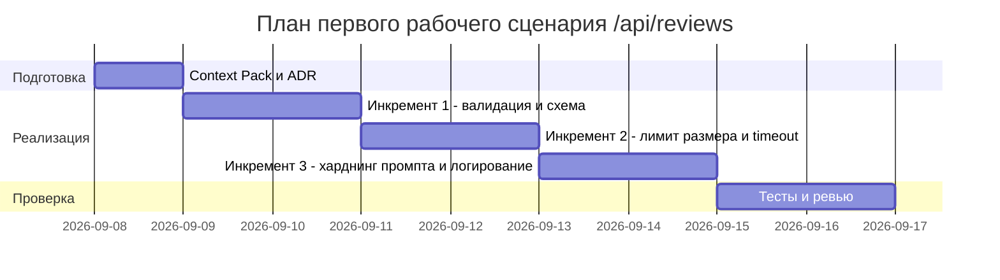

# План поставки

## Инкременты и ответственность

| Инкремент | Наблюдаемый результат | Что делает человек | Что делает AI или субагент | Проверка | Зависимости |
|---|---|---|---|---|---|
| 1 | `ReviewRequest`/`ReviewResponse` на Pydantic, 422 на невалидный вход, статус 201 на успех | Ревьюит и мержит PR, подтверждает контракт API | Пишет схемы и обновляет route по master prompt из [`adr.md`](adr.md) | unit- и integration-тесты на валидацию (см. [`tests_unit.md`](tests_unit.md), [`tests_integration.md`](tests_integration.md)) | Нет |
| 2 | Лимит размера `diff` (413) и timeout/обработка ошибок LLM-вызова | Утверждает пороги (20 000 символов, 10 секунд из `API-1`/`REL-1`) | Реализует проверку размера и `try/except` + timeout вокруг `llm.generate` | unit-тест на лимит размера, тест таймаута с моком LLM | Инкремент 1 (нужна Pydantic-модель для валидатора размера) |
| 3 | Харднинг промпта (редактирование секретов по `SEC-1`) и логирование по `OBS-1` | Формулирует и принимает правило `SEC-1`/`OBS-1` | Реализует sanitizer diff и структурированный prompt-template | тест: diff с тестовым токеном → токен заменён на `[REDACTED]`; лог не содержит содержимого diff или ответа | Инкремент 1 |

## Диаграмма Ганта

## Как использовали AI

- Для чего: разбить решение из [`adr.md`](adr.md) на независимо проверяемые инкременты с явным разделением ответственности человек/AI.
- Тип промпта: master prompt.
- Строка в [`prompts.md`](prompts.md): P1-02.
- Что проверили и исправили сами: убедились, что каждый инкремент закрывает ровно один риск из P1-02 (`P1_02.txt`) и что порядок зависимостей соответствует тому, что лимит размера и timeout физически не встроить без Pydantic-слоя из инкремента 1.
