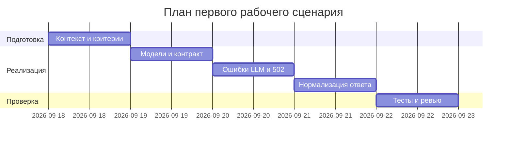

# План поставки

Файл ведёт OpenCode. План ориентирован на выпуск первого рабочего сценария с валидацией и обработкой ошибок.

## Инкременты и ответственность

| Инкремент | Наблюдаемый результат | Что делает человек | Что делает AI или субагент | Проверка | Зависимости |
|---|---|---|---|---|---|
| 1 | Pydantic-модели ReviewRequest/Response, response_model на эндпоинте | Определяет модели, обновляет API | Генерирует шаблоны моделей/валидаторов | pytest unit: валидация полей; curl 422 | TRAINING_PR.diff |
| 2 | Перехват исключений LLM и маппинг 502 | Реализует адаптер/обработчик ошибок | Предлагает обработку, формулирует коды/сообщения | integration: мок LLM -> 502 | Инкремент 1 |
| 3 | Структурированные риски и лимит ≤3 | Нормализует ответ ReviewService | Проверяет соответствие схемы | unit: нормализация; e2e: 200 | Инкремент 1–2 |

## Диаграмма Ганта

## Как использовали AI

- Для чего: разложить выпуск по инкрементам, ответственности и проверкам.
- Тип промпта: структурирующие запросы с master prompt.
- Строка в [`prompts.md`](prompts.md): P1-03.
- Что проверил студент и какие исправления поручил агенту: согласованы зависимости и критерии готовности, расставлены проверки на каждый инкремент.
