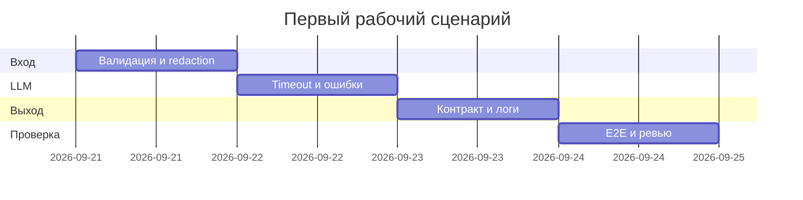

# План поставки

## Инкременты и ответственность

| Инкремент | Наблюдаемый результат | Человек | AI | Проверка | Зависимости |
|---|---|---|---|---|---|
| 1. Вход | Схема, лимит 20 000, redaction | Утверждает правила и код | Предлагает случаи | Unit tests `SEC-1`, `API-1` | `CASE.md` |
| 2. LLM | Timeout и контролируемая ошибка | Реализует клиент | Предлагает mock-сценарии | Integration test `REL-1` | Инкремент 1 |
| 3. Выход | Схема `OUT-1`, evidence, безопасный лог | Принимает результат | Черновик рисков/checks | E2E и log capture | Инкременты 1–2 |

## Диаграмма Ганта

## Как использовали AI

- Для чего: разбить изменение на проверяемые инкременты.
- Тип промпта: Tree of Thoughts.
- Строка в [`prompts.md`](prompts.md): `P1-03`.
- Проверка человеком: AI не назначен владельцем решения или merge.
