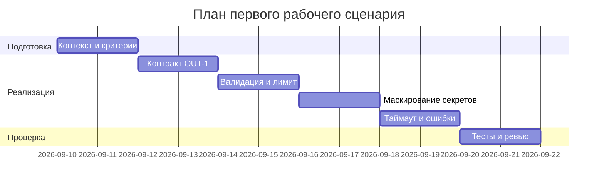

# План поставки

## Инкременты и ответственность

| Инкремент | Наблюдаемый результат | Что делает человек | Что делает AI или субагент | Проверка | Зависимости |
|---|---|---|---|---|---|
| 1 | Контракт OUT-1 на выходе ReviewService | Определяет схему и тесты | Предлагает формат и примеры | Контрактные unit-тесты | CASE.md OUT-1 |
| 2 | Валидация входа и лимит 20k | Уточняет граничные случаи | Генерирует негативные кейсы | API-тесты (413) | CASE.md API-1 |
| 3 | Маскирование секретов при отправке LLM | Определяет паттерны маскировки | Предлагает шаблоны redaction | Интеграционные тесты | CASE.md SEC-1 |
| 4 | Таймаут 10s и graceful error | Выбирает подход реализации | Помогает с обработкой ошибок | Интеграционные тесты отказа | CASE.md REL-1 |
| 5 | Документация и E2E | Сверяет артефакты | Генерирует черновики | E2E сценарии проходят | Пред. инкременты |

## Диаграмма Ганта

Замените даты и задачи на свой план.

## Как использовали AI

- Для чего:
- Тип промпта: master prompt
- Строка в [`prompts.md`](prompts.md): P1-03
- Что проверили и исправили сами: задачи выведены из CASE.md; тайминг условный, без обязательств; без догадок о внешней инфраструктуре
