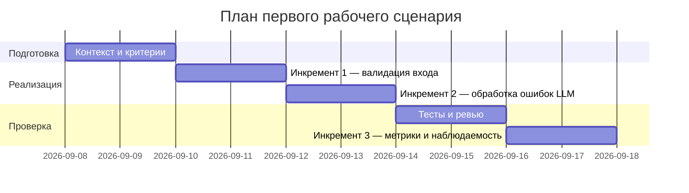

# План поставки

## Инкременты и ответственность

| Инкремент | Наблюдаемый результат | Что делает человек | Что делает AI или субагент | Проверка | Зависимости |
|---|---|---|---|---|---|
| 1 | Запрос без валидного `diff` возвращает 4xx вместо 500 (устраняет TRAINING_PR.diff:36-37) | Инженер добавляет валидацию входа (Pydantic-модель или явную проверку) и код-ревью | AI-ассистент предлагает вариант проверки и сценарии тестов на основе `problem.md`/`product_management.md` | integration-тест из `tests_integration.md`: запрос `{}` → 4xx | нет |
| 2 | Ошибки `llm.generate` (таймаут, исключение) не приводят к падению сервиса, а возвращают контролируемый ответ (устраняет TRAINING_PR.diff:21) | Инженер добавляет try/except и timeout вокруг вызова LLM, ревью | AI-ассистент предлагает набор unit-тестов с моками падающего/зависающего LLM (`tests_unit.md`) | unit-тест: мок LLM бросает исключение → сервис возвращает контролируемый ответ, а не пробрасывает исключение | Инкремент 1 (использует ту же точку входа `ReviewService.review`) |
| 3 | Метрика доли 5xx из-за `diff` и доля необработанных исключений `llm.generate` измеряются и снижаются к целевым значениям (см. `problem.md`) | Инженер настраивает логирование статусов и подключает дашборд/алерт | AI-ассистент помогает сформулировать запросы к логам для расчёта метрик | Наблюдение метрик из `problem.md` за первую неделю после деплоя инкрементов 1–2 | Инкременты 1 и 2 |

## Диаграмма Ганта

## Как использовали AI

- Для чего: разбить устранение найденных в diff проблем на инкременты с наблюдаемым результатом и распределить роли человека/AI.
- Тип промпта: master prompt.
- Строка в [`prompts.md`](prompts.md): P1-03.
- Что проверили и исправили сами: даты в диаграмме Ганта — условный план (не факт из diff), явно помечены как план, а не как согласованные сроки; порядок инкрементов подобран так, чтобы каждый следующий зависел только от ранее устранённой проблемы, а не от недоступных источников.
