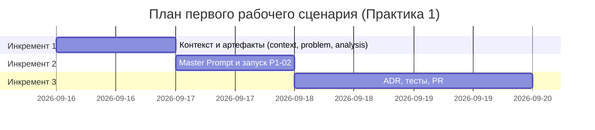

# План поставки

## Инкременты и ответственность

| Инкремент | Наблюдаемый результат | Что делает человек | Что делает AI или субагент | Проверка | Зависимости |
|---|---|---|---|---|---|
| 1 — Context Pack и артефакты | Заполнены `context.md`, `problem.md`, `analysis.md`; выявлены правила `SEC-1`…`OBS-1` и Open Questions | Читает `CASE.md`, формулирует проблему и метрики, проверяет артефакты вручную | Zero-shot (P1-01): анализирует diff, находит технические риски, ставит Open Questions | Каждое правило найдено в `CASE.md`; нет выдуманных фактов | — |
| 2 — Master Prompt и второй запуск | Заполнен `prompts.md` (P1-02); master prompt содержит все 8 разделов | Собирает master prompt из артефактов инкремента 1, запускает P1-02, сравнивает два ответа | Master prompt (P1-02): ревью того же diff с полным контекстом и правилами | P1-02 содержит `summary`, ≤3 risks с `file`, `line`, `evidence`; каждый risk ссылается на diff или правило | Инкремент 1 завершён |
| 3 — Тесты и ADR | Заполнены `adr.md`, `tests_*.md`; тесты покрывают `SEC-1`, `API-1`, `REL-1`, `QA-1` | Проверяет тесты на соответствие правилам, при необходимости исправляет | AI помогает сформулировать тест-кейсы по правилам из Context Pack | `make test` проходит без ошибок | Инкременты 1–2 завершены |

## Диаграмма Ганта

## Как использовали AI

- Для чего: определение инкрементов на основе структуры практики и результата P1-01.
- Тип промпта: zero-shot (P1-01) — ответ использован для понимания объёма работы.
- Строка в [`prompts.md`](prompts.md): P1-01.
- Что проверили и исправили сами: даты выставлены вручную по реальному графику практики; роли человека и AI разделены явно, чтобы не создавалось впечатления, что AI делает всё.
