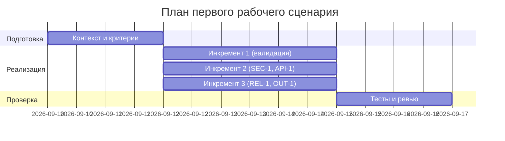

# План поставки

## Инкременты и ответственность

| Инкремент | Наблюдаемый результат | Что делает человек | Что делает AI или субагент | Проверка | Зависимости |
|---|---|---|---|---|---|
| 1 | Схема Pydantic для входа и 422 на неверный ввод | Проектирует модель, пишет валидацию | Генерирует черновик схемы и тест-кейсов | Unit: 422 на отсутствующий diff; Integration: 200 на валидный | TRAINING_PR.diff, CASE.md (OUT-1, QA-1) |
| 2 | Ограничение длины (413) и редактирование секретов | Реализует middleware/пре-процессор | Генерирует регексы/паттерны редактирования | Integration: >20000 → 413; Unit: [REDACTED] | CASE.md (SEC-1, API-1) |
| 3 | Таймаут 10с и структурированный ответ OUT-1 | Оборачивает вызов LLM, оформляет контракт ответа | Предлагает шаблон сериализации и мок LLM | Integration: таймаут → контролируемый ответ; E2E happy path | CASE.md (REL-1, OUT-1) |

## Диаграмма Ганта

## Риски и митигации

- Риск: неподготовленные паттерны редактирования секретов → Митигация: начать с базовых токен-паттернов, добавить конфигурацию и тесты.
- Риск: рост времени ответа при пиковых нагрузках → Митигация: ограничение длины diff, документирование SLA, переход к очереди в будущем спринте.
- Риск: несоответствие контракта OUT-1 при неожиданных ответах LLM → Митигация: строгий маппинг и валидация ответа перед возвратом.

## Роли команды

- Product/PM (человек): приоритизация stories, принятие решений по рискам.
- Backend (человек): реализация схемы, middleware, обёрток таймаута.
- QA (человек): проектирование и запуск тестов unit/integration/e2e.
- AI-ассистент: генерация черновиков схем, шаблонов ответов, тест-кейсов; подготовка моков и сценариев нагрузки.

## Как использовали AI

- Для чего: разложить объем по трем инкрементам и распределить роли
- Тип промпта: master (Role + Context Pack)
- Строка в [`prompts.md`](prompts.md): prompts.md#master-2
- Что проверили и исправили сами: согласовали зависимости с CASE.md и метриками problem.md
