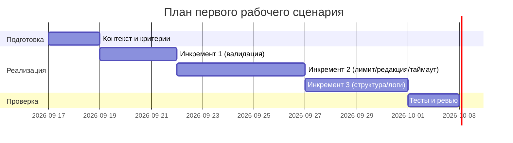

# План поставки

## Инкременты и ответственность

| Инкремент | Наблюдаемый результат | Что делает человек | Что делает AI или субагент | Проверка | Зависимости |
|---|---|---|---|---|---|
| 1. Контракт API и валидация | Описание схемы запроса/ответа; 422 на невалидное тело | Формализует контракт, пишет спецификацию и AC | Генерирует черновики схем и AC | Интеграционный тест: `{}` → 422 | CASE.md правила OUT-1, API-1 |
| 2. Подготовка diff и вызов LLM | Лимит 20 000 символов; redaction секретов; таймаут 10с; HTTP 502 при сбое LLM | Уточняет правила redaction и утверждает контракт ошибки | Предлагает паттерны redaction и обработку ошибок | Unit: 19 999/20 000/20 001; integration: исключение/timeout → `LLM_UPSTREAM_ERROR` | Зависит от инкремента 1 |
| 3. Преобразование ответа и наблюдаемость | Структура summary/risks/checks; безопасные логи | Описывает формат и проверяемые поля | Помогает с шаблоном преобразования | Юнит на структуру; проверка логгера на отсутствие diff/LLM ответа | Зависит от инкремента 1–2 |

## Диаграмма Ганта

Даты примерные; фактический план уточняется по результатам ревью.

## Как использовали AI

- Для чего: разбиение на инкременты, формулировка наблюдаемых результатов и проверок.
- Тип промпта: master prompt.
- Строка в [`prompts.md`](prompts.md): P1-02.
- Что проверили и исправили сами: синхронизировали план с CASE.md, добавили зависимость статусов/лимита/редакции.
