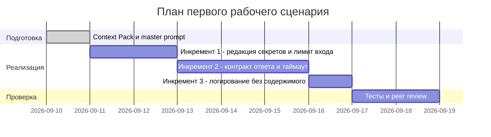

# План поставки

Инкременты нарезаны по правилам `CASE.md`, а не по слоям кода. Порядок задан тяжестью нарушения: пока `SEC-1` не закрыт, каждый вызов утекает содержимое диффа во внешний LLM, поэтому улучшать качество ревью раньше бессмысленно.

## Инкременты и ответственность

| Инкремент | Наблюдаемый результат | Что делает человек | Что делает AI или субагент | Проверка | Зависимости |
|---|---|---|---|---|---|
| 1. Безопасный вход (`SEC-1`, `API-1`) | дифф с тестовым токеном уходит в промпт как `[REDACTED]`; дифф в 20 001 символ получает HTTP 413, LLM не вызывается | задаёт список форматов секретов и порог длины, принимает решение о merge | предлагает regex-набор для редактора и черновик отсечки | unit-проверки `SEC-1` и `API-1` из [`tests_unit.md`](tests_unit.md) | нет |
| 2. Контракт и устойчивость (`REL-1`, `OUT-1`, `QA-1`) | ответ сервиса это валидный JSON `summary`/`risks`/`checks`; риск без evidence в диффе отбрасывается; провайдер, молчащий 11 секунд, даёт контролируемый ответ | утверждает схему ответа и порог таймаута, разбирает отклонённые ответы | формирует кандидатов в `risks` по master prompt | unit- и integration-проверки контракта, [`adr.md`](adr.md) | 1 |
| 3. Наблюдаемость (`OBS-1`) | в логе только `request_id`, длительность и статус; содержимого диффа и ответа модели в логе нет | определяет состав полей лога | не участвует | unit-проверка `OBS-1`, ручной просмотр лога после E2E | 2 |

Колонки «человек» и «AI» это заготовка блока 5 master prompt. Правило одно: AI формирует кандидатов и черновики, человек утверждает пороги и принимает решения. Ни в одном инкременте у AI нет права записи в GitHub (`SCOPE-1`).

## Диаграмма Ганта

Даты оценочные, отсчёт от 2026-09-10. Длительности проставлены по объёму работ, реального окна сдачи в них не заложено.

## Как использовали AI

- Для чего: разложить правила Context Pack на инкременты с наблюдаемым результатом; порядок задан тяжестью нарушений, подтверждённых в `P1-02`.
- Тип промпта: master prompt (`P1-02`), из него взят состав правил.
- Строка в [`prompts.md`](prompts.md): `P1-02`.
- Что проверили и исправили сами: у каждого инкремента в колонке результата стоит наблюдаемый факт, а не «реализована функция»: иначе готовность нечем подтвердить. Порядок инкрементов ставили по тяжести нарушения, а не по удобству реализации. Даты пометили оценочными: реальное окно сдачи ДЗ в план не заложено, выдавать его за настоящий срок нельзя.
