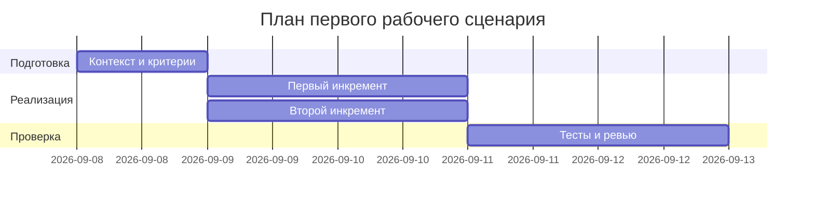

# План поставки

## Инкременты и ответственность

| Инкремент | Наблюдаемый результат | Что делает человек | Что делает AI или субагент | Проверка | Зависимости |
|---|---|---|---|---|---|
| 1. Базовая валидация и контракт | Эндпоинт принимает Pydantic-модель, ограничение размера и формат ответа | Определяет модель запроса/ответа, лимит, секьюрную обработку | Генерирует каркас моделей и схемы, подсказки по валидации | Интеграционные тесты на 422/400 и 413 | TRAINING_PR.diff, FastAPI |
| 2. Улучшение обработки ошибок и тестов | Контролируемые ошибки LLM-таймаута, негативные тесты | Настраивает таймаут обёртки, моки LLM | Предлагает шаблон моков и статусы ошибок | Интеграционный тест на таймаут и 5xx, юнит-тесты сервиса | Пункт 1 |
| 3. Документация и подготовка к ревью | Заполнены analysis.md, adr.md, tests_* и prompts.md | Редактирует документы, проводит самопроверку | Черновики по шаблону, проверка полноты | Просмотр артефактов и чек-лист | Пункт 1–2 |

## Диаграмма Ганта

Замените даты и задачи на свой план.

## Как использовали AI

- Для чего: сформировать минимальный план трёх инкрементов с проверками и ролями без выхода за рамки учебного кейса.
- Тип промпта: master prompt (P1-03).
- Строка в [`prompts.md`](prompts.md): P1-03.
- Что проверили и исправили сами: синхронизировали проверки с правилами CASE, уточнили зависимости и статусы проверок.
