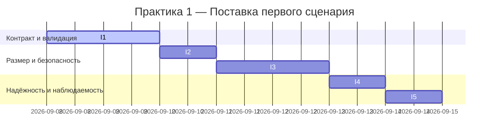

# План поставки

## Инкременты и ответственность

| Инкремент | Наблюдаемый результат | Что делает человек | Что делает AI или субагент | Проверка | Зависимости |
|---|---|---|---|---|---|
| I1: Валидация и контракт OUT-1 | 422 для неверного запроса; 200 с OUT-1 для валидного | Определяет Pydantic-схему запроса/ответа, покрывает тестами | Генерирует черновик схем/валидаций | Интеграционные тесты 422/200; валидация структуры OUT-1 | CASE.md, TRAINING_PR.diff |
| I2: API-1 лимит 20000 | 413 при `len(diff) > 20000` | Добавляет проверку длины и тест | Подсказывает edge-cases и примеры | Интеграционный тест 413 и 200 при пограничных значениях | I1 |
| I3: SEC-1 маскирование | В промпте к LLM секреты заменены на `[REDACTED]` | Реализует маскирование по паттернам | Генерирует паттерны и примеры | Юниты на паттерны; интеграция с мок-LLM | I1 |
| I4: REL-1 таймаут и ошибки | 504 при >10с; 502 при исключении провайдера | Настраивает таймаут, обработку исключений | Генерирует обвязку моков | Интеграционные тесты 502/504 | I1 |
| I5: Наблюдаемость OBS-1 | Логи без diff и содержимого ответа | Настраивает логгер и кореляцию request_id | Предлагает формат логов | Code review + юнит на отсутствие секретов | I1 |

## Диаграмма Ганта

## Как использовали AI

- Для чего: составление инкрементов поставки, распределение ответственности и построение диаграммы Ганта с учётом правил SEC-1, API-1, REL-1, OUT-1, OBS-1.
- Тип промпта: Master Prompt v2
- Строка в [`prompts.md`](prompts.md): P1-04
- Что проверили и исправили сами: проверили корректность колонок таблицы (их шесть), валидность Mermaid gantt и отсутствие изменений заголовков.
