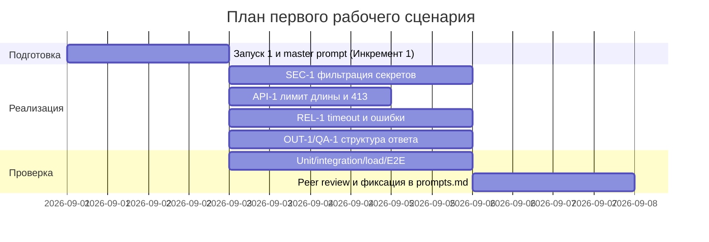

# План поставки

## Инкременты и ответственность

| Инкремент | Наблюдаемый результат | Что делает человек | Что делает AI или субагент | Проверка | Зависимости |
|---|---|---|---|---|---|
| 1 | Безопасный вход: diff очищается от секретов перед вызовом LLM (SEC-1); сценарии P1-01 и master prompt зафиксированы в `prompts.md` | Утверждает правила Context Pack; определяет список секретов для фильтрации | Запуск 1 (zero-shot) и сборка master prompt v1; прототип фильтра `[REDACTED]` | POST diff с тестовым token → в prompt `[REDACTED]` | Токен OpenCode, доступ к LLM |
| 2 | Ограничение входных данных: diff > 20 000 символов отклоняется с HTTP 413 (API-1) | Задаёт порог (20 000) и формат ошибки | Реализует проверку длины на входе эндпоинта | POST diff длиной 25 000 символов → 413, LLM не вызван | Инкремент 1 |
| 3 | Надёжный вызов: timeout 10 с и контролируемый ответ при ошибке LLM (REL-1); логирование только `request_id`/длительность/статус (OBS-1) | Определяет контракт ошибок и содержимое логов; решает критерии приёмки | Реализует timeout, обработку ошибки, клиент логов без содержимого diff/ответа | Мок LLM «спит/падает» → контролируемый ответ, не 500; лог без diff и ответа | Инкременты 1–2 |
| 4 | Структурированный результат: `summary` + `risks` (≤3, `file`/`line`/`evidence`/`risk`) + `checks` (OUT-1), риски только с evidence (QA-1) | Проверяет каждый риск по evidence; принимает решение о merge (SCOPE-1) | Форматирует ответ LLM по OUT-1; отфильтровывает риски без evidence | Сверка ключей JSON с OUT-1; diff без нарушений → 0 risks | Инкремент 3 |
| 5 | Комплект проверок: unit, integration, load, E2E; демонстрация пользователю | Прогоняет E2E-сценарии и принимает первую версию | Готовит проверки по каждому правилу и автотесты | `make test`; E2E-сценарии из `tests_e2e.md` | Инкременты 1–4 |

## Разделение ролей

- **Человек (ревьюер/разработчик):** определяет правила и границы (SEC-1…OBS-1), утверждает пороги и форматы, проверяет каждый риск по evidence, принимает единственное решение о merge или отказе. Никогда не передаёт решение AI.
- **AI/субагент:** анализирует diff строго по Context Pack, возвращает `summary` + ≤3 `risks` с `file`/`line`/`evidence`/`risk` + `checks`; не approve, не merge и не правит код (SCOPE-1).
- **Человек + AI:** совместно фиксируют два запуска (P1-01 zero-shot, P1-02 master prompt), сравнивают по доказательности и воспроизводимым проверкам.

## Диаграмма Ганта

## Как использовали AI

- Для чего: разбить поставку помощника ревьюера на инкременты, распределить роли человека и AI и построить план (Гант)
- Тип промпта: zero-shot (P1-01), master prompt (P1-02)
- Строка в [`prompts.md`](prompts.md): P1-01, P1-02
- Что проверили и исправили сами: каждый инкремент заканчивается наблюдаемым результатом и проверкой по правилам Context Pack; решение о merge остаётся за человеком, а не за инкрементом AI