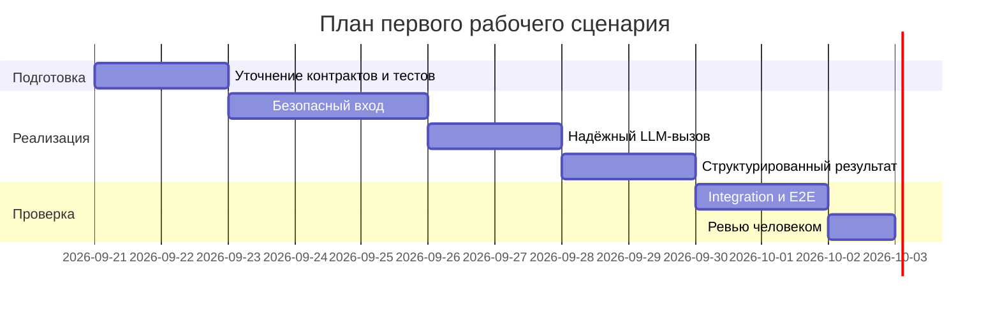

# План поставки

Файл ведёт OpenCode. Обсудите с агентом содержание и проверьте предложенный diff. Все дополнения и исправления поручайте агенту в чате.

## Инкременты и ответственность

| Инкремент | Наблюдаемый результат | Что делает человек | Что делает AI или субагент | Проверка | Зависимости |
|---|---|---|---|---|---|
| 1. Безопасный вход | Большой diff отклоняется, секреты не попадают в prompt | Уточняет список секретов и принимает API-контракт | Предлагает граничные случаи и тесты | Unit и integration-тесты `SEC-1`, `API-1` | Согласованный Context Pack |
| 2. Надёжный вызов | Timeout и ошибка LLM завершаются контролируемо | Определяет формат error response | Проверяет негативные сценарии и непротиворечивость | Mock LLM с задержкой и исключением | Инкремент 1 |
| 3. Проверяемый результат | Ответ соответствует `OUT-1`, решение остаётся за человеком | Проверяет evidence и принимает результат | Формирует черновик ревью и валидирует структуру | Contract и E2E-тесты, ручное ревью | Инкременты 1–2 |

## Диаграмма Ганта

Даты показывают порядок и оценку длительности учебного сценария, а не согласованный production-релиз.

## Как использовали AI

- Для чего: разбить изменение на наблюдаемые инкременты и разделить ответственность человека и AI.
- Тип промпта: декомпозиция с ограничениями Context Pack.
- Строка в [`prompts.md`](prompts.md): P1-03.
- Что проверил студент и какие исправления поручил агенту: каждый инкремент имеет проверку и зависимость; решение по контрактам и итоговое ревью оставлены человеку.
