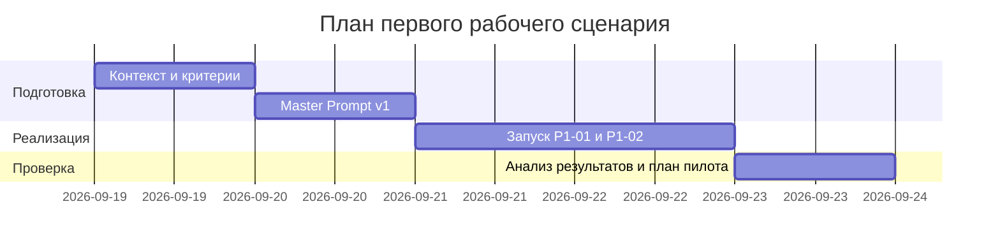

# План поставки

Файл ведёт OpenCode. Обсудите с агентом содержание и проверьте предложенный diff. Все дополнения и исправления поручайте агенту в чате.

## Инкременты и ответственность

| Инкремент | Наблюдаемый результат | Что делает человек | Что делает AI или субагент | Проверка | Зависимости |
|---|---|---|---|---|---|
| 1 | Согласованы контекст, метрики и Master Prompt v1 | Подтверждает язык, границы и метрики | Формирует структуру ответа и правила | Просмотр diff изменений и запуск P1-01/P1-02 | Настроенный провайдер |
| 2 | Структурированный отчёт по diff (описание, ≤3 пункта, проверки) | Проверяет выводы, принимает решение | Анализирует diff и готовит отчёт | Ручная верификация по diff; метрика доли подтверждённых рисков | Master Prompt v1 |
| 3 | План проверки пилота по времени ревью | Выбирает набор задач, сравнивает времена | Предлагает шаги проверок | Фиксация гипотезы −20% к медиане без выдачи за факт | Контекст и инструменты измерения |

## Диаграмма Ганта

Передайте OpenCode даты и задачи своего плана и попросите обновить диаграмму.

## Как использовали AI

- Для чего: спланировать инкременты учебного кейса с человеком в контуре.
- Тип промпта: структурированный запрос (Build-сессия).
- Строка в [`prompts.md`](prompts.md): P1-04.
- Что проверил студент и какие исправления поручил агенту: реалистичность задач и зависимостей; разделение ролей человека и AI.
