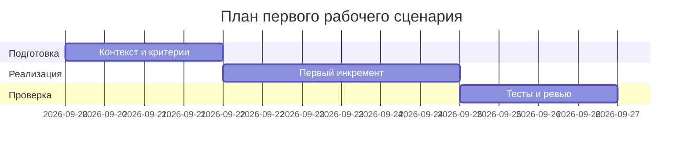

# План поставки

## Инкременты и ответственность

| Инкремент | Наблюдаемый результат | Что делает человек | Что делает AI или субагент | Проверка | Зависимости |
|---|---|---|---|---|---|
| 1 | Собран Context Pack и Master Prompt v1 | Ставит правила и формат | Генерирует структуру промпта по шаблону | P1‑02 запускается и даёт структурный ответ | CASE.md, TRAINING_PR.diff |
| 2 | Добавлены тестовые сценарии и проверки | Формализует критерии | Предлагает негативные/граничные кейсы | Таблицы tests_*.md заполнены | Инкремент 1 |
| 3 | Связность артефактов и план поставки | Связывает ссылки и DoD | Проверяет полноту | Все ссылки между файлами рабочие | 1, 2 |

## Диаграмма Ганта

Замените даты и задачи на свой план.

## Как использовали AI

- Для чего:
- Тип промпта: master prompt для синхронизации DoD и связности
- Строка в [`prompts.md`](prompts.md): Master Prompt v1
- Что проверили и исправили сами: даты и зависимости приведены к учебному контексту; проверки соответствуют OUT‑1/QA‑1.
