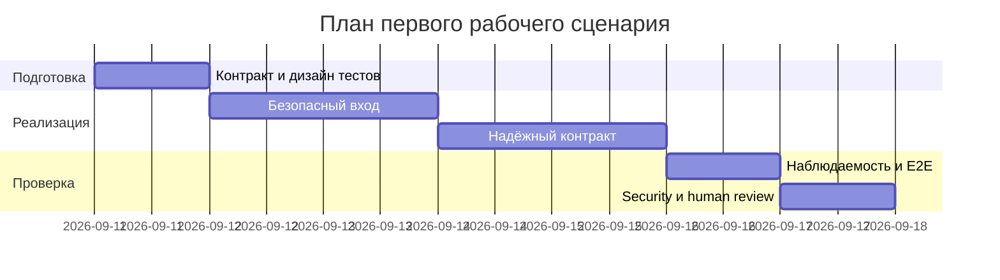

# План поставки

## Инкременты и ответственность

| Инкремент | Наблюдаемый результат | Что делает человек | Что делает AI или субагент | Проверка | Зависимости |
|---|---|---|---|---|---|
| 1. Безопасный вход | API валидирует payload, возвращает 413 для 20 001 символа, а секреты заменяются до внешнего вызова | Утверждает схему входа и набор шаблонов секретов; ревьюит ложные срабатывания | Предлагает реализацию и генерирует unit/integration-тесты по API-1 и SEC-1 | Тесты границ 20 000/20 001; fake LLM не видит секрет и не вызывается при 413 | Утверждённые `context.md`, `problem.md`, `adr.md` |
| 2. Надёжный контракт | LLM ограничен 10 секундами; успех и отказ дают предсказуемый OUT-1 | Определяет семантику контролируемого ответа; проверяет evidence и решение по SCOPE-1 | Предлагает схемы ответа, адаптер LLM и тестовые ответы | Контрактные тесты OUT-1/QA-1; тесты timeout и исключения | Инкремент 1; согласованный контракт ошибки |
| 3. Наблюдаемость и приёмка | Логи содержат только request_id, длительность и статус; весь сценарий проходит E2E и baseline нагрузки | Проводит security-review, приёмку и принимает решение о выпуске | Помогает подготовить E2E/load-сценарии и сводку результатов | Отрицательная проверка логов; E2E-набор; baseline нагрузки без необработанных 5xx | Инкременты 1–2; тестовое окружение и fake/stub LLM |

## Диаграмма Ганта

Каждый инкремент можно принять отдельно по наблюдаемому результату. AI готовит предложения и черновики, но человек утверждает требования, проверяет безопасность и принимает решение о выпуске.

## Как использовали AI

- Для чего: разбить решение ADR на проверяемые инкременты и разделить ответственность человека и AI.
- Тип промпта: план поставки с dependency mapping.
- Строка в [`prompts.md`](prompts.md): P1-06.
- Что проверили и исправили сами: поставили безопасность и валидацию до LLM-интеграции, добавили human review и не поручали AI решения по выпуску или PR.
