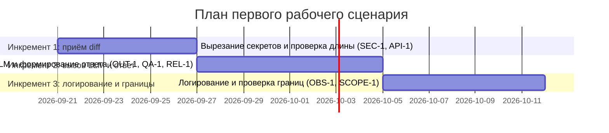

# План поставки

## Инкременты и ответственность

| Инкремент | Наблюдаемый результат | Что делает человек | Что делает AI или субагент | Проверка | Зависимости |
|---|---|---|---|---|---|
| 1 | Сервис принимает diff PR, вырезает из него токены, пароли и приватные ключи и отклоняет с HTTP 413 diff длиннее 20 000 символов | Проектирует список секретных паттернов и порог длины diff, принимает решение о формате отказа, проверяет и утверждает реализацию перед мержем | Генерирует черновик кода вырезания секретов и проверки длины diff, черновик unit-тестов на diff с секретом и на diff длиной 20 001 символ | Прогнать unit-тесты: убедиться, что тестовый token в diff заменён на [REDACTED] (SEC-1), а diff длиной 20 001 символ вернул HTTP 413 (API-1) | — (первый инкремент, зависимостей нет) |
| 2 | Сервис вызывает внешний LLM с таймаутом 10 секунд и возвращает ответ с summary, не более чем тремя подтверждёнными risks и checks либо контролируемую ошибку при таймауте | Проектирует структуру ответа OUT-1 и правило подтверждения риска строкой diff (QA-1), принимает решение о тексте ошибки при таймауте, проверяет соответствие ответов сервиса этим правилам на TRAINING_PR.diff | Генерирует черновик кода вызова LLM с таймаутом, черновик проверки risks на QA-1 и черновик тестов на успешный ответ и на таймаут LLM | Прогнать тесты на TRAINING_PR.diff: убедиться, что risks не больше трёх и каждый подтверждён конкретной строкой diff; смоделировать задержку ответа LLM свыше 10 секунд и убедиться, что вернулся контролируемый ответ, а не зависание (REL-1) | Инкремент 1 (нужен уже очищенный от секретов и проверенный по длине diff) |
| 3 | В лог пишутся только request_id, длительность и статус запроса; подтверждено, что сервис не выполняет approve, merge или изменение кода в GitHub | Формулирует формат лог-записи по OBS-1 и чек-лист границ сервиса по SCOPE-1, проверяет логи и код на отсутствие содержимого diff, ответа модели и вызовов approve/merge/commit | Генерирует черновик кода логирования по OBS-1 и черновик чек-листа для проверки границ SCOPE-1 в коде сервиса | Просмотреть лог тестового запроса и убедиться, что в нём нет текста diff или ответа модели, только request_id, длительность и статус (OBS-1); пройти по чек-листу SCOPE-1 и убедиться, что в коде нет обращений к API approve, merge или изменения файлов PR | Инкремент 2 (логируются длительность и статус уже сформированного ответа) |

## Диаграмма Ганта

## Как использовали AI

- Для чего: черновик таблицы инкрементов с разделением ролей человека и AI и черновик диаграммы Ганта по правилам CASE.md.
- Тип промпта: master prompt (роль, входы, задача и артефакты, формат, границы, шаги, проверка перед выдачей заданы явно).
- Строка в [`prompts.md`](prompts.md): P1-03 (генерация артефактов master prompt'ом).
- Что проверили и исправили сами: убедились, что каждый инкремент опирается на конкретные правила CASE.md (SEC-1, API-1, OUT-1, QA-1, REL-1, OBS-1, SCOPE-1) и на зависимости между инкрементами; проверили, что колонки «Что делает человек» и «Что делает AI» не дублируют друг друга — человек проектирует, принимает решения и проверяет, AI генерирует черновики кода и тестов; в колонке «Проверка» заменили общее слово «тестирование» на конкретные действия; проверили, что диаграмма Ганта синтаксически корректна и даты (2026-09-21 — 2026-10-11) укладываются примерно в три недели.
