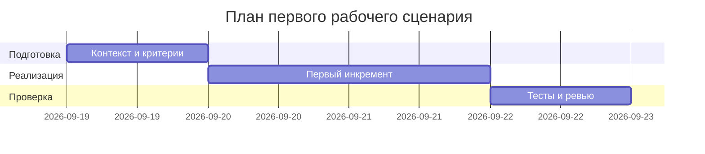

# План поставки

Файл ведёт OpenCode. Обсудите с агентом содержание и проверьте предложенный diff. Все дополнения и исправления поручайте агенту в чате.

## Инкременты и ответственность

| Инкремент | Наблюдаемый результат | Что делает человек | Что делает AI или субагент | Проверка | Зависимости |
|---|---|---|---|---|---|
| 1 | Зафиксирован контракт и риски (ADR, Context Pack) | Подтверждает контракт и пороги | Генерирует ADR/Context/Problem | Ревью файлов adr.md, context.md | TRAINING_PR.diff |
| 2 | Набор тестов AS IS | Подтверждает воспроизводимость | Проектирует tests_unit/integration/e2e/load | Запуск тестов вручную по описанию | Инкремент 1 |
| 3 | Улучшения TO BE спланированы | Принимает план | Обновляет планы и метрики | Сравнение AS IS/TO BE в analysis.md | Инкремент 2 |

## Диаграмма Ганта

Передайте OpenCode даты и задачи своего плана и попросите обновить диаграмму.

## Как использовали AI

- Для чего: спланировать инкременты и проверки.
- Тип промпта: master prompt + task design.
- Строка в [`prompts.md`](prompts.md): P1-02, P1-03.
- Что проверил студент и какие исправления поручил агенту: согласовал сроки и зависимости, уточнил объём тестов.
