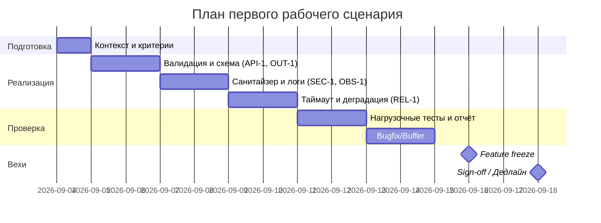

# План поставки

## Инкременты и ответственность

| Инкремент                           | Наблюдаемый результат                                                           | Что делает человек                                     | Что делает AI или субагент                        | Проверка                                         | Зависимости              |
| ----------------------------------- | ------------------------------------------------------------------------------- | ------------------------------------------------------ | ------------------------------------------------- | ------------------------------------------------ | ------------------------ |
| 1: Валидация и схема (API-1, OUT-1) | /api/reviews отвергает >20000 (413); 20000 — OK; ответ соответствует JSON‑схеме | Определяет схему, пишет валидатор и обработчики ошибок | Генерирует болванки схемы/валидаторов по описанию | Unit/Integration/E2E тесты границ и схемы        | Context Pack, problem.md |
| 2: Санитайзер и логи (SEC-1, OBS-1) | В prompt/логах нет секретов; логи содержат только request_id, duration, status  | Определяет паттерны секретов и лог‑формат              | Помогает с regex и фреймворком логирования        | Unit/Integration тесты на утечки, проверка логов | Инкремент 1              |
| 3: Таймаут и деградация (REL-1)     | Вызовы LLM завершаются ≤10с; при таймауте возвращается контролируемый ответ     | Выбирает стратегию деградации, описывает checks        | Генерирует шаблон деградационного ответа          | Integration/E2E тесты с медленным стабом         | Инкременты 1–2           |
| 4: Нагрузка и метрики               | Профиль p99<1с в базовом режиме; 0% >10с в деградации; 100% 413 oversized       | Настраивает сценарии k6/Locust, собирает результаты    | Генерирует скрипты нагрузки                       | Load тесты и отчёты                              | Инкременты 1–3           |

## Диаграмма Ганта

Даты примерные для учебного сценария и могут корректироваться.

## Как использовали AI

- Для чего:
  - Сформировать реалистичный, поэтапный план с наблюдаемыми результатами.
- Тип промпта:
  - Few Shots.
- Строка в [`prompts.md`](prompts.md):
  - P1-06.
- Что проверили и исправили сами:
  - Поправили диаграмму Ганта.
