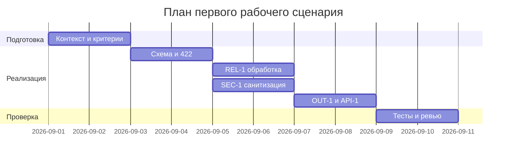

# План поставки

## Инкременты и ответственность

| Инкремент | Наблюдаемый результат | Что делает человек | Что делает AI или субагент | Проверка | Зависимости |
|---|---|---|---|---|---|
| 1. Схема и 422 | Pydantic-модель, некорректные тела → 422 | Реализация модели и обработчика | Генерация шаблонов модели/валидаторов | Интеграционный тест {} → 422 | — |
| 2. REL-1 | Таймаут/ошибки LLM маппятся в контролируемый ответ | Обёртка клиента, маппинг ошибок | Черновик обработчиков исключений | Юнит: TimeoutError → контролируемый ответ | 1 |
| 3. SEC-1 | Санитизация diff перед LLM | Реализация sanitize | Набросок правил редактирования | Юнит: token→[REDACTED] | 1 |
| 4. OUT-1 и API-1 | Нормализованный ответ, 413 на >20k | Схема ответа, проверка длины | Скелет схемы | Интеграционный: >20k → 413; формат ответа | 1–3 |

## Диаграмма Ганта

Замените даты и задачи на свой план.

## Как использовали AI

- Для чего: Разбивка на инкременты, роли и проверки.
- Тип промпта: master prompt.
- Строка в [`prompts.md`](prompts.md): P1-02.
- Что проверили и исправили сами: Выравнивание инкрементов с SEC-1, API-1, REL-1, OUT-1.
