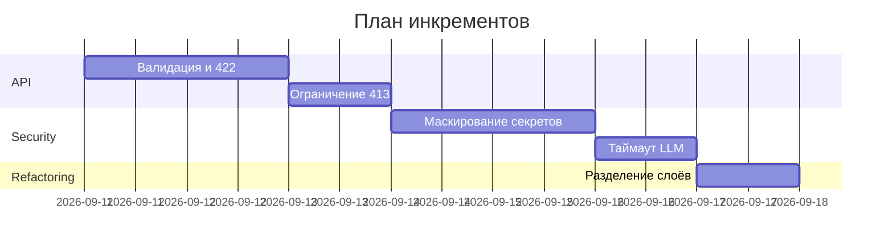

# Проектная часть

## Инкременты

- Инкремент 1: Добавить модель запроса для `/api/reviews`, валидацию и обработку ошибок 422.
- Инкремент 2: Ограничение размера входного diff и возврат 413 при превышении порога.
- Инкремент 3: Маскирование секретов из diff перед отправкой в LLM.
- Инкремент 4: Таймаут LLM-вызова и контролируемая обработка ошибок.
- Инкремент 5: Разделение ответственности: сервис возвращает строку; API формирует контракт ответа.

## Роли (человек / AI)

- Человек: принимает решение по контракту ответов, утверждает политики редактирования секретов и лимиты, код-ревью и релиз.
- AI: готовит ревью diff, предлагает минимальные правки и тест-кейсы, помогает оформить артефакты.

## Диаграмма Ганта (упрощённо)

## Как использовали AI

- Для формализации инкрементов и распределения ролей на основе TRAINING_PR.diff и правил из CASE.md; запись P1-03 в prompts.md.
