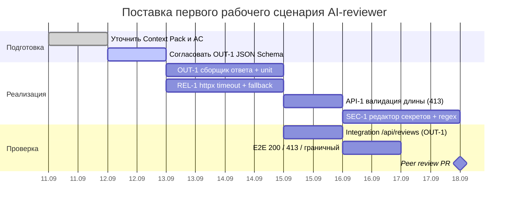

# План поставки

## Инкременты и ответственность

| Инкремент | Наблюдаемый результат | Что делает человек | Что делает AI или субагент | Проверка | Зависимости |
|---|---|---|---|---|---|
| 1 (OUT-1) | API возвращает структуру OUT-1 | Формализует поля и AC; пишет тесты | Генерирует шаблоны JSON-ответа и примеры | Интеграционный вызов → 200 и поля summary/risks/checks | TRAINING_PR.diff |
| 2 (REL-1) | Контролируемая ошибка при сбое LLM | Проектирует обработку таймаута | Предлагает паттерн таймаута/ретраев | Мокаем LLM>10с → нет 5xx, структурный ответ | Инкремент 1 |
| 3 (API-1, SEC-1) | Вход валидируется, секреты редактируются | Описывает правила редактирования, лимиты | Помогает со списком паттернов секретов | >20000 → 413; дифф с тестовым token → [REDACTED] | Инкременты 1–2 |

## Диаграмма Ганта

Даты условные, стартовая точка — 2026-09-11 (день заполнения артефактов). Параллельность: OUT-1 и REL-1 идут одновременно после подготовки; API-1 и SEC-1 — по цепочке после OUT-1; интеграционные и E2E-проверки идут параллельно реализации; финальная веха — peer review PR.

## Как использовали AI

- Для чего: разложить поставку на инкременты с проверками и зависимостями.
- Тип промпта: master prompt (P1-02) с контекстом правил.
- Строка в [`prompts.md`](prompts.md): P1-02; Master Prompt v1.
- Что проверили и исправили сами: согласовали инкременты с OUT-1, REL-1, API-1/SEC-1 и проверяемостью `make test`.
