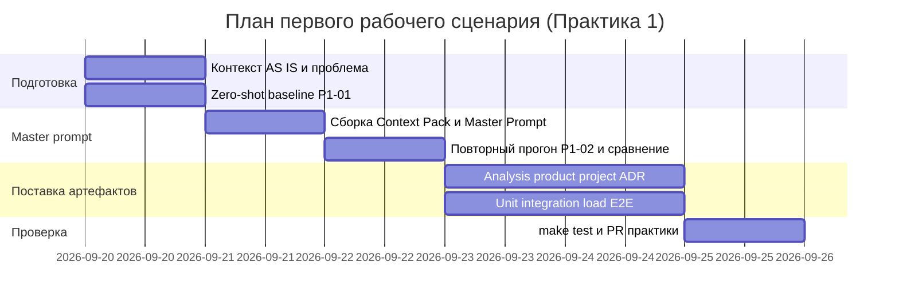

# План поставки

## Инкременты и ответственность

| Инкремент | Наблюдаемый результат | Что делает человек | Что делает AI или субагент | Проверка | Зависимости |
|---|---|---|---|---|---|
| 1. Context Pack и baseline | Заполнены `context.md`, `problem.md`; сохранён ответ P1-01 | Согласует пользователя, границы, метрики; оценивает zero-shot | Собирает черновики артефактов; zero-shot ревью diff | Чеклист README; наличие P1-01 в `prompts.md` | `TRAINING_PR.diff`, README |
| 2. Master prompt и повторный прогон | Master Prompt v1 в `prompts.md`; ответ P1-02; сравнение с P1-01 | Утверждает формат, примеры, DoD; сравнивает запуски | Собирает master prompt; повторное ревью с Context Pack | Таблица сравнения: доказательства, границы, проверки | Инкремент 1 |
| 3. SDLC-пакет и тесты | Заполнены analysis/product/project/adr/tests_*; `make test` OK | Ревьюит связность требований и тестов; сдаёт PR практики | Дописывает артефакты, ADR, наборы проверок | `make test` в `practices/practice_01`; ручной diff PR | Инкремент 2 |

## Диаграмма Ганта

Даты учебного плана (ориентир на занятие и домашнюю доработку; календарь команды — **Открытый вопрос** вне курса):

## Как использовали AI

- Для чего: инкременты, роли людей/AI, диаграмма Ганта.
- Тип промпта: master prompt / планирование.
- Строка в [`prompts.md`](prompts.md): P1-01 и P1-02.
- Что проверил студент и какие исправления поручил агенту: даты привязаны к учебной практике; внешний прод-роадмап не выдуман.
