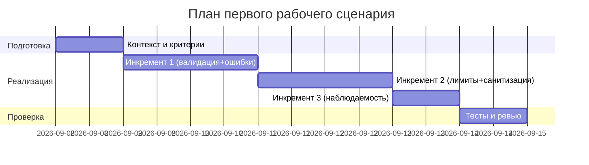

# План поставки

## Инкременты и ответственность

| Инкремент | Наблюдаемый результат | Что делает человек | Что делает AI или субагент | Проверка | Зависимости |
|---|---|---|---|---|---|
| 1 | Валидация входа и обработка ошибок | Определяет схему и правила, код-ревью | Генерирует черновик схемы и обработчиков исключений | Интеграционный тест: отсутствие ключа → 422; симуляция исключения LLM → контролируемый ответ | TRAINING_PR.diff как исходное AS IS |
| 2 | Ограничение размера и санитизация diff | Настраивает лимиты, правила усечения | Предлагает шаблон guardrails для промпта | Тест: > лимита → 413; проверка, что промпт содержит усечённый diff | Инкремент 1 |
| 3 | Минимальная наблюдаемость | Добавляет логирование request_id, длительность, статус | Предлагает формат логов без контента | Тест: логи содержат request_id/latency/status, без диффа и ответа | Инкремент 1 |

## Диаграмма Ганта

Замените даты и задачи на свой план.

## Как использовали AI

- Для чего:
- Тип промпта: master prompt
- Строка в [`prompts.md`](prompts.md): P1-02
- Что проверили и исправили сами: Согласовали инкременты с рисками, подтвержденными строками diff; исключили фичи вне diff.
