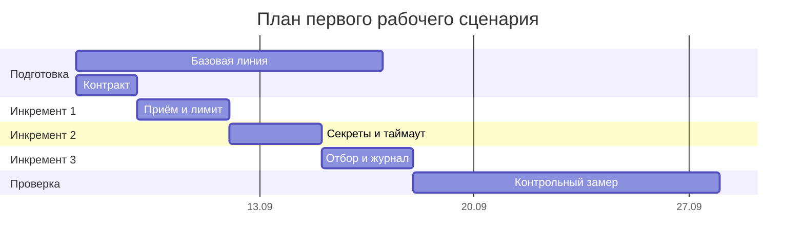

# План поставки

## Инкременты и ответственность

| Инкремент | Наблюдаемый результат | Что делает человек | Что делает AI или субагент | Проверка | Зависимости |
|---|---|---|---|---|---|
| 1 | `POST /api/reviews` принимает diff, отклоняет вход длиннее 20000 символов с HTTP 413, на корректный вход возвращает структуру `summary`, `risks`, `checks` с пустым массивом рисков | Фиксирует контракт `OUT-1` и порог `API-1`, принимает решение о схеме запроса и ответа, ревьюит сгенерированный код | Генерирует схемы запроса и ответа, обработчик эндпоинта и unit-проверки по заданному контракту | Запрос с diff на 25000 символов возвращает 413. Запрос на 4000 символов возвращает ответ, проходящий валидацию схемы. Обращений к внешнему LLM нет | Контракт `OUT-1` и порог `API-1` из Context Pack |
| 2 | Перед вызовом внешнего LLM из diff удаляются токены, пароли и ключи. Вызов выполняется с таймаутом 10 секунд, отказ превращается в контролируемый ответ | Определяет набор паттернов секретов и поведение при частичном совпадении, проверяет, что маскирование не разрушает структуру diff | Реализует удаление секретов и обёртку с таймаутом, пишет integration-проверки с заглушкой LLM | diff с тестовым токеном даёт в промпте `[REDACTED]`. Заглушка LLM с задержкой 11 секунд даёт контролируемый ответ, а не HTTP 500 | Инкремент 1 |
| 3 | В ответ попадают только риски, подтверждённые строкой diff или правилом, не более трёх. В журнал пишутся `request_id`, длительность и статус | Размечает выборку ответов как принятые или отклонённые, задаёт порог доли принятых рисков, разбирает спорные случаи | Реализует отбор рисков по evidence и журналирование, готовит сквозные сценарии | Ответ на diff без нарушений содержит пустой `risks`. В журнале нет содержимого diff и ответа модели. Доля принятых рисков считается на размеченной выборке | Инкременты 1 и 2 |

Роли не смешиваются намеренно. Человек принимает все решения, которые нельзя проверить автоматически: что считать секретом, где проходит порог, какой риск засчитан. AI работает там, где критерий уже сформулирован и результат проверяем.

## Диаграмма Ганта

Замер базовой линии идёт первым и параллельно разработке. Две метрики из [`problem.md`](problem.md) измеримы уже на текущем процессе, и снять значение «до» можно только пока изменение не внедрено. Контрольный замер в конце повторяет ту же процедуру на изменённом процессе, и сравнение двух замеров и есть подтверждение решения.

## Как использовали AI

- Для чего: черновик инкрементов, разделения ответственности человека и AI и диаграммы Ганта
- Тип промпта: R.C.T.F.
- Строка в [`prompts.md`](prompts.md): `P1-05`
- Что проверили и исправили сами: забраковал первую версию диаграммы Ганта, на ней подписи наезжали друг на друга. Заметил, что подпись в строке «Подготовка» выносится за полосу, и потребовал укоротить название вместо растягивания задачи под картинку. Проверил рендер в VS Code. Нашёл ошибку в порядке этапов: замер базовой линии стоял последним, хотя значение «до» нельзя снять после внедрения, перенёс его в начало и добавил контрольный замер в конце
