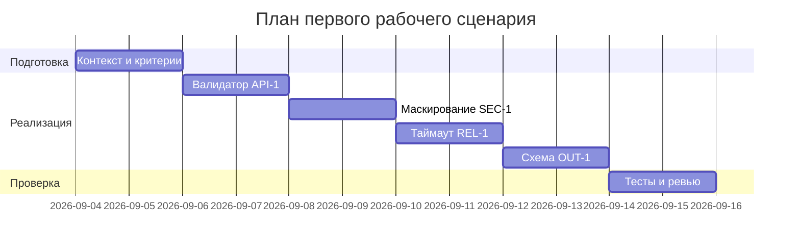

# План поставки

## Инкременты и ответственность

| Инкремент | Наблюдаемый результат | Что делает человек | Что делает AI или субагент | Проверка | Зависимости |
|---|---|---|---|---|---|
| 1 | Валидатор длины diff и 413 | Определяет порог, пишет тесты | Генерирует шаблон валидации | Интеграционный тест >20000 сим. | Контракт API |
| 2 | Маскирование секретов (SEC-1) | Уточняет правила редактирования | Предлагает regex-паттерны и места вставки | Интеграционный тест с фиктивным токеном | Доступ к сервису |
| 3 | Таймаут 10s и маппинг ошибок (REL-1) | Настраивает клиент/обёртку | Генерирует шаблон try/except и маппинг | Тест с искусственной задержкой | LLM-клиент |
| 4 | Формат OUT-1 и валидатор | Утверждает схему | Генерирует схему и валидацию | Unit и интеграционные тесты | Требования OUT-1 |
| 5 | Логи по OBS-1 | Настраивает логер | Предлагает конфиг-минимум | Лог-сканер | Платформа логов |

## Диаграмма Ганта

Замените даты и задачи на свой план.

## Как использовали AI

- Для чего: разложить поставку на инкременты и связать проверки с правилами.
- Тип промпта: master prompt для планирования.
- Строка в [`prompts.md`](prompts.md): P1-03.
- Что проверили и исправили сами: увязали зависимости, скорректировали сроки и состав проверок, оставили только минимально достаточные задачи.
