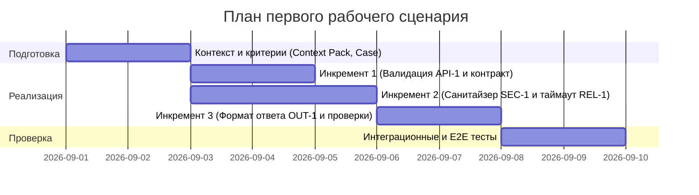

# План поставки

## Инкременты и ответственность

| Инкремент | Наблюдаемый результат | Что делает человек | Что делает AI или субагент | Проверка | Зависимости |
|---|---|---|---|---|---|
| 1. Контракт API и валидация | Эндпоинт `/api/reviews` принимает строго `ReviewRequest(diff: str)`, возвращает 400 при отсутствии поля и 413 при длине > 20 000 знаков | Описывает Pydantic-схему, валидаторы и HTTP 413 (API-1) | Генерирует тесты валидации входного payload | Запуск `pytest tests/test_api_validation.py` | Базовый каркас `app/api.py` |
| 2. Защита и вызов LLM | Санитайзер секретов `SEC-1` и клиент LLM с таймаутом 10 с `REL-1` | Интегрирует маскирование секретов и таймаут в `ReviewService` | Формирует регулярные выражения для токенов и шаблон промпта | Запуск тестов на замену токенов на `[REDACTED]` и mock-таймаут | Инкремент 1 |
| 3. Структурированный ответ и проверки | Ответ эндпоинта строго по контракту `OUT-1` с массивом рисков (<=3) и проверками | Настраивает парсер ответа LLM и формирует итоговый JSON | Выполняет анализ diff по строгим правилам QA-1 и формирует checks | E2E-тест контракта ответа и валидация схемы JSON | Инкремент 2 |

## Диаграмма Ганта

## Как использовали AI

- Для чего: декомпозиция первого сценария на три инкремента, распределение ролей человек/AI и построение диаграммы Ганта.
- Тип промпта: master prompt (P1-02).
- Строка в [`prompts.md`](prompts.md): строка P1-02.
- Что проверили и исправили сами: убедились, что каждый инкремент имеет проверяемый результат и четкую привязку к правилам репозитория.
