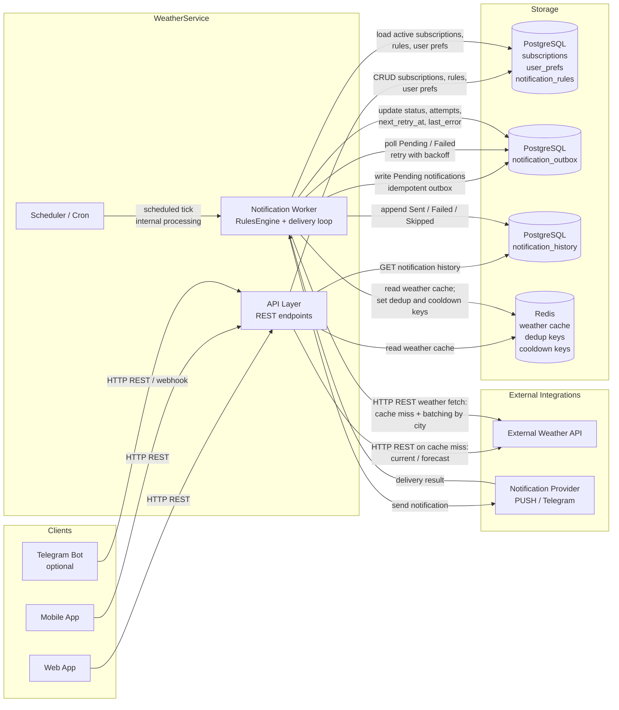

# Отчет по Практике 2: Рожков Михаил

## 1. Анализ промптов R.C.T.F.

### Mermaid_v2
**Role:** Senior QA Engineer
**Context:** Мы улучшаем артефакт из Practice 1 для проекта WeatherService. Это REST API сервис уведомлений о погоде. В системе есть:
- клиентские приложения: web/mobile, опционально Telegram Bot;
- WeatherService API;
- Notification Worker;
- PostgreSQL для хранения подписок, пользовательских настроек, правил уведомлений, outbox и history;
- Redis для weather cache, dedup keys и cooldown keys;
- External Weather API;
- Notification Provider для PUSH, Telegram как опция;
- требования по quiet hours, timezone, cooldown, dedup, retry/backoff, observability.
Нужно превратить простую схему уровня “Client → Backend → DB” в более профессиональную архитектуру v2.0.

**Task:** Построй улучшенную архитектурную схему системы.
Обязательно покажи:
- Clients
- API layer
- Notification Worker
- PostgreSQL
- Redis
- External Weather API
- Notification Provider
- Scheduler / Cron
- ключевые связи между компонентами
- где используется cache
- где используется outbox/retry
- где хранится история уведомлений
- основные протоколы взаимодействия (HTTP REST / internal processing)
Сделай схему реалистичной, но без излишней enterprise-сложности.
**Format:** Верни только валидную Mermaid diagram в формате flowchart LR. После диаграммы добавь короткий список из 5–7 пунктов “Что улучшилось по сравнению с v1.0”. Никакого лишнего текста до диаграммы.
**Результат:** 
---
### 
        GHERKIN_SCENARIOS
        
**Role:** 
        Ты опытный Business Analyst, специализирующийся на BDD и формализации требований для разработки и QA.
        
**Context:** 
        Мы работаем над WeatherService — REST API сервисом уведомлений о погоде.
Основные функции:
- поиск города;
- подписка на город;
- настройка правил уведомлений;
- получение уведомлений через PUSH, Telegram опционально;
- quiet hours, timezone, cooldown, dedup;
- внешние данные о погоде через External Weather API.
Нужно преобразовать user stories из Practice 1 в формальные acceptance criteria, пригодные для команды разработки и QA.
        
**Task:** 
        Преобразуй 3 user stories в Gherkin:
1. Поиск города по названию
2. Подписка на город
3. Создание правила уведомлений для подписки

Для каждой Feature создай:
- 1 позитивный сценарий
- 2 негативных сценария

Обязательно включи реалистичные случаи:
- query слишком короткий
- город не найден
- повторная подписка на тот же cityId
- subscriptionId не найден
- невалидные conditions или cron
- неподдерживаемый channel/type
        
**Format:** 
        Верни 3 отдельных блока в синтаксисе .feature.
Каждый блок должен содержать:
- Feature
- Scenario / Scenario Outline при необходимости
- Given / When / Then
Используй строгий Gherkin, без поясняющего текста между сценариями.
        
**Результат:** 
---
### DOR_V2
**Role:** 
        Ты опытный Product Owner с сильным бэкграундом в Agile/Scrum и подготовке задач для engineering teams.
        
**Context:** 
        Мы разрабатываем WeatherService — REST API сервис уведомлений о погоде.
Текущий DoR из Practice 1 слишком базовый: цель/ценность, AC, API-контракт, зависимости, NFR и заметки по тестированию.
В новой версии нужно сделать Definition of Ready реально полезным для подготовки задач по backend/API/worker/integrations.
Система включает PostgreSQL, Redis, Notification Worker, External Weather API, notification rules, quiet hours, cooldown, dedup, retry/backoff и observability.
        
**Task:** 
        Создай улучшенный Definition of Ready v2.0.
Обязательно структурируй по категориям:
- Requirements
- Technical
- Design / API Contract
- Testing
- Observability / Reliability
- Security / Data
- Delivery Readiness

Добавь конкретику для WeatherService:
- in-scope / out-of-scope
- dependencies
- NFR
- migration readiness
- risks / degradation plan
- KPI or success metric
- cache TTL / retry / rate limit assumptions
- notes for QA
        
**Format:** 
        Верни структурированный Markdown checklist.
Минимум 12 пунктов, сгруппированных по категориям.
После чек-листа добавь короткий блок “Why this is better than v1.0”.
        
**Результат:** 
---
### 
        DOD_V2
        
**Role:** 
        Ты Senior Engineering Manager и Scrum Master, который отвечает за release readiness и качество delivery.
        
**Context:** 
         Мы улучшаем Definition of Done для WeatherService.
Проект включает REST API, Notification Worker, PostgreSQL, Redis, External Weather API, notification sending, observability и retry/backoff.
Старый DoD был слишком общий: реализовано по AC, есть тесты, документация обновлена, всё работает.
Новая версия должна быть более профессиональной и учитывать релизную готовность, эксплуатацию и поддержку.
        
**Task:** 
        Создай Definition of Done v2.0.
Обязательно включи категории:
- Code Quality
- Testing
- Database / Migration
- Documentation
- Observability
- Reliability
- Security
- Review / Release

Добавь специфику для WeatherService:
- CI green
- unit/integration/e2e coverage
- migration checked on clean DB
- OpenAPI updated
- health/readiness and metrics
- idempotency and retry validated
- external API limits considered
- secrets not hardcoded
- code review completed
- release monitoring considerations
        
**Format:** 
        Верни структурированный Markdown checklist.
Минимум 12 пунктов.
После чек-листа добавь блок “What makes this production-oriented”.
        
**Результат:** 
---
### TEST_PLAN_V2
**Role:** 
        Ты Senior QA Engineer с опытом тестирования REST API, background workers и внешних интеграций.
        
**Context:** 
        Проект WeatherService включает:
- поиск города;
- подписки;
- правила уведомлений;
- Redis cache;
- PostgreSQL;
- Notification Worker;
- External Weather API;
- PUSH delivery;
- quiet hours, cooldown, dedup, retry/backoff.
Нужно собрать тест-план v2.0 для команды QA и backend.
        
**Task:** 
        Создай тест-план по пирамиде тестирования.
Сделай:
- 2 Unit теста
- 2 Integration теста
- 2 E2E теста
Минимум 6 тест-кейсов, но можно 8–9, если это делает план лучше.
        
**Format:** 
        Верни Markdown таблицу с колонками:
Test ID | Level | Title | Preconditions | Steps | Expected Result

После таблицы добавь блок:
- Coverage summary
- Critical risks not covered

**Результат:** 
---
### FUNCTIONAL_DELIVERY_V2
**Role:** 
        Ты Senior Delivery Manager с опытом декомпозиции backend-продуктов в Jira.

**Context:** 
         У нас есть базовые Jira-тикеты для WeatherService из Practice 1:
- Cities Search
- Subscriptions CRUD
- Update Rules
- Weather Provider Adapter
- Redis Weather Cache
- Public Weather Endpoints
- Worker + Scheduler
- Rule Engine
- Notification Sending
- Observability Pack
Нужно улучшить delivery до профессионального уровня, чтобы тикеты были самодостаточными и понятными без дополнительных объяснений.
        
**Task:** 
        Создай улучшенный Functional Delivery v2.0.
Выбери 4 ключевых тикета для v1.0/v1.1 и детализируй их.
Для каждого тикета добавь:
- ID
- Title
- Goal / Description
- Scope
- Acceptance Criteria
- Test Cases
- Dependencies
- Priority
- Estimate
- Risks / Notes

**Format:** 
        Верни структурированный Markdown список или Markdown таблицу.
После всех тикетов добавь блок “Delivery order rationale” с объяснением порядка реализации.
**Результат:** 
---
## 2. Улучшенные артефакты

### Mermaid v2


### Gherkin Scenarios
```gherkin

TODO: Вставьте сценарии в формате Gherkin
Feature: Weather Subscription API
  Scenario: Successful subscription via POST /subscribe
    Given клиент имеет валидный API endpoint
    When клиент отправляет POST /subscribe с {"city": "Moscow", "email": "user@test.com"}
    Then API возвращает 200 OK с данными о погоде

```

### DoR v2.0

Requirements

 User story понятен: кто (роль) → что хочет → какой ожидаемый результат.

 In-scope явно перечислен (например: подписка/отписка, управление правилами, digest/threshold уведомления, quiet hours).

 Out-of-scope явно перечислен (например: ML-персонализация, сложная сегментация, админка, биллинг, мульти-провайдерные маршрутизации сверх PUSH/Telegram).

 Acceptance Criteria тестируемые (Given/When/Then) + негативные сценарии (невалидный город, падение провайдера, смена таймзоны).

 Определены бизнес-правила: quiet hours (что именно считается “тихо”), источник таймзоны, cooldown (как считается окно), dedup (окно и ключ), поведение при повторной доставке.

 KPI/метрика успеха: p95 времени доставки < X минут, доля дубликатов < Y%, failure rate < Z%, backlog outbox < N.

Technical

 Зависимости подтверждены: контракт External Weather API + лимиты/квоты; контракт Notification Provider (PUSH) + sandbox; Telegram (если в scope) + сопоставление user↔chat.

 Затрагиваемые сущности/таблицы определены: user_prefs, subscriptions, notification_rules, notification_outbox, notification_history (и что именно меняем).

 Migration readiness: миграции БД подготовлены, совместимость при rolling deploy, plan rollback.

 Redis usage зафиксирован: ключи/неймспейс, TTL (cache TTL), dedup keys, cooldown keys, eviction/expiry, поведение при недоступности Redis.

 Outbox + идемпотентность описаны: схема события, генерация notification_id, идемпотентность на стороне воркера/провайдера, dedup window.

 Модель работы воркера: batching по city_id, частота запуска scheduler, параллелизм/конкурентность, порядок обработки (если важен).

 Retry/backoff политика: max attempts, backoff (с jitter), какие ошибки retryable/non-retryable, лимит по времени/дедлайны.

 Rate limit допущения: лимиты API (per user/IP), лимиты внешнего Weather API (per worker/city), лимиты провайдера.

 Degradation plan: что делаем при падении Redis / External Weather API / Provider (пропуск, задержка, fallback, частичная доставка, “pause sending”).

 Оценка нагрузки: ожидаемые users/subscriptions/rules, пики уведомлений/мин, влияние на Postgres/Redis/worker.

Design / API Contract

 API контракты описаны: эндпоинты, методы, схемы запрос/ответ, коды ошибок, pagination/filters (если нужно).

 Стратегия версионирования: без ломаний для v1; breaking changes только через новую версию/фичефлаг.

 Валидации: правила порогов, формат таймзоны, допустимые окна quiet hours, лимиты на количество правил/подписок.

 Ожидания по консистентности: где eventual consistency (API ↔ worker), как отображаем “pending”.

 Граничные кейсы: DST, смена таймзоны, изменение правил “на лету”, удаление подписки при наличии в очереди/outbox.

 Payload контракт с провайдером: формат, локализация/язык, ограничения размера, стратегия повторов, защита от дублей.

Testing

 План тестирования: unit + integration + contract tests (External Weather API + Provider).

 Тесты воркера: batching, quiet hours, cooldown, dedup, outbox retry, идемпотентность, poison-сообщения.

 Тесты БД: миграции apply/rollback, индексы/констрейнты, рост history/outbox, периодическая чистка (если есть).

 Тесты Redis: корректность TTL, отсутствие stampede (если нужно), поведение при недоступности.

 Нагрузочные цели: N уведомлений/мин, p95 latency по ключевым эндпоинтам, бюджет запросов к БД.

 Notes for QA: как подготовить тест-данные (города/подписки/правила), как фиксировать время для quiet hours/cooldown, sandbox провайдера.

Observability / Reliability

 Логи структурированные: correlation IDs (request_id, user_id, notification_id, city_id), уровни логирования, маскирование чувствительных данных.

 Метрики определены: sent/success/fail, retries, dedup_drops, cooldown_skips, provider_latency, external_api_errors, outbox_backlog.

 Трейсинг: API → worker → external API/provider, политика семплинга.

 Алерты: рост backlog, spike ошибок провайдера, rate-limit от Weather API, деградация Redis/Postgres.

 SLO: доступность API, своевременность доставки, допустимый уровень дублей.

 Runbook/операционные действия: пауза воркера, дренаж outbox, replay, сценарии провайдер-аутейджа.

Security / Data

 AuthN/AuthZ определены: кто может менять подписки/правила, токены, маппинг Telegram (если в scope).

 PII/данные: что храним (timezone, channel identifiers), ретеншн для history, удаление/анонимизация (если требуется).

 Секреты: хранение ключей External Weather API, Provider, Telegram bot token (vault/secret manager).

 Anti-abuse: лимиты на создание правил/подписок, анти-спам (dedup/cooldown), rate limit на эндпоинты.

 Аудит: что пишем в notification_history, какие поля в логах нельзя светить.

Delivery Readiness

 Feature flag + rollout: процентный rollout, kill switch для рассылки, пер-клиент включение.

 Backward compatibility: старые клиенты не ломаем, миграции совместимы с rolling deploy.

 Deployment checklist: порядок деплоя API/worker, миграции, изменения Redis ключей, scheduler.

 Ownership: кто on-call, куда смотреть (дашборды), уровни SEV.

 Release acceptance: сценарий демо, критерии QA sign-off, post-deploy проверки в проде.


### DoD v2.0

Code Quality

 Реализация полностью покрывает AC и согласованные бизнес-правила (quiet hours, cooldown, dedup, rules engine).

 Код соответствует coding standards проекта, нет “временных” решений/feature flags без владельца и срока.

 Нет техдолга уровня P0/P1 без заведённых задач и явного согласования scope.

 Конфигурация вынесена в Options/Config, значения по умолчанию безопасные (не “шлём всем всегда”).

 Обработаны ошибки и крайние случаи (invalid inputs, timezone/DST, rule updates mid-cycle).

Testing

 Unit tests добавлены/обновлены для core-логики (rules evaluation, dedup/cooldown, quiet hours).

 Integration tests есть для PostgreSQL (репозитории/запросы), Redis (TTL/keys), External Weather API клиент (контракт/маппинг).

 E2E / workflow tests для критических сценариев: subscribe → rule create → notification emitted → outbox → send → history.

 Тесты проверяют idempotency (повторная обработка одного notification_id не создаёт дублей).

 Тесты проверяют retry/backoff (retryable vs non-retryable, max attempts, jitter/таймауты).

 В CI нет flaky-тестов; при необходимости добавлены retries для тестов и стабилизация окружения.

Database / Migration

 Все изменения схемы оформлены миграциями; миграции проходят на clean DB и на “обновляемой” БД.

 Проверены rollback/forward сценарии или documented fallback (если rollback невозможен).

 Добавлены/обновлены индексы/констрейнты под новые запросы и инварианты (уникальность/ссылочная целостность).

 Рост notification_history/outbox учтён: retention/архивация/очистка либо явно out-of-scope с задачей.

 Миграции совместимы с rolling deploy (API/worker могут жить на смешанных версиях, если требуется).

Documentation

 OpenAPI/Swagger обновлён и соответствует реальному контракту (коды ошибок, схемы, примеры).

 Обновлены README / runbook / ADR/HLD (если изменения архитектурно значимые).

 Задокументированы настройки: TTL cache, dedup window, cooldown window, retries/backoff, rate limits.

 Описаны ограничения и edge cases (DST, timezone, provider downtime behavior).

Observability

 Добавлены/обновлены health/readiness endpoints для API и воркера (включая зависимости по необходимости).

 Метрики добавлены: delivery success/fail, retry count, dedup drops, cooldown skips, outbox backlog, external API latency/errors.

 Логи структурированы и коррелируются (request_id, user_id, notification_id, city_id); PII не логируется.

 Трейсинг/корреляция запросов (API → worker → external/provider) настроены или явно out-of-scope с задачей.

Reliability

 Реализованы и проверены timeouts и circuit/guard логика при обращении к External Weather API/Provider (минимум: таймауты + ограничение ретраев).

 Учтены External Weather API limits: rate limit/квоты, backoff при 429, кэширование (Redis TTL) и защита от stampede (если нужно).

 Outbox pattern работает: записи создаются атомарно, обработка устойчива к рестартам, есть retry + backoff.

 Подтверждена idempotency отправки: повторная доставка/повторный воркер-run не создаёт дублей.

 Есть план деградации: Redis down / external down / provider down (queue, delay, skip, kill switch).

Security

 Секреты не захардкожены: ключи External Weather API/Provider/Telegram только через secret manager/env vars.

 Валидация входных данных и ограничения (rate limit, max rules/subscriptions) учтены либо заведены отдельные задачи.

 Права доступа (AuthN/AuthZ) соблюдены для всех изменённых эндпоинтов; аудит изменений критичных настроек при необходимости.

Review / Release

 CI green: сборка, линтер/анализаторы, тесты, миграции/интеграционные проверки проходят.

 Прошёл code review (минимум 1–2 апрува), закрыты все блокирующие комментарии.

 Проверены “release artifacts”: versioning, changelog/релиз-ноты (если принято), конфиг в окружениях.

 Настроен release monitoring: дашборды/алерты на ключевые метрики, план “что смотреть первые 30–60 минут”.

 Есть rollout plan (feature flag/процентный rollout/kill switch) и понятный rollback/fallback.


### Test Plan v2

| Test ID | Level       | Title                                                                           | Preconditions                                                                                | Steps                                                                                                                                                                                                                                                               | Expected Result                                                                                                                                                                                                                      |
| ------- | ----------- | ------------------------------------------------------------------------------- | -------------------------------------------------------------------------------------------- | ------------------------------------------------------------------------------------------------------------------------------------------------------------------------------------------------------------------------------------------------------------------- | ------------------------------------------------------------------------------------------------------------------------------------------------------------------------------------------------------------------------------------ |
| TP-U1   | Unit        | City search validation: query length and normalization                          | Валидатор поиска города подключен в API layer                                                | 1. Передать `query="L"`.<br>2. Передать `query="  Lon  "`.<br>3. Передать пустое значение.                                                                                                                                                                          | Для `query < 2` символов возвращается ошибка валидации `400`; пробелы обрезаются, валидный запрос допускается к поиску. Это соответствует AC для `GET /cities?query=`.                                                               |
| TP-U2   | Unit        | RulesEngine: threshold trigger fires only when condition is met                 | Есть правило `ThresholdTrigger` и нормализованная weather model                              | 1. Создать правило `precipMm_gte=5`.<br>2. Передать погоду с `precipMm=7`.<br>3. Повторить с `precipMm=2`.                                                                                                                                                          | При `7 >= 5` результат `fired=true` с reason по условию; при `2 < 5` результат `fired=false`. Логика соответствует описанию `ThresholdTrigger`.                                                                                      |
| TP-U3   | Unit        | Notification ID / dedup key generation is deterministic                         | Есть функция построения `notification_id` и `windowKey`                                      | 1. Передать одинаковые `subscriptionId`, `ruleId`, `windowKey`, `channel` дважды.<br>2. Повторить с другим `windowKey`.                                                                                                                                             | Для одинаковых входных данных `notification_id` идентичен; при другом окне отличается. Это поддерживает идемпотентность и защиту от дублей.                                                                                          |
| TP-I1   | Integration | Redis weather cache: hit vs miss with External Weather API                      | Поднят test Redis, замокан External Weather API, TTL настроен                                | 1. Запросить погоду по `cityId=A` при пустом кэше.<br>2. Проверить вызов провайдера и запись `weather:{provider}:{cityId}` в Redis.<br>3. Повторить тот же запрос до истечения TTL.                                                                                 | На `cache miss` сервис вызывает External Weather API, нормализует ответ и кладет его в Redis; на `cache hit` ответ берется из Redis и повторный вызов провайдера не выполняется.                                                     |
| TP-I2   | Integration | Subscription persistence and duplicate protection in PostgreSQL                 | Поднята test PostgreSQL, миграции применены, пользователь существует                         | 1. Выполнить `POST /subscriptions` с валидным `cityId`.<br>2. Проверить запись в таблице `subscriptions`.<br>3. Повторить тот же запрос для того же `user_id` и `city_id`.                                                                                          | Первая подписка создает запись и возвращает `201`; повторная подписка блокируется по `unique(user_id, city_id)` и возвращает `409` (или идемпотентный `200`, если команда это зафиксирует единообразно).                             |
| TP-I3   | Integration | Weather provider timeout is converted to controlled failure                     | Замокан External Weather API с timeout, retry policy включен                                 | 1. Вызвать публичный weather endpoint или worker fetch pipeline для `cityId=A`.<br>2. Провайдер отвечает timeout на все попытки.<br>3. Проверить логику retry и итоговый результат.                                                                                 | Выполняются ограниченные retry; ошибка фиксируется как доменная/инфраструктурная; API возвращает `502/504`, а worker не падает и продолжает работу.                                                                                  |
| TP-E1   | E2E         | Subscription flow: city search → subscribe → read list                          | Поднят полный test environment: API + PostgreSQL                                             | 1. Выполнить `GET /cities?query=Lon`.<br>2. Выбрать `cityId` из результата.<br>3. Выполнить `POST /subscriptions`.<br>4. Запросить список подписок пользователя.                                                                                                    | Поиск возвращает список городов с идентификацией локации; подписка успешно создается; в списке есть новая подписка пользователя. Это покрывает основной happy path пользователя.                                                     |
| TP-E2   | E2E         | Worker processing flow: rule fired → outbox → provider send → history persisted | Поднят полный стенд: API + Worker + PostgreSQL + Redis + мок Push Provider + мок Weather API | 1. Создать подписку и правило `ThresholdTrigger`.<br>2. Подготовить weather response, который триггерит правило.<br>3. Запустить worker tick / scheduler.<br>4. Проверить `notification_outbox`, вызов provider и `notification_history`.                           | Worker группирует подписки по `city_id`, берет погоду из cache/provider, оценивает правило, создает `Pending` в outbox, отправляет уведомление, переводит статус в `Sent` и пишет запись в `notification_history`.                   |
| TP-E3   | E2E         | Negative delivery flow: provider timeout → retry/backoff → failed history       | Поднят полный стенд, Push Provider всегда отвечает timeout/error                             | 1. Создать подписку и правило, которое гарантированно сработает.<br>2. Запустить worker tick.<br>3. Проверить, что outbox получил `Failed`, `attempt+1`, `next_retry_at`, `last_error`.<br>4. Дождаться следующего окна retry и повторить.<br>5. Проверить history. | При ошибке провайдера worker не падает: в outbox обновляются `status`, `attempt`, `next_retry_at`, `last_error`; backoff применяется; в `notification_history` фиксируется `Failed`. Это подтверждает outbox/retry/backoff цепочку.  |


### Functional Delivery v2.0

1) WS-1 — Cities Search Endpoint

Title
Cities Search Endpoint

Goal / Description
Дать клиенту быстрый и однозначный способ найти город по названию и выбрать корректную локацию для дальнейшей подписки. Результат поиска должен возвращать cityId, name, country, а при необходимости и дополнительные признаки для различения дублей по названию. Базовый контракт и негативный кейс query < 2 уже зафиксированы в артефактах Practice 1.

Scope

Endpoint GET /cities?query=

Валидация входного query

Нормализация строки поиска: trim, case-insensitive search

Возврат списка [{cityId, name, country, lat, lon}]

Корректная обработка “город не найден”

Исключение: fuzzy ranking и локализация названий — вне scope v1.0

Acceptance Criteria

AC1. Given query длиной 2+ символа, when клиент вызывает GET /cities?query=Lon, then API возвращает 200 OK и массив городов с полями cityId, name, country, lat, lon. 

d1cf1ecd-87a5-4546-86d9-393f39b…

AC2. Given query короче 2 символов, when клиент вызывает endpoint, then API возвращает 400 Bad Request с понятной ошибкой валидации. 

d1cf1ecd-87a5-4546-86d9-393f39b…

AC3. Given валидный запрос, для которого нет совпадений, when поиск выполнен, then API возвращает 200 OK и пустой массив.

AC4. Given несколько городов с одинаковым названием, when поиск выполнен, then клиент получает данные, достаточные для различения локаций, и дальнейшая подписка строится на cityId, а не на текстовом имени. Это важно из-за edge case с дублирующимися названиями городов. 

d1cf1ecd-87a5-4546-86d9-393f39b…

Test Cases

POS: GET /cities?query=Lon → 200, список не пустой

NEG: GET /cities?query=L → 400

NEG: GET /cities?query=zzzz_invalid_city → 200, []

Edge: поиск по названию с несколькими совпадениями (Paris) возвращает разные cityId

Dependencies

Контракт city search provider / справочник городов

OpenAPI схема для ответа

Общий error response format

Priority
P0

Estimate
3 SP

Risks / Notes

Риск неоднозначности городов с одинаковыми названиями

Нельзя использовать имя города как business key для подписки

Желательно заранее согласовать лимит на длину query и формат сортировки результатов

2) WS-2 — Subscriptions CRUD

Title
Subscriptions CRUD

Goal / Description
Реализовать основной пользовательский поток: создать подписку на выбранный город, получить список своих подписок и удалить подписку. В v2.0 тикет должен быть самодостаточным: с правилами уникальности, хранением в PostgreSQL и понятным поведением при повторной подписке. В исходных артефактах уже зафиксированы create/list/delete, ограничение “list только пользователя” и негативный кейс duplicate subscription. В схеме данных предусмотрен unique(user_id, city_id).

Scope

POST /subscriptions

GET /subscriptions

DELETE /subscriptions/{id}

Persist в PostgreSQL

Уникальность подписки на уровне (user_id, city_id)

Возврат только подписок текущего пользователя

Из scope v1.0 исключены правила уведомлений; они входят в worker/delivery slice

Acceptance Criteria

AC1. Given существующий cityId, when пользователь вызывает POST /subscriptions, then API возвращает 201 Created, а в PostgreSQL создается запись подписки.

AC2. Given у пользователя уже есть подписка на тот же cityId, when он повторно вызывает POST /subscriptions, then API возвращает согласованное поведение: 409 Conflict или идемпотентный 200 OK; выбранный вариант должен быть зафиксирован единообразно в контракте и тестах.

AC3. Given у пользователя есть подписки, when он вызывает GET /subscriptions, then API возвращает только его подписки, без утечки чужих данных. 

d1cf1ecd-87a5-4546-86d9-393f39b…

AC4. Given существующая подписка пользователя, when он вызывает DELETE /subscriptions/{id}, then API возвращает успешный код, а запись больше не участвует в последующих выдачах и обработке worker.

AC5. Given неизвестный cityId, when пользователь пытается создать подписку, then API возвращает 404 Not Found или 400 Bad Request — одно из двух должно быть закреплено в контракте до начала реализации.

Test Cases

POS: создать подписку на валидный cityId → 201

POS: получить список подписок текущего пользователя

POS: удалить существующую подписку

NEG: повторная подписка на тот же cityId → 409/200

NEG: создать подписку с несуществующим cityId → контролируемая ошибка

Security: пользователь не видит подписки другого пользователя

Dependencies

WS-1 или другой источник валидного cityId

PostgreSQL + миграция таблицы subscriptions

Согласованный способ определения current user

Priority
P0

Estimate
5 SP

Risks / Notes

Если не зафиксировать поведение duplicate subscription, QA и backend начнут проверять разные сценарии

Желательно сразу обновить OpenAPI и error catalog

Поле is_paused уже есть в модели данных и пригодится worker later, но pause/unpause можно вынести в follow-up subtask v1.1. 

d1cf1ecd-87a5-4546-86d9-393f39b…

3) WS-4 — Weather Data Access (Provider Adapter + Redis Cache)

Title
Weather Data Access: Provider Adapter + Redis Cache

Goal / Description
Сделать единый внутренний слой получения погоды: сначала пробовать Redis cache, на miss — обращаться во внешний Weather API через адаптер с timeout/retry, нормализовать ответ и складывать его в cache. В базовых артефактах это было разнесено на два тикета — Weather Provider Adapter и Redis Weather Cache; для delivery v2.0 их лучше вести как одну вертикаль, потому что реальная ценность возникает только вместе. В спецификации уже зафиксированы current+forecast, bounded retries, доменные ошибки провайдера, cache key per city и configurable TTL.

Scope

Internal adapter для External Weather API

Поддержка current и forecast

Timeout + ограниченный retry

Нормализация внешнего ответа во внутреннюю weather model

Redis key: weather:{provider}:{cityId}

Configurable TTL (в документе указан ориентир 10–30 минут)

Поведение cache hit / cache miss

Из scope v1.0 исключены multi-provider и fallback provider strategy

Acceptance Criteria

AC1. Given cityId и пустой Redis cache, when сервис запрашивает погоду, then адаптер вызывает External Weather API, нормализует ответ и записывает результат в Redis по ключу weather:{provider}:{cityId} с TTL из конфигурации.

AC2. Given данные по cityId уже есть в Redis и TTL не истек, when сервис запрашивает погоду повторно, then данные возвращаются из cache без повторного вызова внешнего провайдера. 

d1cf1ecd-87a5-4546-86d9-393f39b…

AC3. Given внешний провайдер отвечает timeout/temporary failure, when адаптер выполняет вызов, then применяется ограниченный retry, после исчерпания попыток возвращается контролируемая доменная ошибка, а процесс не падает.

AC4. Given неизвестный cityId, when сервис пытается получить погоду, then результатом является согласованная ошибка 404/domain not found, без записи мусорных данных в cache.

AC5. Given нормализованный weather payload, when он сохраняется в Redis, then структура подходит как для public weather endpoints, так и для последующего worker processing. Это соответствует общей архитектуре API + Worker + shared cache.

Test Cases

Integration: cache miss → вызов provider → запись в Redis

Integration: cache hit → provider не вызывается

Integration: provider timeout → retry → controlled failure

Unit: mapping external response → internal weather model

NEG: unknown city → controlled error

Dependencies

Redis

Contract с External Weather API

Общая weather DTO/domain model

Конфигурация TTL, timeout, retry policy

Priority
P0

Estimate
8 SP

Risks / Notes

Основной риск — несогласованность формата weather model между API и Worker

Отдельно стоит проверить rate limits провайдера и исключить cache stampede

Fallback на stale cache при ошибках провайдера можно выделить в follow-up улучшение v1.1/v2.0; в исходных артефактах обозначены 429/5xx как важные edge cases. 

d1cf1ecd-87a5-4546-86d9-393f39b…

4) WS-7 — Worker + Notification Delivery

Title
Worker + Scheduler + Rule Evaluation + Notification Delivery

Goal / Description
Собрать рабочий end-to-end pipeline уведомлений: scheduler запускает worker, worker читает активные подписки и правила, получает погоду через cache/adapter, оценивает правила, применяет quiet hours / timezone / cooldown / dedup, создает запись в outbox, отправляет уведомление через PUSH provider, ведет retry/backoff и пишет историю доставки. В Practice 1 это было разбито на несколько тикетов (Worker + Scheduler, Rule Engine, Notification Sending), но для delivery v2.0 их лучше вести одним тикетом или одной epic-story со связанными subtasks, иначе теряется сквозная ответственность за результат “уведомление дошло/не дошло и почему”. Все эти части описаны в LLD Notifications.

Scope

Scheduler / cron trigger

Worker loop по активным subscriptions и notification_rules

Поддержка DailyDigest и ThresholdTrigger

Чтение user_prefs для timezone / quiet hours

Проверки quiet hours, cooldown, dedup

Формирование notification_id

Запись в notification_outbox со статусами Pending/Sending/Sent/Failed

Отправка через PUSH provider

Retry/backoff на transient errors

Запись в notification_history со статусом Sent/Failed/Skipped

Базовый batching по city_id

Acceptance Criteria

AC1. Given есть активная подписка, активное правило и погода удовлетворяет условию, when scheduler запускает worker, then worker получает weather payload, оценивает правило, создает одну запись в notification_outbox со статусом Pending, выполняет отправку и после успеха пишет запись в notification_history со статусом Sent.

AC2. Given подписка is_paused = true или правило is_enabled = false, when worker выполняет тик, then такая пара не обрабатывается для отправки. Это прямо зафиксировано в алгоритме загрузки активных subscriptions/rules.

AC3. Given текущее время попадает в quiet hours, либо активен cooldown, либо уже существует dedup key для расчетного окна, when worker обрабатывает правило, then уведомление не отправляется повторно; результат фиксируется как Skipped с понятной причиной. Quiet hours, cooldown и dedup являются обязательной частью v1.1 anti-spam slice.

AC4. Given provider отправки возвращает transient timeout/error, when worker пытается доставить уведомление, then статус в outbox меняется на Failed, увеличивается attempt, рассчитывается next_retry_at по backoff, ошибка сохраняется в last_error, а worker продолжает обработку других записей.

AC5. Given два параллельных запуска worker пытаются отправить одно и то же уведомление для одной пары (subscriptionId, ruleId, windowKey, channel), when обе ветки доходят до outbox insert, then благодаря уникальному notification_id создается не более одной записи и дубль не уходит пользователю. Идемпотентность зафиксирована в LLD как обязательное свойство.

AC6. Given правило DailyDigest, when текущее время в нужной timezone совпадает с cron-окном, then rule считается fired; given ThresholdTrigger, when все заданные условия выполнены, then rule считается fired с reason, пригодным для истории уведомлений. 

d1cf1ecd-87a5-4546-86d9-393f39b…

Test Cases

E2E: scheduler tick → rule fired → outbox → push sent → history Sent

Integration: paused subscription не обрабатывается

Integration: quiet hours → Skipped

Integration: cooldown active → Skipped

Integration: dedup key exists → дубликат не уходит

Integration: provider timeout → Failed + attempt + 1 + next_retry_at

Concurrency: два worker-инстанса не создают duplicate notification

Unit: DailyDigest cron evaluation

Unit: ThresholdTrigger evaluation

Dependencies

WS-2 Subscriptions CRUD

Weather data access layer (WS-4)

PostgreSQL миграции: user_prefs, notification_rules, notification_outbox, notification_history

Redis для dedup и cooldown

PUSH provider contract

Наличие agreed error/status model для history

Priority
P1

Estimate
13 SP

Risks / Notes

Это самый рискованный тикет по интеграциям и edge cases

Критичные edge cases уже отмечены в спецификации: quiet hours через полночь, разные timezone, два инстанса worker, 429/5xx weather provider, provider error после фактической отправки, частые триггеры, paused subscription, изменение правила во время обработки. 

d1cf1ecd-87a5-4546-86d9-393f39b…

Практически лучше вести этот тикет как story с 3–4 subtasks: scheduler/selection, rules evaluation, outbox/delivery, history/observability

Telegram лучше оставить вне base scope, так как в дорожной карте он указан как опция. 

d1cf1ecd-87a5-4546-86d9-393f39b…

Delivery order rationale

WS-1 Cities Search идет первым, потому что без устойчивого cityId нельзя корректно построить подписку, а в системе важно различать города с одинаковыми названиями.

WS-2 Subscriptions CRUD вторым дает первый законченный пользовательский value slice: найти город → подписаться → увидеть свои подписки. Это соответствует дорожной карте v1.0 “работает ценность”. 

d1cf1ecd-87a5-4546-86d9-393f39b…

WS-4 Weather Data Access третьим закрывает инфраструктурную основу для всех последующих сценариев: public weather, worker, limits provider и cache efficiency. В исходных артефактах Weather Provider Adapter и Redis Cache уже выделены как отдельные обязательные компоненты.

WS-7 Worker + Notification Delivery идет последним, потому что зависит и от подписок, и от weather access layer, и от схем данных для outbox/history. Именно здесь добавляется v1.1 контроль и anti-spam: quiet hours, timezone, dedup, cooldown, retry/backoff, история уведомлений.


## 3. Домашнее задание

### Event Storming v2.0

1. Actors

User — ищет город, подписывается, настраивает правила и пользовательские предпочтения, получает уведомления.

Client App (Web/Mobile) — отправляет пользовательские команды в API и показывает список подписок, правил и историю.

Telegram Bot (optional) — альтернативная клиентская точка входа и/или канал доставки для следующих версий.

WeatherService API — принимает команды, валидирует входные данные, управляет подписками, правилами, user preferences и историей.

Scheduler/Worker — по расписанию инициирует проверку правил и обработку outbox.

External Weather API — источник current/forecast данных о погоде.

Notification Provider — отправляет PUSH, а Telegram может быть опциональным каналом.
Эта раскладка расширяет light-версию Event Storming и соответствует границам v1.0/v1.1 для Notifications, User Preferences и delivery pipeline.

2. Commands

SearchCity(query) → CityFound / CityNotFound

SubscribeToCity(cityId) → SubscriptionCreated / DuplicateSubscriptionRejected

UpdateUserPreferences(timezone, quietHours, preferredChannel) → UserPreferencesUpdated

CreateNotificationRule(subscriptionId, rulePayload) → NotificationRuleUpserted

UpdateNotificationRule(ruleId, rulePatch) → NotificationRuleUpserted

PauseOrUnsubscribeSubscription(subscriptionId) → в основном потоке приводит к остановке дальнейшей обработки подписки

RunNotificationCheck() → WeatherLoaded, затем либо RuleTriggered, либо NotificationSkipped

ProcessOutboxDelivery() → NotificationSent / NotificationDeliveryFailed
Такой набор уже привязан к реальным endpoints, worker flow и outbox delivery, а не только к user-facing действиям.

3. Domain Events

CityFound — результаты поиска города получены и валидны для выбора cityId.

CityNotFound — поиск не дал совпадений.

SubscriptionCreated — подписка пользователя на город создана.

DuplicateSubscriptionRejected — повторная подписка на тот же cityId отклонена или погашена идемпотентностью.

UserPreferencesUpdated — сохранены timezone, quiet hours, preferred channel.

NotificationRuleUpserted — правило создано или обновлено.

WeatherLoaded — погодные данные получены: либо из Redis cache, либо из External Weather API с последующей нормализацией и кэшированием.

RuleTriggered — правило DailyDigest или ThresholdTrigger сработало.

NotificationQueued — запись создана в notification_outbox со статусом Pending.

NotificationSkipped — отправка пропущена по причине quiet hours, cooldown active, already sent in window или rule not triggered.

NotificationSent — доставка успешна, статус зафиксирован и история пополнена.

NotificationDeliveryFailed — доставка не удалась, попытка и backoff обновлены, ошибка зафиксирована в outbox/history.
События специально покрывают cache, rules, anti-spam, outbox, retry и историю уведомлений, которых не было в light-версии в достаточной детализации.

4. Policies / Business Rules

Search validation
SearchCity(query) обрабатывается только для валидного поискового запроса; пользователь выбирает город по cityId, а не по строковому имени. Это важно из-за дублей вроде Paris FR / Paris US.

Subscription uniqueness
Для подписки действует ограничение unique(user_id, city_id), поэтому повторная подписка не должна создавать вторую активную запись. 

d1cf1ecd-87a5-4546-86d9-393f39b…

Effective timezone / quiet hours resolution
Worker определяет timezone так: rule.timezone, если задана, иначе user_prefs.timezone; quiet hours берутся из rule, а если не заданы — из user_prefs. 

d1cf1ecd-87a5-4546-86d9-393f39b…

Cache-first weather loading
Погода сначала читается из Redis weather:{provider}:{cityId}; при cache miss Worker/API обращается во внешний Weather API, нормализует ответ и записывает его обратно в cache с TTL. 

d1cf1ecd-87a5-4546-86d9-393f39b…

Rule evaluation semantics
DailyDigest срабатывает по cron в нужной timezone; ThresholdTrigger срабатывает по условиям вроде tempC_gte, tempC_lte, precipMm_gte. По умолчанию для триггера должны выполняться все заданные условия. 

d1cf1ecd-87a5-4546-86d9-393f39b…

Anti-spam + reliable delivery
Перед отправкой Worker проверяет quiet hours, cooldown и dedup по windowKey; при срабатывании формирует notificationId = hash(subscriptionId + ruleId + windowKey + channel), пишет notification_outbox, а затем доставляет через provider с retry/backoff и фиксирует статусы в notification_history. 

d1cf1ecd-87a5-4546-86d9-393f39b…

5. Main flow
Happy path

User / Client App → SearchCity(query) → CityFound
Пользователь ищет город и получает валидный список результатов для выбора нужного cityId. 

d1cf1ecd-87a5-4546-86d9-393f39b…

User / Client App → SubscribeToCity(cityId) → SubscriptionCreated
После выбора города создается подписка пользователя.

User / Client App → UpdateUserPreferences(...) → UserPreferencesUpdated
Пользователь сохраняет timezone, quiet hours и preferred channel. 

d1cf1ecd-87a5-4546-86d9-393f39b…

User / Client App → CreateNotificationRule(...) → NotificationRuleUpserted
Для подписки создается правило DailyDigest или ThresholdTrigger. 

d1cf1ecd-87a5-4546-86d9-393f39b…

Scheduler/Worker → RunNotificationCheck() → WeatherLoaded
Воркер по расписанию загружает активные subscriptions/rules, группирует подписки по city_id, берет погоду из Redis или fetch-ит из внешнего провайдера и кэширует результат. 

d1cf1ecd-87a5-4546-86d9-393f39b…

Worker → Rule evaluation → RuleTriggered
Для пары (subscription, rule) применяются timezone и quiet hours, затем RulesEngine проверяет DailyDigest или ThresholdTrigger. 

d1cf1ecd-87a5-4546-86d9-393f39b…

Worker → enqueue to outbox → NotificationQueued
Если правило сработало и anti-spam проверки пройдены, формируется notificationId, создается запись в notification_outbox, ставятся dedup и cooldown ключи. 

d1cf1ecd-87a5-4546-86d9-393f39b…

Worker → ProcessOutboxDelivery() → NotificationSent
Outbox-процесс выбирает Pending, отправляет уведомление через Notification Provider и пишет Sent в history. 

d1cf1ecd-87a5-4546-86d9-393f39b…

Important exceptions

SearchCity(query) → CityNotFound
Если совпадений нет, пользователь получает пустой результат и не может создать подписку. 

d1cf1ecd-87a5-4546-86d9-393f39b…

SubscribeToCity(cityId) → DuplicateSubscriptionRejected
Если подписка на этот город уже есть, дубль не создается. 

d1cf1ecd-87a5-4546-86d9-393f39b…

RunNotificationCheck() → NotificationSkipped
Если наступили quiet hours, активен cooldown, уже есть dedup key или правило не сработало, отправка пропускается с причиной. 

d1cf1ecd-87a5-4546-86d9-393f39b…

ProcessOutboxDelivery() → NotificationDeliveryFailed
Если provider вернул ошибку/timeout, статус становится Failed, увеличивается attempt, рассчитывается next_retry_at, а история фиксирует неуспешную доставку. 

d1cf1ecd-87a5-4546-86d9-393f39b…

Parallel worker runs
Даже при параллельных запусках дубли ограничиваются уникальным notification_id и dedup/window логикой. 

d1cf1ecd-87a5-4546-86d9-393f39b…

6. Improvements vs v1.0

Добавлены user preferences: timezone, quiet hours, preferred channel теперь явно участвуют в доменной логике, а не остаются вне Event Storming. 

d1cf1ecd-87a5-4546-86d9-393f39b…

Появился полный notifications pipeline: от правила и WeatherLoaded до outbox, retry/backoff и history. В light-версии были только RuleTriggered и NotificationSent.

Появились anti-spam механики как часть бизнеса: cooldown, dedup и skip reasons вынесены в отдельные policy/event элементы. 

d1cf1ecd-87a5-4546-86d9-393f39b…

Добавлены важные исключения: city not found, duplicate subscription, provider failure, parallel worker runs. Это делает артефакт полезным для проектирования и QA.

Связь command → event стала явной: теперь видно, какие команды пользовательские, а какие внутренние worker/outbox команды двигают систему дальше.

Event Storming теперь отражает реальную архитектуру v1.0/v1.1: API, Scheduler/Worker, Redis cache, External Weather API, Notification Provider, PostgreSQL outbox/history больше не скрыты за абстрактным “backend”.


### Roadmap v2.0

v1.0 — Работает базовая ценность
Version goal

Довести продукт до состояния, в котором пользователь может найти город, подписаться на него и получать базовые погодные уведомления через один канал доставки. Это соответствует исходной цели v1.0: “работает ценность”. 

d1cf1ecd-87a5-4546-86d9-393f39b…

Value delivered

Пользователь получает первый законченный сценарий: поиск города → подписка → получение current/forecast → получение полезного уведомления по двум базовым типам правил — DailyDigest и ThresholdTrigger. Для команды это еще и первая проверка, что API, Worker, внешний Weather API и канал доставки действительно связаны в один рабочий поток. 

d1cf1ecd-87a5-4546-86d9-393f39b…

 

d1cf1ecd-87a5-4546-86d9-393f39b…

Key scope items

Подписки на города: поиск, добавить, список, удалить. 

d1cf1ecd-87a5-4546-86d9-393f39b…

Получение current/forecast из внешнего Weather API. 

d1cf1ecd-87a5-4546-86d9-393f39b…

Redis weather cache с TTL для снижения количества запросов к провайдеру. 

d1cf1ecd-87a5-4546-86d9-393f39b…

 

d1cf1ecd-87a5-4546-86d9-393f39b…

Worker-проверка по расписанию. 

d1cf1ecd-87a5-4546-86d9-393f39b…

Два типа уведомлений: ежедневный дайджест и пороговый триггер по температуре/осадкам. 

d1cf1ecd-87a5-4546-86d9-393f39b…

 

d1cf1ecd-87a5-4546-86d9-393f39b…

Один канал доставки через Notification Provider abstraction. 

d1cf1ecd-87a5-4546-86d9-393f39b…

Dependencies / assumptions

Есть стабильный внешний Weather API с понятными limit/timeout условиями. 

d1cf1ecd-87a5-4546-86d9-393f39b…

Подняты PostgreSQL и Redis; схема данных минимум покрывает subscriptions, а cache — weather payload per city. 

d1cf1ecd-87a5-4546-86d9-393f39b…

Scheduler/Worker может запускаться периодически и независимо от API. 

d1cf1ecd-87a5-4546-86d9-393f39b…

В v1.0 достаточно одного канала доставки; Telegram не обязателен. 

d1cf1ecd-87a5-4546-86d9-393f39b…

Success metrics

Метрики ниже — предложенные KPI для учебного продукта, опирающиеся на требование фиксировать success metrics, observability и эффект от TTL/cache. 

d1cf1ecd-87a5-4546-86d9-393f39b…

Не менее 1 успешного E2E сценария: подписка → срабатывание правила → отправка. 

d1cf1ecd-87a5-4546-86d9-393f39b…

Cache hit ratio на повторных запросах по одному городу: целевой ориентир >50% на локальном/demo сценарии. Это прямо связано с целью “снизить количество запросов к провайдеру за счет TTL”. 

d1cf1ecd-87a5-4546-86d9-393f39b…

Notification send success rate для happy path: целевой ориентир >90% на тестовом стенде. Основание — требование видеть sent/failed и проверять доставку. 

d1cf1ecd-87a5-4546-86d9-393f39b…

Search-to-subscribe completion: пользователь может пройти путь “поиск → подписка” без ручных доработок API. Это следует из базового value slice и user stories. 

d1cf1ecd-87a5-4546-86d9-393f39b…

Risks

Нестабильность или лимиты External Weather API могут сломать happy path без хорошего cache/timeout поведения. 

d1cf1ecd-87a5-4546-86d9-393f39b…

Ошибки идентификации города при одинаковых названиях (Paris FR vs Paris US) ухудшат UX и приведут к неверным подпискам. 

d1cf1ecd-87a5-4546-86d9-393f39b…

Без базовой observability сложно понять, почему уведомление не дошло. В файле это уже отмечено как важный эксплуатационный слой. 

d1cf1ecd-87a5-4546-86d9-393f39b…

Deferred items

Quiet hours и timezone. 

d1cf1ecd-87a5-4546-86d9-393f39b…

Dedup/cooldown anti-spam. 

d1cf1ecd-87a5-4546-86d9-393f39b…

История уведомлений и статусная модель доставки. 

d1cf1ecd-87a5-4546-86d9-393f39b…

Retry/backoff. 

d1cf1ecd-87a5-4546-86d9-393f39b…

Telegram как второй канал. 

d1cf1ecd-87a5-4546-86d9-393f39b…

v1.1 — Контроль, анти-спам и надежность
Version goal

Сделать уведомления контролируемыми и надежными: чтобы они приходили в правильное время, не дублировались и были объяснимыми для пользователя и команды поддержки. Это соответствует формулировке v1.1 “контроль и анти-спам”. 

d1cf1ecd-87a5-4546-86d9-393f39b…

Value delivered

Пользователь начинает доверять сервису: уведомления не будят ночью, не повторяются без причины, а история помогает понять “почему пришло” или “почему не пришло”. Для команды разработки это переход от demo-версии к эксплуатационно более зрелой системе с retry/statuses и причинами skip/fail. 

d1cf1ecd-87a5-4546-86d9-393f39b…

 

d1cf1ecd-87a5-4546-86d9-393f39b…

Key scope items

User preferences: timezone, quiet hours, preferred channel. 

d1cf1ecd-87a5-4546-86d9-393f39b…

Dedup keys и cooldown keys в Redis. 

d1cf1ecd-87a5-4546-86d9-393f39b…

История уведомлений с причинами Sent/Failed/Skipped. 

d1cf1ecd-87a5-4546-86d9-393f39b…

 

d1cf1ecd-87a5-4546-86d9-393f39b…

Outbox + retry/backoff + delivery statuses. 

d1cf1ecd-87a5-4546-86d9-393f39b…

Опционально Telegram Bot как второй канал доставки. 

d1cf1ecd-87a5-4546-86d9-393f39b…

Корректная логика worker: timezone resolution, quiet hours check, cooldown, dedup, status updates. 

d1cf1ecd-87a5-4546-86d9-393f39b…

Dependencies / assumptions

Базовый v1.0 flow уже работает: subscriptions, weather fetch, cache, scheduler, simple notification delivery. 

d1cf1ecd-87a5-4546-86d9-393f39b…

В PostgreSQL добавлены user_prefs, notification_rules, notification_outbox, notification_history. 

d1cf1ecd-87a5-4546-86d9-393f39b…

В Redis заведены ключи для weather cache, dedup, cooldown. 

d1cf1ecd-87a5-4546-86d9-393f39b…

Notification Worker умеет обрабатывать Pending/Failed записи и не ломается на transient provider errors. 

d1cf1ecd-87a5-4546-86d9-393f39b…

Success metrics

Это предложенные KPI для v1.1, выведенные из требований по anti-spam, history, retry и observability. 

d1cf1ecd-87a5-4546-86d9-393f39b…

Duplicate notifications per window = 0 в штатном сценарии благодаря dedup и уникальному notification_id. 

d1cf1ecd-87a5-4546-86d9-393f39b…

Quiet hours compliance = 100% для тестовых сценариев: в quiet interval уведомления не отправляются. 

d1cf1ecd-87a5-4546-86d9-393f39b…

History coverage = 100% для исходов Sent/Failed/Skipped: каждое решение worker отражено в истории или outbox. 

d1cf1ecd-87a5-4546-86d9-393f39b…

Retry recovery rate: transient provider errors обрабатываются повторно, а worker продолжает работу. Для учебного проекта разумный ориентир — успешное восстановление хотя бы части временных отказов в интеграционных тестах. Это основано на retry/backoff и статусах. 

d1cf1ecd-87a5-4546-86d9-393f39b…

Support explainability: по каждой записи можно ответить “почему отправили/пропустили”, что прямо соответствует цели истории уведомлений. 

d1cf1ecd-87a5-4546-86d9-393f39b…

Risks

Quiet hours через полночь и разные timezone rule/user — явные edge cases, уже отмеченные в спецификации. 

d1cf1ecd-87a5-4546-86d9-393f39b…

Параллельный запуск двух worker-инстансов может дать дубли без корректной идемпотентности outbox. 

d1cf1ecd-87a5-4546-86d9-393f39b…

Ошибка канала доставки после фактической отправки создает ambiguous state, где можно случайно заспамить пользователя повтором. 

d1cf1ecd-87a5-4546-86d9-393f39b…

Deferred items

Более умные правила: резкая смена погоды, ветер, UV, alerts. 

d1cf1ecd-87a5-4546-86d9-393f39b…

Multi-provider и fallback. 

d1cf1ecd-87a5-4546-86d9-393f39b…

A/B по контенту и частоте. 

d1cf1ecd-87a5-4546-86d9-393f39b…

Масштабирование: advanced batching, prioritization, explicit rate limiting strategy. Хотя batching уже есть в алгоритме worker как полезная оптимизация, в roadmap это становится полноценной целью только в v2.0. 

d1cf1ecd-87a5-4546-86d9-393f39b…

 

d1cf1ecd-87a5-4546-86d9-393f39b…

v2.0 — Персонализация и масштабирование
Version goal

Превратить WeatherService из базового notification backend в более умный и устойчивый сервис: с richer rules, fallback по данным, экспериментами над контентом и управляемым масштабированием. Это соответствует формулировке v2.0 “персонализация и масштабирование”. 

d1cf1ecd-87a5-4546-86d9-393f39b…

Value delivered

Пользователь получает более релевантные и полезные уведомления, а продуктовая команда — пространство для улучшения engagement через разные правила и A/B. Технически сервис лучше выдерживает рост числа подписок за счет provider abstraction, fallback и оптимизации фоновой обработки. 

d1cf1ecd-87a5-4546-86d9-393f39b…

Key scope items

Более умные правила: резкая смена погоды, ветер, UV, alerts. 

d1cf1ecd-87a5-4546-86d9-393f39b…

Multi-provider + fallback для Weather API. 

d1cf1ecd-87a5-4546-86d9-393f39b…

A/B тесты по контенту и/или частоте уведомлений. 

d1cf1ecd-87a5-4546-86d9-393f39b…

Масштабирование обработки: batching по city_id, rate limiting, приоритезация. 

d1cf1ecd-87a5-4546-86d9-393f39b…

 

d1cf1ecd-87a5-4546-86d9-393f39b…

Усиление observability для контроля latency, retries, cache efficiency и delivery quality. Это следует из DoR/DoD v2.0, где observability уже объявлена обязательной частью зрелости. 

d1cf1ecd-87a5-4546-86d9-393f39b…

Dependencies / assumptions

v1.1 уже обеспечивает корректность и надежность базовой доставки: outbox, history, dedup, cooldown, timezone/quiet hours. 

d1cf1ecd-87a5-4546-86d9-393f39b…

 

d1cf1ecd-87a5-4546-86d9-393f39b…

Weather provider layer уже выделен как адаптер, поэтому его можно расширять до multi-provider/fallback без перелома API. 

d1cf1ecd-87a5-4546-86d9-393f39b…

Есть минимальная observability, иначе A/B и масштабирование нельзя объективно оценить. 

d1cf1ecd-87a5-4546-86d9-393f39b…

Есть согласованные продуктовые правила, что именно считается “полезным” уведомлением, иначе richer rules быстро превращаются в шум. Это выводится из user story про “получать только полезное”. 

d1cf1ecd-87a5-4546-86d9-393f39b…

Success metrics

Это уже продуктово-инженерные KPI, предложенные на базе roadmap v2.0 и требований к observability/limits/performance. 

d1cf1ecd-87a5-4546-86d9-393f39b…

Fallback success rate: при отказе primary provider сервис продолжает обслуживать часть запросов через secondary/fallback path. Основание — явный scope multi-provider + fallback. 

d1cf1ecd-87a5-4546-86d9-393f39b…

Provider rate-limit incidents снижаются за счет batching и rate limiting. Это напрямую связано с масштабированием и лимитами внешнего API. 

d1cf1ecd-87a5-4546-86d9-393f39b…

 

d1cf1ecd-87a5-4546-86d9-393f39b…

Notifications relevance proxy: меньше manual unsubscribe/pause после уведомлений или лучшее удержание подписок. Это логичный продуктовый KPI для “более умных правил”; в документе он не зафиксирован числом, поэтому здесь это именно предложенная метрика. 

d1cf1ecd-87a5-4546-86d9-393f39b…

Batch efficiency: меньше внешних weather fetch на одну обработанную подписку за счет группировки по city_id. В worker algorithm batching прямо указан как способ не дергать API на каждую подписку. 

d1cf1ecd-87a5-4546-86d9-393f39b…

Experiment readiness: есть возможность сравнивать контент/частоту уведомлений через A/B и видеть effect в метриках. 

d1cf1ecd-87a5-4546-86d9-393f39b…

Risks

Более умные правила легко повышают точность, но так же легко могут повысить шум, если не ограничивать частоту и не мерить реальную полезность. Это особенно рискованно для B2C-уведомлений. Основание — уже существующий акцент на anti-spam и history. 

d1cf1ecd-87a5-4546-86d9-393f39b…

 

d1cf1ecd-87a5-4546-86d9-393f39b…

Multi-provider увеличивает сложность нормализации данных и тестирования fallback-сценариев. 

d1cf1ecd-87a5-4546-86d9-393f39b…

A/B без хорошей observability даст “фичу ради фичи”, а не управляемое улучшение продукта. 

d1cf1ecd-87a5-4546-86d9-393f39b…

Deferred items

Для учебного backend-проекта на этом уровне я бы осознанно не тащил дальше полноценный broker-based event-driven redesign, сложную ML-персонализацию и историческое хранилище погодных рядов. В исходной архитектурной части такие варианты уже обозначены как более дорогие и избыточные для v1/v2. 

d1cf1ecd-87a5-4546-86d9-393f39b…

How roadmap improved vs previous version

Теперь roadmap показывает не только список фич, но и зачем существует каждая версия: базовая ценность, контроль/анти-спам, затем персонализация и масштабирование. Это развивает исходные названия v1.0/v1.1/v2.0 в полноценные version goals. 

d1cf1ecd-87a5-4546-86d9-393f39b…

Для каждой версии добавлены value delivered, dependencies, risks и deferred items, чего не было в исходной краткой записи roadmap. Основание для такого уровня детализации есть в DoR v2.0: там прямо добавлены success metrics, границы scope, риски, observability и delivery order. 

d1cf1ecd-87a5-4546-86d9-393f39b…

Появились успех-метрики, причем не абстрактные, а привязанные к cache TTL, anti-spam, retry, history, fallback и batching. Это соответствует требованию включать KPI и наблюдаемость. 

d1cf1ecd-87a5-4546-86d9-393f39b…

Версии стали образовывать логичный product flow: сначала core utility, потом trust/reliability, потом optimization/personalization. Это согласуется с эпиками и user stories из документа.


### Chain of Thought
**Задача:** 
Role: Ты AI workflow designer и technical mentor, который помогает студенту оформить многоэтапный prompting workflow.

Context: Мне нужно оформить MULTIPROMPTTASK_V2 для проекта WeatherService.
Проект связан с REST API уведомлений о погоде.
В домашнем задании нужно показать многоэтапный prompting, где каждый следующий шаг использует результат предыдущего.
Тема workflow: проектирование данных и backend-артефактов для notification subsystem.

Я хочу использовать цепочку:
1. Спроектировать PostgreSQL-структуру
2. На основе схемы сделать Pydantic models
3. На основе схемы и моделей сделать SQL DDL
4. При необходимости добавить шаг валидации или review

Task: Сформируй MULTIPROMPTTASK_V2 в полном виде.
Нужно выдать:
- MULTIPROMPT_STEPS — список шагов (3–5 штук)
- MULTIPROMPT_SEQUENCE — последовательность промптов, где у каждого шага есть цель, сам промпт и краткий summary результата
- MULTIPROMPT_RESULT — финальный результат всей цепочки и вывод, почему multi-step prompting оказался полезен

Сделай workflow логичным: каждый следующий шаг должен зависеть от предыдущего.
Не пиши слишком абстрактно — всё должно быть завязано на WeatherService и notification subsystem.

Format: Верни 3 отдельных блока:
1. MULTIPROMPT_STEPS
2. MULTIPROMPT_SEQUENCE
3. MULTIPROMPT_RESULT

Стиль: как готовый артефакт для вставки в task.py.


**Шаги:** 
Step 1 — PostgreSQL schema design
Спроектировать минимальную, но реалистичную PostgreSQL-схему для notification subsystem: user_prefs, subscriptions, notification_rules, notification_outbox, notification_history, ключи, индексы и связи. Этот шаг опирается на уже зафиксированную LLD-структуру notification subsystem и outbox/history подход. 

d1cf1ecd-87a5-4546-86d9-393f39b…

Step 2 — Pydantic models from schema
На основе готовой схемы БД описать Pydantic-модели для API и внутреннего backend-слоя: create/update/read DTO, enum-ы статусов и типов правил, структуры conditions и payload. Этот шаг зависит от Step 1, потому что поля моделей должны соответствовать таблицам и доменным ограничениям. 

d1cf1ecd-87a5-4546-86d9-393f39b…

Step 3 — SQL DDL generation
На основе схемы и Pydantic-моделей собрать SQL DDL: CREATE TABLE, PRIMARY KEY, FOREIGN KEY, UNIQUE, CHECK, индексы. Шаг зависит сразу от двух предыдущих: схема дает структуру таблиц, а модели помогают уточнить типы, обязательность и допустимые значения. 

d1cf1ecd-87a5-4546-86d9-393f39b…

Step 4 — Validation and review
Проверить согласованность артефактов: нет ли расхождений между таблицами, моделями и DDL; все ли покрывает worker flow, quiet hours, cooldown, dedup, outbox/retry и notification history. Этот шаг нужен, потому что в notification subsystem много связанной логики, и ошибки чаще всего появляются именно на стыке схемы, модели и delivery pipeline.


**Последовательность:** 
Role: Ты Senior Backend Architect и Data Modeler с опытом проектирования PostgreSQL для notification systems.

Context: Я проектирую notification subsystem для WeatherService. Это REST API сервис уведомлений о погоде. В подсистеме есть:
- user preferences: timezone, quiet hours, preferred channel
- subscriptions на города
- notification rules
- outbox для надежной доставки
- notification history
- worker по расписанию
- Redis используется отдельно для weather cache, dedup и cooldown, поэтому в PostgreSQL нужны только основные persistent сущности

Task: Спроектируй PostgreSQL-схему для notification subsystem.
Нужно включить:
- user_prefs
- subscriptions
- notification_rules
- notification_outbox
- notification_history
Для каждой таблицы укажи:
- поля
- типы данных
- primary key
- foreign keys
- unique constraints
- важные индексы
Сделай схему реалистичной, но без лишней enterprise-сложности.
Учитывай:
- DailyDigest и ThresholdTrigger
- preferred channel
- quiet hours
- retry/backoff
- delivery statuses
- idempotency через notification_id

Format: Верни структурированный Markdown по таблицам. После таблиц добавь короткий блок “Design notes”.

Summary of result
На выходе получаем базовую схему PostgreSQL с 5 ключевыми таблицами, связями между ними, уникальностью (user_id, city_id) для подписок, notification_id для идемпотентности, отдельными outbox/history сущностями и индексами под worker processing. Это прямо соответствует зафиксированной LLD: persistent storage в PostgreSQL хранит user_prefs, subscriptions, notification_rules, notification_outbox, notification_history.

Step 2 — Pydantic models from schema
Role: Ты Senior Python Backend Engineer с опытом проектирования Pydantic models для REST API и background workers.

Context: Ниже приведен результат предыдущего шага — PostgreSQL-схема notification subsystem WeatherService.

[ВСТАВИТЬ РЕЗУЛЬТАТ ШАГА 1]

Task: На основе этой схемы создай Pydantic models.
Нужно сделать:
- enums для rule type, channel, outbox status, history status
- модели для user preferences
- модели для subscription
- модели для notification rule
- модели для outbox entry
- модели для notification history
- request/response модели для API, где это уместно
- отдельную модель для Threshold conditions
Учитывай:
- DailyDigest использует cron
- ThresholdTrigger использует conditions
- timezone и quiet hours могут быть nullable
- payload_json и conditions_json должны быть представлены как typed structures, а не просто Any, если это возможно

Format: Верни Python-код с Pydantic models. После кода добавь короткий блок “Mapping notes”, где объяснишь, как модели соотносятся с таблицами из предыдущего шага.

Результат этого шага — типизированный слой моделей, где бизнес-сущности из БД переводятся в Python/Pydantic: enum-ы для DailyDigest / ThresholdTrigger, каналы доставки, статусы Pending/Sending/Sent/Failed/Skipped, а также структуры для conditions и payload. Это особенно полезно для notification subsystem, потому что rule evaluation и delivery flow работают не с “сырым json”, а с формализованными данными.

Step 3 — SQL DDL generation
Role: Ты Senior Database Engineer с опытом написания PostgreSQL DDL для backend-сервисов.

Context: Ниже приведены результаты двух предыдущих шагов:
1) схема PostgreSQL
2) Pydantic models

[ВСТАВИТЬ РЕЗУЛЬТАТ ШАГА 1]
[ВСТАВИТЬ РЕЗУЛЬТАТ ШАГА 2]

Task: Сгенерируй SQL DDL для PostgreSQL.
Нужно:
- CREATE TABLE для всех сущностей
- PK/FK/UNIQUE constraints
- CHECK constraints там, где они реально полезны
- индексы для worker и history queries
- типы данных сделать реалистичными для PostgreSQL
- не использовать лишнюю сложность, но учесть production-like потребности notification subsystem

Учитывай:
- unique(user_id, city_id) для subscriptions
- unique(notification_id) для outbox
- индексы на (status, next_retry_at) и (subscription_id, created_at)
- jsonb для conditions/payload, если это логично
- timestamps для created_at/updated_at/sent_at

Format: Верни один SQL-блок. После него добавь короткий блок “DDL notes” с 5–7 пояснениями по ключевым решениям.

После этого шага получается уже не абстрактная схема, а конкретный DDL для PostgreSQL: таблицы, ограничения и индексы под реальные сценарии worker-а — загрузка активных подписок, поиск Pending/Failed по next_retry_at, история по подписке и защита от дублей через unique(notification_id). Это хорошо соответствует worker algorithm и outbox processing, описанным в спецификации.

Step 4 — Validation and review
Role: Ты Principal Backend Reviewer и Technical Mentor.

Context: Ниже приведены три артефакта по notification subsystem WeatherService:
1) PostgreSQL schema
2) Pydantic models
3) SQL DDL

[ВСТАВИТЬ РЕЗУЛЬТАТ ШАГА 1]
[ВСТАВИТЬ РЕЗУЛЬТАТ ШАГА 2]
[ВСТАВИТЬ РЕЗУЛЬТАТ ШАГА 3]

Task: Проведи review и validation.
Проверь:
- нет ли расхождений между схемой, моделями и DDL
- все ли нужные сущности покрыты
- хватает ли полей для worker flow
- хватает ли полей для outbox/retry/history
- не потерялись ли timezone, quiet hours, cooldown, dedup-related данные
- есть ли спорные решения, которые стоит явно зафиксировать как assumptions

Format: Верни 3 блока:
1. Consistency check
2. Issues found
3. Final recommendations
Сделай вывод кратким и практичным.

Финальный review выявляет несогласованности между проектными слоями: например, если в модели есть enum-значение, а в DDL нет CHECK, или если в DDL не хватает индекса под outbox polling. Такой шаг особенно важен здесь, потому что notification subsystem зависит не только от CRUD-таблиц, но и от worker flow: quiet hours, cooldown, dedup, outbox/retry и history должны быть отражены согласованно.


**Результат:** 
Сначала строится PostgreSQL-схема как доменная основа: user_prefs, subscriptions, notification_rules, notification_outbox, notification_history. 

d1cf1ecd-87a5-4546-86d9-393f39b…

Потом эта схема переводится в Pydantic-модели, чтобы формализовать API/request-response слой и внутренние структуры правил/статусов.

Дальше на базе схемы и моделей собирается SQL DDL, уже пригодный для миграций и реализации.

В конце выполняется review, который проверяет, что артефакты не противоречат друг другу и реально поддерживают worker pipeline: weather fetch, rule evaluation, quiet hours, cooldown, dedup, outbox, retry/backoff и notification history.


## 4. Рефлексия

**Before/After:** 
    Главной разницей для меня стал гораздо более детальный и конкретный ответ
    

**Сложности:** Context - до этого я первым промптом в чате задавал общий контекст, однако для каждого промта каждый раз придумывать сложно
