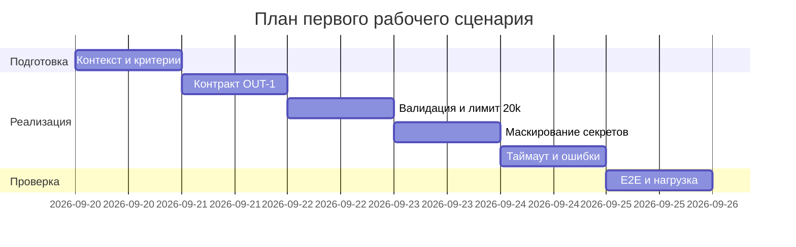

# План поставки

## Инкременты и ответственность

| Инкремент | Наблюдаемый результат | Что делает человек | Что делает AI или субагент | Проверка | Зависимости |
|---|---|---|---|---|---|
| 1. Контракт OUT-1 | Ответ сервиса строго в формате OUT-1: `summary`, `risks` (≤3, с `file/line/evidence/risk`), `checks` | Утверждает схему и граничные случаи; проводит ревью | Предлагает схему и примеры валидных/невалидных ответов; генерирует черновик контракт-тестов | DoD: [tests_unit.md](../../practice_01/tests_unit.md) (OUT-1) зелёные; [tests_integration.md](../../practice_01/tests_integration.md) «API -> ReviewService» — ответ соответствует OUT-1; метрика из [problem.md](../../practice_01/problem.md): «Доля ответов в формате OUT-1» — целевой порог ≥95% | [CASE.md](../../practice_01/CASE.md): OUT-1, QA-1 |
| 2. Валидация входа и лимит 20 000 (API-1) | Запросы с `diff` > 20 000 символов отклоняются с HTTP 413; отсутствие `diff` — корректная ошибка валидации | Уточняет границы, формат ошибки, коды | Генерирует негативные кейсы и диффы на 19–21k | DoD: лимит 20k реализован; [tests_unit.md](../../practice_01/tests_unit.md) (API-1) — зелёные; [tests_integration.md](../../practice_01/tests_integration.md) — 413 для >20k; [tests_load.md](../../practice_01/tests_load.md) «Граничный размер diff» — 413 стабильно, p95 без деградации; метрика: «Доля отклонённых слишком длинных diff» = 100% | [CASE.md](../../practice_01/CASE.md): API-1; инкр. 1 |
| 3. Маскирование секретов (SEC-1) | Перед отправкой во внешний LLM секреты редактированы как `[REDACTED]`; в ответах и логах нет секретов | Определяет паттерны маскировки и источники потенциальных секретов | Предлагает шаблоны redaction и тестовые примеры секретов | DoD: маскирование активно; [tests_integration.md](../../practice_01/tests_integration.md) «ReviewService -> Masking» — evidence `[REDACTED]`; [tests_e2e.md](../../practice_01/tests_e2e.md) — в ответе и артефактах секретов нет | [CASE.md](../../practice_01/CASE.md): SEC-1; инкр. 1–2 |
| 4. Таймаут 10s и контролируемая ошибка (REL-1) | LLM-вызов ограничен 10 сек; при превышении — предсказуемая ошибка без падения API | Выбирает стратегию таймаута/ретрая и формат ошибки | Готовит прототип обработки ошибок и тест кейсы отказа | DoD: таймаут 10s реализован; [tests_integration.md](../../practice_01/tests_integration.md) «LLM timeout >10s» — API отвечает контролируемо; [tests_load.md](../../practice_01/tests_load.md) — под нагрузкой стабильность ответа; метрика: «Доля запросов с корректной обработкой таймаута LLM» ≥99% | [CASE.md](../../practice_01/CASE.md): REL-1; инкр. 1–3 |
| 5. Документация и E2E | Согласованные артефакты и сценарий от API до ответа модели; описание формата и ограничений | Сверяет артефакты, финализирует doc | Генерирует черновики разделов и сценариев | DoD: [tests_e2e.md](../../practice_01/tests_e2e.md) — сценарий проходит; ссылки на [CASE.md](../../practice_01/CASE.md) и метрики [problem.md](../../practice_01/problem.md) добавлены в документацию; все предыдущие тесты зелёные | Инкр. 1–4 |

## Диаграмма Ганта

## Как использовали AI

- Для чего: проверить и доуточнить слабый артефакт [`practice_02/project_management.md`](../project_management.md) по источникам Практики 1 (CASE.md, problem.md, tests_*), убрать плейсхолдеры и привязать DoD к тестам и метрикам; сформировать итоговый план без неподтверждённых допущений
- Тип промпта: Chain of Verification
- Строка в [prompts.md](../prompts.md): Chain of Verification — [chain_of_verification/experiment.md](experiment.md); исходные данные — P1-02, P1-03
- Что проверили и исправили сами: выкинут шаблон «Замените даты…»; сроки оформлены как последовательности без обязательств; все численные пороги (20 000, 10s, ≥95%, 100%, ≥99%) дословно из CASE.md и problem.md; ссылки ведут на существующие файлы `practice_01`; не заявляли фактического прохождения тестов
