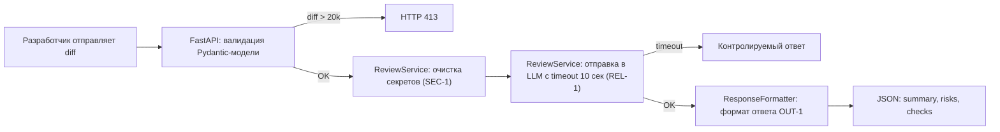

# Few-shot

- Артефакт Практики 1: `analysis.md` — пустой шаблон AS IS/TO BE без какого-либо содержимого
- Что хотим улучшить: полностью заполнить анализ процесса (AS IS, TO BE, таблица разницы, mermaid-диаграммы) на основе TRAINING_PR.diff и context.md

## Примеры

### Хороший результат

````markdown
## AS IS

Разработчик открывает PR в репозитории. Текущий процесс выглядит так:

1. **Разработчик** отправляет POST-запрос на `/api/reviews` с JSON, содержащим ключ `diff` (`app/api.py:36-37`)
2. **FastAPI-сервис** напрямую берёт `payload["diff"]` без валидации наличия ключа или типа значения — при отсутствии `diff` возникает `KeyError` (`app/api.py:37`)
3. **ReviewService.review()** формирует промпт строкой `f"Review this pull request and find problems:\n{diff}"` и отправляет во внешний LLM (`app/review_service.py:20-21`)
4. **Внешний LLM** возвращает ответ как строку
5. **ReviewService** оборачивает ответ в `{"comment": answer}` и возвращает клиенту (`app/review_service.py:22`)

**Участники:** разработчик (открывающий PR), FastAPI-сервис, внешний LLM.
**Задержки:** нет timeout на вызов LLM — если LLM недоступен, запрос зависает.
**Точки потери информации:** секреты из diff попадают во внешний LLM (SEC-1), нет логирования (OBS-1).

## TO BE



## Разница

| Что меняется | AS IS | TO BE | Как проверим |
|---|---|---|---|
| Валидация входа | `payload["diff"]` без проверки | Pydantic-модель, HTTP 422 | Unit-тест: передать без ключа `diff` |
| Очистка секретов (SEC-1) | Diff как есть | `[REDACTED]` перед LLM | Unit-тест: diff с `token=abc` |
````

### Плохой результат

````markdown
## AS IS

Текущий процесс не оптимален. Сервис отправляет diff в LLM без проверки.

## TO BE

Нужно добавить валидацию и обработку ошибок.

## Разница

| Что меняется | AS IS | TO BE | Как проверим |
|---|---|---|---|
|  |  |  |  |
````

**Почему плохо:** нет конкретных ссылок на файлы/строки, нет mermaid-диаграммы, таблица «Разница» пуста, нет участников и задержек в AS IS, нет правил из CASE.md.

## Запрос

```
Заполни файл analysis.md на основе TRAINING_PR.diff и context.md.

Вот текущий шаблон analysis.md:

# Анализ процесса: AS IS и TO BE

## AS IS
Опишите текущий процесс от события до результата. Укажите участников, задержки, ручные операции и точки потери информации.

## TO BE
Опишите один небольшой процесс после изменения. Используйте BPMN, DFD или IDEF*.

## Разница
| Что меняется | AS IS | TO BE | Как проверим изменение |
|---|---|---|---|
|  |  |  |  |

## Как использовали AI
- Для чего:
- Тип промпта:
- Строка в prompts.md:
- Что проверили и исправили сами:

Вот данные из TRAINING_PR.diff:

app/review_service.py:
class LLM(Protocol):
    def generate(self, prompt: str) -> str: ...

class ReviewService:
    def __init__(self, llm: LLM) -> None:
        self.llm = llm
    def review(self, diff: str) -> dict[str, str]:
        prompt = f"Review this pull request and find problems:\n{diff}"
        answer = self.llm.generate(prompt)
        return {"comment": answer}

app/api.py:
from fastapi import FastAPI
from app.dependencies import review_service
app = FastAPI()

@app.post("/api/reviews")
def create_review(payload: dict) -> dict[str, str]:
    return review_service.review(payload["diff"])

@app.get("/health")
def health() -> dict[str, str]:
    return {"status": "ok"}

Правила из CASE.md:
- SEC-1: перед отправкой во внешний LLM из diff удаляются токены, пароли и приватные ключи
- API-1: diff длиннее 20 000 символов отклоняется с HTTP 413
- REL-1: внешний LLM-вызов имеет timeout 10 секунд
- OUT-1: ответ содержит summary, массив risks и массив checks. В risks максимум 3 элемента
- OBS-1: в лог пишутся только request_id, длительность и статус

Заполни AS IS с конкретными ссылками на файлы и строки, TO BE с mermaid-диаграммой, таблицу «Разница» минимум 4 строки, и раздел «Как использовали AI».
```

## Что получили

Файл `analysis.md` заполнен:
- AS IS: 5 шагов с ссылками на `app/api.py:36-37` и `app/review_service.py:19-22`, участники, задержки, точки потери
- TO BE: mermaid flowchart с шагами очистки секретов, валидации, timeout, форматирования
- Таблица «Разница»: 5 строк (валидация, SEC-1, REL-1, OUT-1, OBS-1) с конкретными изменениями
- «Как использовали AI»: заполнен

## Что изменили в исходном артефакте

- Файл и раздел: `analysis.md` — все разделы (AS IS, TO BE, Разница, Как использовали AI)
- Изменение: пустой шаблон заменён на полный анализ с конкретными ссылками на код и правила
- Как проверили: каждый вывод подтверждён строкой из TRAINING_PR.diff или правилом из CASE.md, mermaid-диаграмма синтаксически валидна
- Что отклонили: generic-рекомендации типа «добавить тесты» — не относятся к анализу процесса AS IS/TO BE